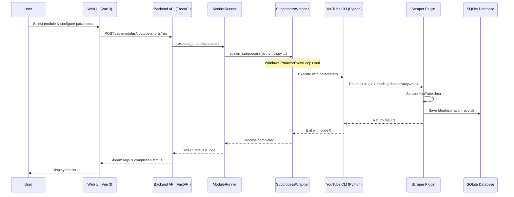

# YouTube Shorts Module - Execution Flow

**Platform Focus**: Windows 10/11 with NVIDIA RTX 5090  
**Last Updated**: 2025-11-04

## Overview

This document provides a comprehensive walkthrough of how the YouTube Shorts Source module executes from user interaction in the Web Client to data storage in the database. The flow is optimized for Windows platforms with special attention to subprocess execution and event loop handling.

## High-Level Flow



## Detailed Step-by-Step Execution

### 1. User Initiates Launch (Windows Web Browser)

**Location**: Web Client Frontend (`Client/Frontend/`)

**User Actions**:
1. Opens web browser (Edge, Chrome, Firefox on Windows)
2. Navigates to `http://localhost:5173` (default Vite dev server)
3. Clicks on "YouTube Shorts" module card
4. Fills in launch parameters in the modal form:
   - **Mode**: `trending`, `channel`, or `keyword`
   - **Max Results**: Number of Shorts to scrape (e.g., 50)
   - **Channel URL**: (if mode=channel) e.g., `@SnappyStories_1`
   - **Query**: (if mode=keyword) search keywords

**Frontend Code**:
```javascript
// Client/Frontend/src/views/Dashboard.vue
async function launchModule(moduleId, params) {
  const response = await fetch(`/api/modules/${moduleId}/run`, {
    method: 'POST',
    headers: { 'Content-Type': 'application/json' },
    body: JSON.stringify(params)
  });
  
  const runData = await response.json();
  // Navigate to log viewer with run_id
  router.push(`/logs/${runData.run_id}`);
}
```

**Parameters Sent**:
```json
{
  "mode": "channel",
  "channel_url": "@SnappyStories_1",
  "max_results": 50
}
```

---

### 2. Backend Receives Request (Windows Server)

**Location**: `Client/Backend/src/api/routes/modules.py`

**Process**:
1. FastAPI endpoint receives POST request
2. Validates module exists in module registry
3. Merges user parameters with module defaults
4. Validates parameter types and constraints
5. Generates unique run ID (UUID4)
6. Creates run entry in run registry
7. Delegates to ModuleRunner for execution

**Backend Code**:
```python
# Client/Backend/src/api/routes/modules.py
@router.post("/modules/{module_id}/run")
async def run_module(module_id: str, params: dict):
    # Get module configuration
    module = module_registry.get_module(module_id)
    
    # Merge parameters
    run_params = {**module.default_params, **params}
    
    # Generate run ID
    run_id = str(uuid.uuid4())
    
    # Execute module
    await module_runner.execute_module(
        module_id=module_id,
        run_id=run_id,
        params=run_params
    )
    
    return {"run_id": run_id, "status": "started"}
```

**Windows Consideration**: FastAPI runs on Uvicorn with Windows ProactorEventLoop policy set by `uvicorn_runner.py`.

---

### 3. ModuleRunner Prepares Execution (Windows Process Management)

**Location**: `Client/Backend/src/core/module_runner.py`

**Process**:
1. Retrieves module configuration (working directory, command template)
2. Constructs command line with parameters
3. Prepares environment variables
4. Creates SubprocessWrapper instance
5. Registers run in run registry with status "running"

**Module Configuration** (`module.json`):
```json
{
  "id": "youtube-shorts",
  "name": "YouTube Shorts",
  "module_type": "source",
  "category": "content",
  "subcategory": "shorts",
  "working_directory": "Sources/Content/Shorts/YouTube",
  "command": "python -m src.cli run --mode {mode} --max-results {max_results}",
  "parameters": [
    {
      "name": "mode",
      "type": "select",
      "options": ["trending", "channel", "keyword"],
      "default": "trending"
    },
    {
      "name": "max_results",
      "type": "number",
      "default": 50
    }
  ]
}
```

**Command Construction**:
```python
# Client/Backend/src/core/module_runner.py
def build_command(module, params):
    # Template: python -m src.cli run --mode {mode} --max-results {max_results}
    command = module.command
    
    for key, value in params.items():
        command = command.replace(f"{{{key}}}", str(value))
    
    # Result: python -m src.cli run --mode channel --max-results 50
    return command
```

---

### 4. SubprocessWrapper Spawns Process (Windows Subprocess)

**Location**: `Client/Backend/src/core/subprocess_wrapper.py`

**Critical Windows Requirement**: 
- Must use `asyncio.ProactorEventLoopPolicy` on Windows
- Set in `Client/Backend/src/uvicorn_runner.py`:

```python
# Client/Backend/src/uvicorn_runner.py
if sys.platform == "win32":
    # CRITICAL: Required for subprocess support on Windows
    asyncio.set_event_loop_policy(asyncio.WindowsProactorEventLoopPolicy())
```

**Process**:
1. Validates working directory exists (Windows path format)
2. Splits command into executable and arguments
3. Creates asyncio subprocess with:
   - `stdout=PIPE` - Capture standard output
   - `stderr=PIPE` - Capture error output
   - `cwd=working_directory` - Set working directory (Windows path)
   - `env=environment` - Set environment variables
4. Starts asynchronous log streaming tasks

**Windows Subprocess Creation**:
```python
# Client/Backend/src/core/subprocess_wrapper.py
async def spawn_subprocess(command: str, cwd: str):
    # On Windows, use shell=True if command contains shell operators
    # Otherwise, split command for direct execution
    
    if sys.platform == "win32":
        # Windows: Handle path separators and Python launcher
        if command.startswith("python"):
            # Use py launcher for better version control on Windows
            command = command.replace("python", "py -3.10", 1)
    
    process = await asyncio.create_subprocess_shell(
        command,
        stdout=asyncio.subprocess.PIPE,
        stderr=asyncio.subprocess.PIPE,
        cwd=cwd,
        env=os.environ.copy()
    )
    
    return process
```

**Output Capture** (Asynchronous streaming):
```python
async def stream_output(stream, run_id, stream_type):
    """Stream subprocess output line-by-line on Windows"""
    while True:
        line = await stream.readline()
        if not line:
            break
        
        # Decode with Windows-1252 encoding fallback for Windows
        try:
            text = line.decode('utf-8')
        except UnicodeDecodeError:
            text = line.decode('windows-1252', errors='ignore')
        
        # Store in run registry for SSE streaming
        run_registry.add_log(run_id, text, stream_type)
```

**Windows Path Handling**:
```python
# Convert forward slashes to backslashes on Windows
working_dir = Path(module.working_directory)
if sys.platform == "win32":
    working_dir = working_dir.resolve()  # Absolute Windows path
```

---

### 5. CLI Execution (Python on Windows)

**Location**: `Sources/Content/Shorts/YouTube/src/cli.py`

**Process**:
1. CLI entry point invoked via `python -m src.cli`
2. Click parses command-line arguments
3. Loads configuration from `.env` file (Windows path)
4. Routes to appropriate command handler based on mode
5. Initializes selected plugin with configuration
6. Executes scraping operation

**CLI Routing**:
```python
# src/cli.py
import click
from src.core import Config, Database
from src.plugins import (
    YouTubeTrendingPlugin,
    YouTubeChannelPlugin,
    YouTubeSearchPlugin
)

@click.command()
@click.option('--mode', type=click.Choice(['trending', 'channel', 'keyword']))
@click.option('--max-results', type=int, default=50)
@click.option('--channel-url', type=str, default=None)
@click.option('--query', type=str, default=None)
def run(mode, max_results, channel_url, query):
    """Main run command for YouTube Shorts scraping"""
    
    # Load configuration (Windows .env file)
    config = Config()
    db = Database(config.database_path)
    
    # Route to plugin based on mode
    if mode == 'trending':
        plugin = YouTubeTrendingPlugin(config)
        ideas = plugin.scrape(max_results=max_results)
    
    elif mode == 'channel':
        if not channel_url:
            raise ValueError("--channel-url required for channel mode")
        plugin = YouTubeChannelPlugin(config)
        ideas = plugin.scrape(channel_url=channel_url, top_n=max_results)
    
    elif mode == 'keyword':
        if not query:
            raise ValueError("--query required for keyword mode")
        # NOTE: Not yet implemented (Issue #300)
        plugin = YouTubeTrendingPlugin(config)  # Fallback
        ideas = plugin.scrape(max_results=max_results)
        print("WARNING: Keyword search not yet implemented, using trending")
    
    # Save to database
    for idea in ideas:
        db.insert_idea(idea)
    
    print(f"✓ Scraped {len(ideas)} ideas and saved to database")
```

**Windows Configuration Loading**:
```python
# src/core/config.py
from pathlib import Path
import os
from dotenv import load_dotenv

class Config:
    def __init__(self, env_file: str = ".env"):
        # Handle Windows paths
        env_path = Path(env_file)
        if not env_path.is_absolute():
            env_path = Path.cwd() / env_path
        
        load_dotenv(env_path)
        
        # Load configuration with Windows path defaults
        self.database_path = os.getenv(
            'DATABASE_PATH',
            str(Path.cwd() / 'youtube_shorts.db')  # Windows path
        )
```

---

### 6. Plugin Execution (Scraping on Windows)

**Location**: `Sources/Content/Shorts/YouTube/src/plugins/`

**Example: Channel Plugin**

**Process**:
1. Plugin receives scraping parameters
2. Uses yt-dlp to scrape channel data (works cross-platform)
3. Extracts metadata (title, description, views, etc.)
4. Downloads and parses subtitles
5. Calculates universal metrics
6. Transforms to IdeaInspiration format
7. Returns list of idea dictionaries

**Plugin Code**:
```python
# src/plugins/youtube_channel_plugin.py
from src.plugins import SourcePlugin
from src.core import UniversalMetrics, IdeaProcessor
import yt_dlp

class YouTubeChannelPlugin(SourcePlugin):
    def scrape(self, channel_url: str, top_n: int = 50):
        """Scrape Shorts from a YouTube channel"""
        
        # yt-dlp options (works on Windows)
        ydl_opts = {
            'extract_flat': False,
            'playlist_items': f'1-{top_n}',
            'writesubtitles': True,
            'writeautomaticsub': True,
            'subtitleslangs': ['en'],
            'quiet': True,
            'no_warnings': True
        }
        
        ideas = []
        
        # Windows: yt-dlp handles Windows paths automatically
        with yt_dlp.YoutubeDL(ydl_opts) as ydl:
            # Extract channel shorts
            info = ydl.extract_info(
                f"{channel_url}/shorts",
                download=False
            )
            
            for entry in info['entries']:
                # Calculate metrics
                metrics = UniversalMetrics.from_youtube(entry)
                
                # Transform to IdeaInspiration
                idea = IdeaProcessor.transform(
                    source="youtube_shorts_channel",
                    source_id=entry['id'],
                    title=entry['title'],
                    description=entry.get('description', ''),
                    metrics=metrics,
                    raw_data=entry
                )
                
                ideas.append(idea)
        
        return ideas
```

**Windows Considerations**:
- yt-dlp handles Windows file paths automatically
- Temporary files stored in Windows temp directory
- FFmpeg required (installed separately on Windows)

---

### 7. Database Storage (SQLite on Windows)

**Location**: `Sources/Content/Shorts/YouTube/src/core/database.py`

**Process**:
1. Opens SQLite connection (Windows file path)
2. Inserts IdeaInspiration records
3. Handles duplicates (UNIQUE constraint on source + source_id)
4. Commits transaction
5. Closes connection

**Database Code**:
```python
# src/core/database.py
import sqlite3
from pathlib import Path

class Database:
    def __init__(self, db_path: str):
        # Windows path handling
        self.db_path = Path(db_path).resolve()
        self._ensure_db_exists()
    
    def insert_idea(self, idea: dict):
        """Insert IdeaInspiration record"""
        conn = sqlite3.connect(self.db_path)
        cursor = conn.cursor()
        
        try:
            cursor.execute("""
                INSERT INTO idea_inspirations 
                (source, source_id, title, description, score, created_at)
                VALUES (?, ?, ?, ?, ?, ?)
            """, (
                idea['source'],
                idea['source_id'],
                idea['title'],
                idea['description'],
                idea.get('score', 0.0),
                idea.get('created_at')
            ))
            conn.commit()
        except sqlite3.IntegrityError:
            # Duplicate - skip
            pass
        finally:
            conn.close()
```

**Windows Database Path**:
```
Default: Sources/Content/Shorts/YouTube/youtube_shorts.db
Absolute: C:\Users\<username>\...\youtube_shorts.db
```

---

### 8. Process Completion (Windows)

**Process**:
1. Plugin returns scraped ideas to CLI
2. CLI prints summary to stdout
3. CLI exits with code 0 (success) or 1 (error)
4. SubprocessWrapper detects process exit
5. Captures exit code and final output
6. Updates run status in registry
7. Stores completion time

**Completion Handling**:
```python
# Client/Backend/src/core/subprocess_wrapper.py
async def wait_for_completion(process, run_id):
    """Wait for subprocess to complete and update status"""
    exit_code = await process.wait()
    
    # Update run registry
    if exit_code == 0:
        run_registry.set_status(run_id, "completed")
    else:
        run_registry.set_status(run_id, "failed")
        run_registry.set_error(run_id, f"Process exited with code {exit_code}")
    
    run_registry.set_end_time(run_id, datetime.now())
```

---

### 9. Log Streaming to Frontend (Real-time on Windows)

**Location**: `Client/Backend/src/api/routes/logs.py`

**Process**:
1. Frontend connects to SSE endpoint `/api/logs/{run_id}/stream`
2. Backend streams logs from run registry
3. New logs pushed in real-time as subprocess outputs them
4. Connection maintained until process completes

**SSE Endpoint**:
```python
# Client/Backend/src/api/routes/logs.py
from fastapi import APIRouter
from sse_starlette.sse import EventSourceResponse

@router.get("/logs/{run_id}/stream")
async def stream_logs(run_id: str):
    """Stream logs in real-time via Server-Sent Events"""
    
    async def log_generator():
        last_index = 0
        
        while True:
            # Get new logs since last check
            logs = run_registry.get_logs(run_id, since=last_index)
            
            for log in logs:
                yield {
                    "event": "log",
                    "data": log.message
                }
                last_index = log.index
            
            # Check if run completed
            run = run_registry.get_run(run_id)
            if run.status in ["completed", "failed"]:
                yield {"event": "complete", "data": run.status}
                break
            
            # Wait before checking again (Windows-friendly polling)
            await asyncio.sleep(0.1)
    
    return EventSourceResponse(log_generator())
```

**Frontend Log Display**:
```javascript
// Client/Frontend/src/views/LogViewer.vue
const eventSource = new EventSource(`/api/logs/${runId}/stream`);

eventSource.addEventListener('log', (event) => {
  logs.value.push(event.data);
  scrollToBottom();
});

eventSource.addEventListener('complete', (event) => {
  status.value = event.data;
  eventSource.close();
});
```

---

### 10. Completion Notification

**Process**:
1. Frontend receives "complete" event from SSE
2. Displays completion status (success/failed)
3. Shows final log count
4. Enables "View Results" button
5. User can navigate to database viewer or export

**Frontend Display**:
```vue
<!-- Client/Frontend/src/views/LogViewer.vue -->
<template>
  <div class="log-viewer">
    <div v-if="status === 'completed'" class="status-success">
      ✓ Scraping completed successfully
      <button @click="viewResults">View Results</button>
    </div>
    
    <div v-else-if="status === 'failed'" class="status-error">
      ✗ Scraping failed - check logs below
    </div>
    
    <div class="logs">
      <pre v-for="(log, i) in logs" :key="i">{{ log }}</pre>
    </div>
  </div>
</template>
```

---

## Parameter Flow Summary

Here's how parameters flow through the entire system:

```
┌─────────────────────────────────────────────────────────────────┐
│ 1. Web UI Form (Vue 3)                                          │
│    mode: "channel"                                              │
│    channel_url: "@SnappyStories_1"                              │
│    max_results: 50                                              │
└────────────────────────┬────────────────────────────────────────┘
                         ▼
┌─────────────────────────────────────────────────────────────────┐
│ 2. Backend API (FastAPI)                                        │
│    POST /api/modules/youtube-shorts/run                         │
│    Body: {"mode": "channel", "channel_url": "...", ...}         │
└────────────────────────┬────────────────────────────────────────┘
                         ▼
┌─────────────────────────────────────────────────────────────────┐
│ 3. ModuleRunner (Python)                                        │
│    Builds command from template + params                        │
└────────────────────────┬────────────────────────────────────────┘
                         ▼
┌─────────────────────────────────────────────────────────────────┐
│ 4. Command Line (Windows)                                       │
│    python -m src.cli run \                                      │
│      --mode channel \                                           │
│      --channel-url @SnappyStories_1 \                           │
│      --max-results 50                                           │
└────────────────────────┬────────────────────────────────────────┘
                         ▼
┌─────────────────────────────────────────────────────────────────┐
│ 5. CLI Parser (Click)                                           │
│    mode = "channel"                                             │
│    channel_url = "@SnappyStories_1"                             │
│    max_results = 50                                             │
└────────────────────────┬────────────────────────────────────────┘
                         ▼
┌─────────────────────────────────────────────────────────────────┐
│ 6. Plugin Execution (YouTubeChannelPlugin)                      │
│    plugin.scrape(                                               │
│        channel_url="@SnappyStories_1",                          │
│        top_n=50                                                 │
│    )                                                            │
└─────────────────────────────────────────────────────────────────┘
```

---

## Windows-Specific Considerations

### 1. Event Loop Policy (CRITICAL)

**Problem**: Default `SelectorEventLoop` on Windows doesn't support subprocess operations.

**Solution**: Use `ProactorEventLoopPolicy` in `uvicorn_runner.py`:

```python
if sys.platform == "win32":
    asyncio.set_event_loop_policy(asyncio.WindowsProactorEventLoopPolicy())
```

**Reference**: `Client/Backend/src/uvicorn_runner.py`

### 2. Path Separators

**Problem**: Windows uses backslashes (`\`), Python uses forward slashes (`/`).

**Solution**: Use `pathlib.Path` for cross-platform compatibility:

```python
from pathlib import Path

# Automatically handles Windows vs Unix paths
working_dir = Path("Sources/Content/Shorts/YouTube")
db_path = Path.cwd() / "youtube_shorts.db"
```

### 3. Python Version Management

**Recommendation**: Use Python Launcher (`py`) on Windows:

```powershell
# Instead of: python -m src.cli run
# Use: py -3.10 -m src.cli run

# This ensures Python 3.10 is used (required for DaVinci Resolve compatibility)
```

### 4. File Encoding

**Problem**: Windows may use different encodings (Windows-1252, UTF-8 with BOM).

**Solution**: Explicit encoding handling:

```python
# Reading subprocess output
try:
    text = line.decode('utf-8')
except UnicodeDecodeError:
    text = line.decode('windows-1252', errors='ignore')

# Writing files
with open(file_path, 'w', encoding='utf-8') as f:
    f.write(content)
```

### 5. Environment Variables

**Windows .env Loading**:
```python
from dotenv import load_dotenv
load_dotenv()  # Automatically finds .env in current directory
```

**PowerShell Environment**:
```powershell
# Set environment variable for current session
$env:YOUTUBE_API_KEY = "your_key_here"

# Or load from .env using cross-env
cross-env YOUTUBE_API_KEY=your_key python -m src.cli run
```

### 6. Subprocess Execution Modes

**Windows Shell vs Direct**:

```python
# Option 1: Shell execution (more compatible, less secure)
process = await asyncio.create_subprocess_shell(
    command,
    stdout=PIPE,
    stderr=PIPE,
    cwd=cwd
)

# Option 2: Direct execution (more secure, requires proper command splitting)
process = await asyncio.create_subprocess_exec(
    executable,
    *args,
    stdout=PIPE,
    stderr=PIPE,
    cwd=cwd
)
```

**Current Implementation**: Uses shell mode for flexibility with command templates.

---

## Error Scenarios and Recovery

### 1. Keyword Search Not Implemented

**Symptom**: User selects "keyword" mode, but gets trending results.

**Cause**: Keyword search plugin not yet implemented (Issue #300).

**Behavior**:
```python
if mode == 'keyword':
    print("WARNING: Keyword search not yet implemented, using trending fallback")
    plugin = YouTubeTrendingPlugin(config)
    ideas = plugin.scrape(max_results=max_results)
```

**Recovery**: Use trending or channel mode as workaround.

### 2. Windows Event Loop Error

**Symptom**: `NotImplementedError: Subprocess not supported on Windows`

**Cause**: Backend started without ProactorEventLoop policy.

**Fix**: Always start backend using `uvicorn_runner.py`:

```powershell
cd Client\Backend
py -3.10 -m src.uvicorn_runner
```

### 3. Module Not Found

**Symptom**: CLI fails with `ModuleNotFoundError`

**Cause**: Virtual environment not activated or dependencies not installed.

**Fix**:
```powershell
cd Sources\Content\Shorts\YouTube
py -3.10 -m venv venv
.\venv\Scripts\activate
pip install -r requirements.txt
```

### 4. Database Locked

**Symptom**: `sqlite3.OperationalError: database is locked`

**Cause**: Another process has the database open.

**Fix**: Close all connections, use WAL mode for concurrent access:

```python
conn = sqlite3.connect(db_path)
conn.execute("PRAGMA journal_mode=WAL")
```

### 5. Permission Denied (Windows)

**Symptom**: `PermissionError: [WinError 5] Access is denied`

**Cause**: Antivirus blocking or insufficient permissions.

**Fix**:
- Run as Administrator (right-click → Run as administrator)
- Add exception to Windows Defender
- Check file permissions in Windows Explorer

---

## Performance Characteristics (Windows RTX 5090)

- **Scraping Speed**: ~1-2 seconds per Short (network dependent)
- **Batch Size**: Recommended 50-100 Shorts per run
- **Database Writes**: ~100-200 inserts/second (SQLite on NVMe SSD)
- **Memory Usage**: ~200-500 MB (yt-dlp + metadata)
- **CPU Usage**: Low (I/O bound, not CPU intensive)
- **GPU Usage**: None (future: ML classification could use RTX 5090)

---

## Related Documentation

- **[ARCHITECTURE.md](./ARCHITECTURE.md)** - Module architecture and design patterns
- **[KNOWN_ISSUES.md](./KNOWN_ISSUES.md)** - Known limitations and platform issues
- **[TROUBLESHOOTING.md](./TROUBLESHOOTING.md)** - Common problems and solutions
- **[Client Architecture](../../../Client/_meta/docs/ARCHITECTURE.md)** - Web client architecture
- **[System Architecture](../../../_meta/docs/ARCHITECTURE.md)** - Overall system design

---

**Platform**: Windows 10/11 (Primary)  
**GPU**: NVIDIA RTX 5090  
**Python**: 3.10.x (Required)  
**Last Updated**: 2025-11-04
