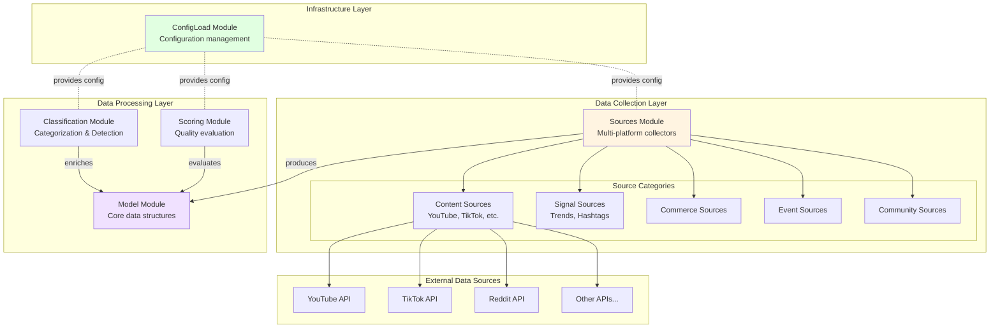
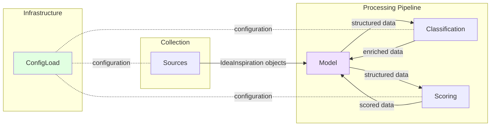
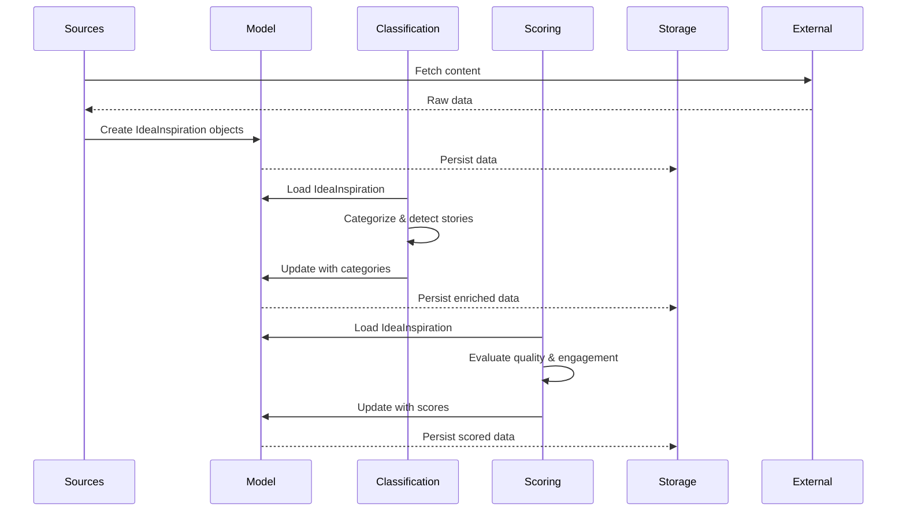
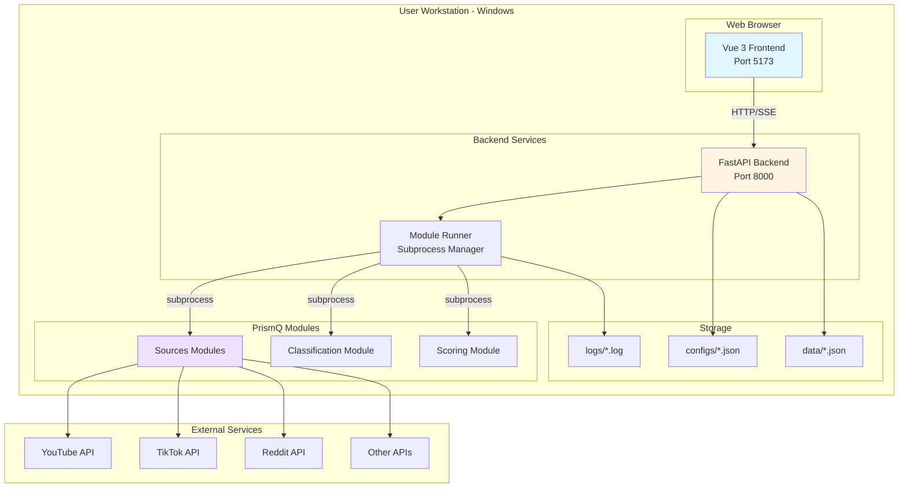

# PrismQ.IdeaInspiration - Architecture

## Overview

PrismQ.IdeaInspiration is a multi-module repository that follows consistent architectural patterns across its components. This document describes the overall architecture and module organization patterns used throughout the repository.

## Repository Structure

The repository contains multiple specialized modules that work together:

- **Classification** - Content categorization and story detection
- **ConfigLoad** - Centralized configuration management
- **Model** - Core IdeaInspiration data model
- **Scoring** - Content scoring and evaluation engine
- **Sources** - Content source integrations and taxonomy

**Note**: The Web Client control panel has been moved to a separate repository for better modularity.

### System-Level Architecture Diagram



## Module Organization Patterns

### Pattern 1: `src/` and `mod/` Separation (Used in Scoring)

Some modules follow a clear separation between infrastructure and business logic:

#### `src/` - Core Python Package Implementation
- Configuration management (`config.py`)
- Logging infrastructure (`logging_config.py`)
- Core utilities and infrastructure code
- Package initialization and common functionality

#### `mod/` - Business/Domain Modules
- Domain-specific implementations
- Business logic modules
- Higher-level application components
- Use case orchestration

**Example Structure:**
```
ModuleName/
├── src/                      # Infrastructure layer
│   ├── __init__.py
│   ├── config.py
│   └── logging_config.py
├── mod/                      # Business logic layer
│   ├── README.md
│   └── module_name/
│       ├── __init__.py
│       └── ... (module files)
├── tests/
│   ├── src/                 # Infrastructure tests
│   └── mod/                 # Business logic tests
└── README.md
```

**Guidelines for `mod/` Modules:**

1. **Single Responsibility**: Each module should focus on a specific domain or business concern
2. **Dependency Injection**: Depend on `src/` infrastructure via interfaces/protocols
3. **Testing**: Add corresponding tests in `tests/mod/YourModule/`
4. **Documentation**: Document the module's purpose, inputs, and outputs
5. **SOLID Principles**: Follow SOLID design principles (see `.github/copilot-instructions.md`)

### Pattern 2: `src/` with Submodules (Used in Sources/Content/Shorts/YouTube)

Some modules organize code into functional submodules:

```
ModuleName/
├── src/
│   ├── __init__.py
│   ├── cli.py
│   ├── core/                # Core utilities
│   │   ├── config.py
│   │   ├── database.py
│   │   └── logging_config.py
│   └── plugins/             # Extensible plugins
│       ├── __init__.py
│       └── plugin_impl.py
├── _meta/
│   ├── docs/               # Module documentation
│   ├── issues/             # Issue tracking
│   └── research/           # Research materials
└── README.md
```

### Pattern 3: Direct Package Structure (Used in Model, ConfigLoad)

Some simpler modules use a direct package structure:

```
ModuleName/
├── __init__.py
├── main_module.py
├── tests/
└── README.md
```

## Separation of Concerns

### Infrastructure vs. Business Logic

**Infrastructure (`src/`):**
- ✅ Configuration management
- ✅ Logging setup
- ✅ Database connections
- ✅ Common utilities
- ✅ Package initialization

**Business Logic (`mod/` or domain-specific code):**
- ✅ Domain models
- ✅ Use case implementations
- ✅ Business rules
- ✅ Domain-specific workflows
- ✅ Application-specific modules

## SOLID Principles Application

All modules in this repository follow SOLID design principles:

1. **Single Responsibility Principle (SRP)**: Each module/class has one reason to change
2. **Open/Closed Principle (OCP)**: Open for extension, closed for modification
3. **Liskov Substitution Principle (LSP)**: Subtypes must be substitutable for their base types
4. **Interface Segregation Principle (ISP)**: Use focused, minimal interfaces
5. **Dependency Inversion Principle (DIP)**: Depend on abstractions, inject dependencies

See [SOLID_PRINCIPLES.md](./SOLID_PRINCIPLES.md) for detailed explanations and examples.

## Module Integration

### Integration Architecture

The modules in PrismQ.IdeaInspiration work together in a coordinated workflow:



### Data Flow Diagram



### Typical Workflow

1. **Sources** → Collect content from various platforms (YouTube, TikTok, Reddit, etc.)
2. **Model** → Transform into unified IdeaInspiration structure
3. **Classification** → Categorize and detect story potential
4. **Scoring** → Evaluate quality and engagement metrics
5. **ConfigLoad** → Manage configuration across all modules

**Note**: With the Client module now in a separate repository, these modules can be executed via:
- Direct CLI invocation of each module
- External orchestration tools
- Custom automation scripts
- The separate Web Client interface (if integrated)

### Module Details

<<<<<<< HEAD
=======
#### Web Client Module
- **Purpose**: Unified control panel for managing all PrismQ modules
- **Technology**: FastAPI (Backend) + Vue 3 (Frontend)
- **Key Features**:
  - Module discovery and catalog
  - Parameter configuration and persistence
  - One-click module launching
  - Real-time log streaming (SSE)
  - Run history and monitoring
  - Concurrent execution support
- **Documentation**: [Client Architecture](../../Client/_meta/docs/ARCHITECTURE.md)

>>>>>>> origin/main
#### Sources Module
- **Purpose**: Multi-platform content collection
- **Categories**: Content, Signals, Commerce, Events, Community, Creative, Internal
- **Key Features**:
  - YouTube, TikTok, Instagram, Reddit integration
  - Trend and hashtag tracking
  - Configurable data collection
  - Rate limiting and API management

#### Model Module
- **Purpose**: Core data structures and interfaces
- **Key Components**:
  - IdeaInspiration base model
  - Common data schemas
  - Serialization/deserialization

#### Classification Module
- **Purpose**: Content categorization and story detection
- **Key Features**:
  - Multi-label classification
  - Story potential detection
  - Category taxonomies

#### Scoring Module
- **Purpose**: Content quality evaluation
- **Key Features**:
  - Multi-dimensional scoring (title, description, text quality, engagement, etc.)
  - Readability analysis
  - Sentiment analysis
  - Engagement metrics calculation
- **Documentation**: [Scoring Architecture](../../Scoring/_meta/docs/ARCHITECTURE.md)

## Documentation Standards

### Repository-Level Documentation (`_meta/docs/`)

Project-level documentation that applies to the entire repository:
- Architecture decisions (this file)
- Development guidelines
- Integration guides
- Contributing guidelines
- Design principles

### Module-Level Documentation

Each module may have its own documentation:
- `docs/` or `_meta/docs/` - Module-specific documentation
- `README.md` - Module overview and quick start
- `ARCHITECTURE.md` - Module architecture (if complex)

## Target Platform

All modules are optimized for:
- **Operating System**: Windows
- **GPU**: NVIDIA RTX 5090 (32GB VRAM)
- **CPU**: AMD Ryzen processor
- **RAM**: 64GB DDR5

## Related Documentation

- [Contributing Guidelines](./CONTRIBUTING.md)
<<<<<<< HEAD
=======
- [Web Client Architecture](../../Client/_meta/docs/ARCHITECTURE.md) - Detailed Client architecture
>>>>>>> origin/main
- [Scoring Module Architecture](../../Scoring/_meta/docs/ARCHITECTURE.md) - Scoring module details
- Main README: `/README.md`

## Technology Stack

### Data Processing Modules
- **Language**: Python 3.10+
- **Key Libraries**: 
  - Data handling: Pydantic, dataclasses
  - NLP: NLTK, textstat (for Scoring)
  - API clients: requests, aiohttp
  - Configuration: JSON, YAML

### Infrastructure
- **Configuration**: JSON-based configuration files
- **Logging**: Python logging module, structured logs
- **Process Management**: subprocess module, async/await
- **Data Persistence**: JSON files (development), future: SQLite/PostgreSQL

## Deployment Architecture



### Target Platform Optimization

All modules are optimized for the following platform:
- **Operating System**: Windows 10/11
- **GPU**: NVIDIA RTX 5090 (Ada Lovelace architecture, 32GB VRAM)
- **CPU**: AMD Ryzen processor
- **RAM**: 64GB DDR5

### Performance Considerations

- **GPU Acceleration**: Future AI/ML models will utilize RTX 5090
- **Async Operations**: Non-blocking I/O for concurrent module execution
- **Memory Management**: Efficient handling of large datasets with 64GB RAM
- **Subprocess Isolation**: Each module runs independently for fault isolation
