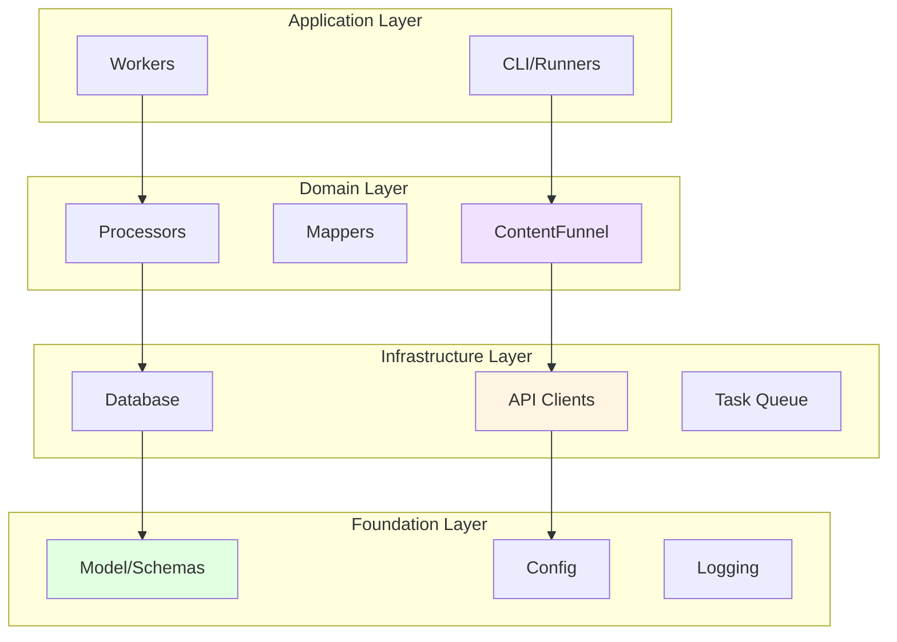

# Testing and Mocking Strategy - Layer Isolation

## Overview

This document outlines PrismQ.T.Idea.Inspiration's comprehensive testing and mocking strategy, focusing on layer isolation, dependency injection, and testability-first design. A layered architecture simplifies testing by allowing each module to be tested in isolation with dependencies mocked.

## Core Principles

### 1. Design for Testability from the Start

Every module and layer should be designed with testing in mind:

- **Use Protocols/Interfaces**: Define clear contracts using Python `Protocol` classes
- **Dependency Injection**: Accept dependencies through constructors, not hardcoded instantiation
- **Single Responsibility**: Each class should have one reason to change, making tests focused
- **Minimal Side Effects**: Avoid global state and side effects that complicate testing

### 2. Test the Interface, Not the Implementation

Write tests against the public interface and expected behavior of a layer:

- Assert **what** a layer does, not **how** it does it
- Tests should survive internal refactoring if the interface contract holds
- Use interfaces as documentation of guarantees between layers

### 3. Mock Dependencies to Isolate Layers

Use mocking frameworks or stub implementations to break dependencies:

- Higher layers receive mock lower-layer implementations
- Lower layers receive mock higher-layer callbacks
- Tests become fast, reliable, and pinpoint issues within one layer

## Layer Testing Architecture

### Layered Design in PrismQ



### Testing Strategy by Layer

| Layer | Test Focus | Dependencies to Mock | Example |
|-------|-----------|---------------------|---------|
| **Application** | User interactions, orchestration | Domain services, infrastructure | Mock ContentFunnel, TaskQueue |
| **Domain** | Business logic, transformations | Infrastructure services | Mock API clients, database |
| **Infrastructure** | External integrations, I/O | External services | Mock HTTP responses, database |
| **Foundation** | Data structures, utilities | None (pure functions) | Direct testing, no mocks |

## Dependency Injection Patterns

### Pattern 1: Protocol-Based Injection (Recommended)

**Use When**: You want maximum flexibility and testability

```python
from typing import Protocol, Optional, Dict, Any

class IVideoFetcher(Protocol):
    """Protocol for fetching video content."""
    
    def fetch_video(
        self, 
        video_url: str, 
        video_id: Optional[str] = None,
        **kwargs
    ) -> Optional[Dict[str, Any]]:
        """Fetch video content and metadata.
        
        Args:
            video_url: URL to the video
            video_id: Optional video identifier
            
        Returns:
            Dictionary with video data or None if fetch failed
        """
        ...


class YouTubeSource:
    """YouTube content source with injected fetcher."""
    
    def __init__(self, video_fetcher: IVideoFetcher):
        """Initialize with video fetcher dependency.
        
        Args:
            video_fetcher: Implementation of IVideoFetcher protocol
        """
        self.video_fetcher = video_fetcher
    
    def get_video_content(self, url: str) -> Optional[Dict[str, Any]]:
        """Get video content using injected fetcher."""
        return self.video_fetcher.fetch_video(url)
```

**Test Example**:

```python
import pytest
from typing import Optional, Dict, Any

class MockVideoFetcher:
    """Mock video fetcher for testing."""
    
    def __init__(self, mock_data: Optional[Dict[str, Any]] = None):
        self.mock_data = mock_data or {'title': 'Test Video'}
        self.call_count = 0
        self.last_url = None
    
    def fetch_video(
        self, 
        video_url: str, 
        video_id: Optional[str] = None,
        **kwargs
    ) -> Optional[Dict[str, Any]]:
        """Mock implementation."""
        self.call_count += 1
        self.last_url = video_url
        return self.mock_data


def test_youtube_source_with_mock():
    """Test YouTubeSource with mock fetcher."""
    # Arrange
    mock_fetcher = MockVideoFetcher({'title': 'Expected Video', 'views': 1000})
    source = YouTubeSource(mock_fetcher)
    
    # Act
    result = source.get_video_content('https://youtube.com/watch?v=test123')
    
    # Assert
    assert result['title'] == 'Expected Video'
    assert result['views'] == 1000
    assert mock_fetcher.call_count == 1
    assert 'test123' in mock_fetcher.last_url
```

### Pattern 2: Optional Dependency Injection

**Use When**: You want sensible defaults but allow testing overrides

```python
from typing import Optional

class AudioClient:
    """Audio client with optional HTTP session injection."""
    
    def __init__(
        self, 
        api_key: str,
        session: Optional[requests.Session] = None
    ):
        """Initialize client.
        
        Args:
            api_key: API authentication key
            session: Optional HTTP session (for testing)
        """
        self.api_key = api_key
        self.session = session or self._create_default_session()
    
    def _create_default_session(self) -> requests.Session:
        """Create production HTTP session."""
        session = requests.Session()
        # Configure retry logic, etc.
        return session
```

**Test Example**:

```python
import requests_mock

def test_audio_client_with_mock_session():
    """Test audio client with mocked HTTP session."""
    with requests_mock.Mocker() as m:
        # Mock API response
        m.get('https://api.audio.com/track/123', json={'title': 'Test Track'})
        
        client = AudioClient(api_key='test_key')
        result = client.get_track('123')
        
        assert result['title'] == 'Test Track'
```

### Pattern 3: Factory Injection

**Use When**: Dependencies need configuration or lifecycle management

```python
from typing import Callable, Protocol

class IDatabaseFactory(Protocol):
    """Factory for creating database connections."""
    
    def create_connection(self) -> 'IDatabase':
        """Create a new database connection."""
        ...


class Worker:
    """Worker with database factory injection."""
    
    def __init__(self, db_factory: IDatabaseFactory):
        """Initialize with database factory.
        
        Args:
            db_factory: Factory for creating database connections
        """
        self.db_factory = db_factory
    
    def process_task(self, task_id: str) -> bool:
        """Process task with fresh database connection."""
        db = self.db_factory.create_connection()
        try:
            # Process task
            return True
        finally:
            db.close()
```

## Unit Testing Guidelines

### Test Structure: AAA Pattern

Organize tests using **Arrange, Act, Assert**:

```python
def test_content_funnel_video_subtitle_extraction():
    """Test video content with subtitle extraction."""
    # Arrange - Set up test fixtures and mocks
    subtitle_extractor = MockSubtitleExtractor()
    funnel = ContentFunnel(subtitle_extractor=subtitle_extractor)
    video_idea = IdeaInspiration.from_video(
        title="Test Video",
        source_url="https://example.com/video123"
    )
    
    # Act - Execute the code under test
    result = funnel.process(video_idea, extract_subtitles=True)
    
    # Assert - Verify expected outcomes
    assert subtitle_extractor.call_count == 1
    assert "Subtitle text from" in result.content
    assert 'transformation_chain' in result.metadata
```

### Test Coverage Targets

- **Critical Business Logic**: 95%+ coverage
- **Infrastructure Layer**: 85%+ coverage  
- **Integration Points**: 80%+ coverage
- **Utilities/Helpers**: 90%+ coverage

### What to Test

#### Happy Path Tests ✅

```python
def test_successful_audio_transcription():
    """Test successful audio transcription flow."""
    transcriber = MockAudioTranscriber(confidence=95.0)
    funnel = ContentFunnel(audio_transcriber=transcriber)
    
    audio_idea = IdeaInspiration.from_audio(
        title="Podcast Episode",
        source_url="https://example.com/audio.mp3"
    )
    
    result = funnel.process(audio_idea, transcribe_audio=True)
    
    assert "Transcribed text from" in result.content
    assert result.metadata['transcription_language'] == 'en'
```

#### Error Cases ❌

```python
def test_graceful_handling_of_transcription_failure():
    """Test error handling when transcription fails."""
    transcriber = MockAudioTranscriber(should_succeed=False)
    funnel = ContentFunnel(audio_transcriber=transcriber)
    
    audio_idea = IdeaInspiration.from_audio(
        title="Podcast Episode",
        source_url="https://example.com/audio.mp3"
    )
    
    # Should not raise exception
    result = funnel.process(audio_idea, transcribe_audio=True)
    
    # Content should remain empty after failure
    assert result.content == ""
    assert 'transformation_chain' not in result.metadata
```

#### Edge Cases 🔍

```python
def test_content_not_overwritten_when_already_present():
    """Test that existing content is preserved."""
    subtitle_extractor = MockSubtitleExtractor()
    funnel = ContentFunnel(subtitle_extractor=subtitle_extractor)
    
    video_idea = IdeaInspiration.from_video(
        title="Test Video",
        subtitle_text="Existing content",
        source_url="https://example.com/video123"
    )
    
    result = funnel.process(video_idea, extract_subtitles=True)
    
    # Extractor should not be called
    assert subtitle_extractor.call_count == 0
    # Existing content preserved
    assert result.content == "Existing content"
```

#### Boundary Conditions 📏

```python
def test_rate_limiting_at_exact_limit():
    """Test rate limiting at exact threshold."""
    client = AudioClient(rate_limit_per_minute=3)
    
    # Make exactly 3 requests (at limit)
    for _ in range(3):
        client._rate_limit_wait()
    
    # 4th request should wait
    start = time.time()
    client._rate_limit_wait()
    elapsed = time.time() - start
    
    # Should have waited some time
    assert elapsed > 0
```

## Mocking Strategies

### Strategy 1: Manual Mock Classes (Recommended for Protocols)

**Advantages**: Full control, clear behavior, easy debugging

```python
class MockAudioExtractor:
    """Mock audio extractor with configurable behavior."""
    
    def __init__(
        self, 
        should_succeed: bool = True,
        mock_format: str = 'mp3',
        mock_duration: int = 180
    ):
        self.should_succeed = should_succeed
        self.mock_format = mock_format
        self.mock_duration = mock_duration
        self.call_count = 0
        self.call_args_list = []
    
    def extract_audio(
        self,
        video_url: str,
        video_id: Optional[str] = None,
        **kwargs
    ) -> Optional[Dict[str, Any]]:
        """Mock extraction with tracking."""
        self.call_count += 1
        self.call_args_list.append({
            'video_url': video_url,
            'video_id': video_id,
            'kwargs': kwargs
        })
        
        if not self.should_succeed:
            return None
        
        return {
            'audio_url': f"{video_url}.audio",
            'audio_format': self.mock_format,
            'duration': self.mock_duration
        }
```

### Strategy 2: unittest.mock for Simple Cases

**Use When**: Simple mocking needs, no complex state tracking

```python
from unittest.mock import Mock, MagicMock, patch

def test_with_unittest_mock():
    """Test using unittest.mock."""
    # Create mock
    mock_database = Mock()
    mock_database.insert_idea.return_value = True
    mock_database.get_idea.return_value = None
    
    # Use mock
    worker = Worker(database=mock_database)
    worker.process_task('task-123')
    
    # Verify calls
    mock_database.insert_idea.assert_called_once()
    assert mock_database.get_idea.call_count == 1
```

### Strategy 3: pytest Fixtures for Reusable Mocks

**Use When**: Mocks are reused across many tests

```python
# conftest.py
import pytest

@pytest.fixture
def mock_audio_extractor():
    """Reusable mock audio extractor."""
    return MockAudioExtractor()

@pytest.fixture
def mock_audio_transcriber():
    """Reusable mock audio transcriber."""
    return MockAudioTranscriber()

@pytest.fixture
def mock_subtitle_extractor():
    """Reusable mock subtitle extractor."""
    return MockSubtitleExtractor()

@pytest.fixture
def content_funnel_with_mocks(
    mock_audio_extractor,
    mock_audio_transcriber,
    mock_subtitle_extractor
):
    """Fully configured ContentFunnel with all mocks."""
    return ContentFunnel(
        audio_extractor=mock_audio_extractor,
        audio_transcriber=mock_audio_transcriber,
        subtitle_extractor=mock_subtitle_extractor
    )

# test_content_funnel.py
def test_using_fixtures(content_funnel_with_mocks):
    """Test using fixture-provided mocks."""
    funnel = content_funnel_with_mocks
    video = IdeaInspiration.from_video(
        title="Test",
        source_url="https://example.com/video"
    )
    
    result = funnel.process(video, extract_subtitles=True)
    assert result.content != ""
```

### Strategy 4: requests-mock for HTTP Clients

**Use When**: Testing code that makes HTTP requests

```python
import requests_mock

def test_api_client_with_requests_mock():
    """Test API client with mocked HTTP responses."""
    with requests_mock.Mocker() as m:
        # Mock multiple endpoints
        m.get(
            'https://api.example.com/videos/123',
            json={
                'id': '123',
                'title': 'Test Video',
                'views': 1000
            }
        )
        m.get(
            'https://api.example.com/videos/404',
            status_code=404
        )
        
        client = APIClient()
        
        # Test successful request
        result = client.get_video('123')
        assert result['title'] == 'Test Video'
        
        # Test error handling
        with pytest.raises(requests.HTTPError):
            client.get_video('404')
```

## Integration Testing Guidelines

### When to Write Integration Tests

Integration tests verify that layers work together correctly:

- **After Unit Tests**: Write integration tests after unit tests pass
- **Critical Paths**: Focus on important user flows
- **Seams Between Layers**: Test where layers interact
- **External Dependencies**: Test real API/database interactions (sparingly)

### Integration Test Example

```python
def test_end_to_end_video_processing():
    """Integration test for complete video processing pipeline."""
    # Use real implementations (or close to real)
    audio_extractor = RealAudioExtractor()  # Might use test files
    transcriber = RealTranscriber()  # Might use small test audio
    
    funnel = ContentFunnel(
        audio_extractor=audio_extractor,
        audio_transcriber=transcriber
    )
    
    # Use a known test video
    video = IdeaInspiration.from_video(
        title="Test Video",
        source_url="https://example.com/test-video.mp4"
    )
    
    result = funnel.process(
        video,
        extract_audio=True,
        transcribe_audio=True
    )
    
    # Verify end-to-end behavior
    assert result.content != ""
    assert 'transformation_chain' in result.metadata
    assert 'audio_format' in result.metadata
```

### Integration vs Unit Tests

| Aspect | Unit Tests | Integration Tests |
|--------|-----------|-------------------|
| **Scope** | Single class/function | Multiple components |
| **Speed** | Very fast (<1ms) | Slower (100ms-1s+) |
| **Dependencies** | All mocked | Some real, some mocked |
| **Frequency** | Run constantly | Run before commit/PR |
| **Focus** | Logic correctness | Component interaction |
| **Count** | Many (100s) | Fewer (10s) |

## Test Organization

### Directory Structure

```
Module/
├── src/
│   ├── __init__.py
│   ├── core/
│   │   ├── content_funnel.py
│   │   └── base_client.py
│   └── clients/
│       ├── youtube_client.py
│       └── spotify_client.py
├── _meta/
│   └── tests/
│       ├── unit/                      # Unit tests (mocked dependencies)
│       │   ├── __init__.py
│       │   ├── conftest.py            # Shared fixtures
│       │   ├── test_content_funnel.py
│       │   └── test_base_client.py
│       ├── integration/               # Integration tests (real dependencies)
│       │   ├── __init__.py
│       │   ├── conftest.py
│       │   └── test_video_pipeline.py
│       └── mocks/                     # Reusable mock implementations
│           ├── __init__.py
│           ├── mock_extractors.py
│           └── mock_clients.py
└── pyproject.toml                     # Test configuration
```

### Naming Conventions

- **Test Files**: `test_<module_name>.py`
- **Test Classes**: `Test<ClassName>` (optional, for grouping)
- **Test Functions**: `test_<what_is_being_tested>`
- **Mock Classes**: `Mock<ClassName>` or `Stub<ClassName>`
- **Fixtures**: `<resource_name>` (e.g., `mock_database`, `sample_task`)

### Example Test File Structure

```python
"""
Unit tests for ContentFunnel.

Tests the content transformation pipeline with mocked extractors
and transcribers to isolate the funnel logic.
"""

import pytest
from typing import Optional, Dict, Any

# Imports
from core.content_funnel import ContentFunnel, TransformationStage
from idea_inspiration import IdeaInspiration, ContentType

# Mock implementations
class MockAudioExtractor:
    """Mock audio extractor for testing."""
    # ... implementation

class MockAudioTranscriber:
    """Mock audio transcriber for testing."""
    # ... implementation


# Test class (optional grouping)
class TestContentFunnel:
    """Test suite for ContentFunnel core functionality."""
    
    def test_initialization(self):
        """Test basic initialization."""
        # ...
    
    def test_video_subtitle_extraction(self):
        """Test video content with subtitle extraction."""
        # ...


class TestContentFunnelErrorHandling:
    """Test suite for ContentFunnel error scenarios."""
    
    def test_extraction_failure(self):
        """Test graceful handling of extraction failure."""
        # ...


# Standalone tests (for simple cases)
def test_transformation_metadata_creation():
    """Test TransformationMetadata dataclass."""
    # ...


if __name__ == '__main__':
    pytest.main([__file__, '-v'])
```

## Best Practices Summary

### ✅ Do

1. **Design interfaces first** - Define Protocols before implementations
2. **Inject dependencies** - Accept dependencies via constructors
3. **Test behavior** - Assert what code does, not how
4. **Mock external I/O** - Mock APIs, databases, file systems
5. **Use AAA pattern** - Arrange, Act, Assert structure
6. **Keep tests fast** - Unit tests should run in milliseconds
7. **Test edge cases** - Empty inputs, null values, boundaries
8. **Test error paths** - Exceptions, failures, retries
9. **Use fixtures** - Share setup code via pytest fixtures
10. **Document test intent** - Clear docstrings explaining what's tested

### ❌ Don't

1. **Don't test private methods** - Test public interfaces only
2. **Don't mock what you don't own** - Wrap external libraries first
3. **Don't write brittle tests** - Avoid testing implementation details
4. **Don't skip error tests** - Error cases are critical
5. **Don't share state** - Each test should be independent
6. **Don't ignore slow tests** - Investigate and optimize
7. **Don't test frameworks** - Trust library/framework code works
8. **Don't duplicate tests** - Consolidate similar test cases
9. **Don't use real I/O in unit tests** - Mock databases, APIs, files
10. **Don't commit commented-out tests** - Fix or delete

## Layer-Specific Testing Examples

### Testing the Application Layer

**Goal**: Verify orchestration and user interaction logic

```python
def test_cli_processes_video_command():
    """Test CLI processes video command correctly."""
    # Mock domain layer
    mock_funnel = Mock()
    mock_funnel.process.return_value = IdeaInspiration(
        title="Test",
        content="Processed content"
    )
    
    cli = CLI(content_funnel=mock_funnel)
    result = cli.process_video('https://example.com/video')
    
    # Verify orchestration
    mock_funnel.process.assert_called_once()
    assert result.content == "Processed content"
```

### Testing the Domain Layer

**Goal**: Verify business logic and transformations

```python
def test_content_funnel_transformation_chain():
    """Test transformation chain tracking."""
    # Mock infrastructure
    mock_extractor = MockAudioExtractor()
    mock_transcriber = MockAudioTranscriber()
    
    funnel = ContentFunnel(
        audio_extractor=mock_extractor,
        audio_transcriber=mock_transcriber
    )
    
    video = IdeaInspiration.from_video(
        title="Test",
        source_url="https://example.com/video"
    )
    
    # Test business logic
    result = funnel.process(
        video,
        extract_audio=True,
        transcribe_audio=True
    )
    
    # Verify transformation logic
    history = funnel.get_transformation_history()
    assert len(history) == 2
    assert history[0]['from_stage'] == 'video_source'
    assert history[1]['to_stage'] == 'text_transcribed'
```

### Testing the Infrastructure Layer

**Goal**: Verify external integrations work correctly

```python
def test_youtube_api_client_rate_limiting():
    """Test rate limiting in API client."""
    client = YouTubeAPIClient(rate_limit_per_minute=3)
    
    with requests_mock.Mocker() as m:
        m.get('https://api.youtube.com/videos', json={})
        
        # Make requests up to limit
        start = time.time()
        for _ in range(3):
            client.get_video('test')
        
        # Should be fast (no waiting)
        assert time.time() - start < 1.0
        
        # Next request should wait
        start = time.time()
        client.get_video('test')
        elapsed = time.time() - start
        
        # Should have waited
        assert elapsed > 0
```

### Testing the Foundation Layer

**Goal**: Verify data structures and utilities

```python
def test_idea_inspiration_from_video():
    """Test IdeaInspiration creation from video."""
    idea = IdeaInspiration.from_video(
        title="Test Video",
        description="Test description",
        source_url="https://example.com/video"
    )
    
    assert idea.title == "Test Video"
    assert idea.source_type == ContentType.VIDEO
    assert idea.source_url == "https://example.com/video"
    assert isinstance(idea.metadata, dict)
```

## Running Tests

### Basic Commands

```bash
# Run all tests
pytest

# Run with verbose output
pytest -v

# Run specific test file
pytest _meta/tests/unit/test_content_funnel.py

# Run specific test
pytest _meta/tests/unit/test_content_funnel.py::test_video_subtitle_extraction

# Run tests matching pattern
pytest -k "content_funnel"

# Run with coverage
pytest --cov=src --cov-report=html

# Run only unit tests
pytest _meta/tests/unit/

# Run only integration tests
pytest _meta/tests/integration/
```

### Test Configuration (pytest.ini)

```ini
[pytest]
testpaths = _meta/tests
python_files = test_*.py
python_classes = Test*
python_functions = test_*

# Coverage settings
addopts =
    --verbose
    --strict-markers
    --tb=short
    --cov=src
    --cov-report=term-missing
    --cov-report=html

# Markers for organizing tests
markers =
    unit: Unit tests (fast, isolated)
    integration: Integration tests (slower, real dependencies)
    slow: Slow tests (>1 second)
    smoke: Smoke tests (quick sanity checks)
```

### Running Specific Test Categories

```bash
# Run only unit tests
pytest -m unit

# Run only integration tests
pytest -m integration

# Run everything except slow tests
pytest -m "not slow"

# Run smoke tests only
pytest -m smoke
```

## Continuous Integration

### Pre-commit Testing

```bash
# Run before committing
pytest _meta/tests/unit/

# Quick smoke test
pytest -m smoke

# Full test suite (before pushing)
pytest --cov=src --cov-fail-under=80
```

### CI Pipeline Configuration

```yaml
# Example GitHub Actions workflow
name: Tests

on: [push, pull_request]

jobs:
  test:
    runs-on: windows-latest
    
    steps:
      - uses: actions/checkout@v3
      
      - name: Set up Python 3.10
        uses: actions/setup-python@v4
        with:
          python-version: '3.10'
      
      - name: Install dependencies
        run: |
          python -m pip install --upgrade pip
          pip install -e .[test]
      
      - name: Run unit tests
        run: pytest _meta/tests/unit/ -v
      
      - name: Run integration tests
        run: pytest _meta/tests/integration/ -v
      
      - name: Check coverage
        run: pytest --cov=src --cov-fail-under=80
```

## References

- **Python Protocols**: [PEP 544 - Protocols](https://peps.python.org/pep-0544/)
- **Testing Best Practices**: [pytest documentation](https://docs.pytest.org/)
- **Mocking Guide**: [unittest.mock](https://docs.python.org/3/library/unittest.mock.html)
- **SOLID Principles**: See `_meta/docs/SOLID_PRINCIPLES.md` (if exists)
- **Project Architecture**: See `_meta/docs/ARCHITECTURE.md`

## Related Documents

- [ARCHITECTURE.md](./ARCHITECTURE.md) - System architecture overview
- [CONTRIBUTING.md](./CONTRIBUTING.md) - How to contribute
- [PYTHON_PACKAGING_STANDARD.md](./PYTHON_PACKAGING_STANDARD.md) - Module standards
- [SOLID_PRINCIPLES.md](./SOLID_PRINCIPLES.md) - Design principles (if exists)

---

**Last Updated**: 2025-11-14  
**Status**: Active  
**Maintained By**: PrismQ Development Team
