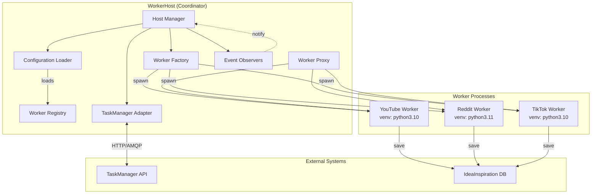

# PrismQ.Client.WorkerHost - Design Pattern Research and Implementation Strategy

**Version**: 1.0  
**Status**: Research & Design  
**Created**: 2025-11-14  
**Author**: PrismQ Architecture Team

---

## Table of Contents

- [Executive Summary](#executive-summary)
- [Problem Statement](#problem-statement)
- [Design Pattern Research](#design-pattern-research)
- [Selected Design Patterns](#selected-design-patterns)
- [Architecture Design](#architecture-design)
- [Configuration Schema](#configuration-schema)
- [Worker Protocol](#worker-protocol)
- [Implementation Strategy](#implementation-strategy)
- [Benefits and Trade-offs](#benefits-and-trade-offs)
- [Next Steps](#next-steps)

---

## Executive Summary

This document presents the research findings and implementation strategy for **PrismQ.Client.WorkerHost**, a general-purpose worker coordinator designed to manage heterogeneous Python workers with isolated dependencies.

**Core Principle**: The WorkerHost is a thin coordinator that knows what workers exist, where their virtualenvs are, and how to communicate with them, but contains **zero business logic**.

**Key Features**:
- Configuration-driven worker discovery
- Subprocess-based execution with isolated virtualenvs
- Stable JSON protocol for inter-process communication
- Support for multiple TaskManager integrations (HTTP, AMQP, Redis)
- Automatic timeout, retry, and logging infrastructure
- Zero-downtime worker addition (just update config)

---

## Problem Statement

### Current Challenges

1. **Dependency Hell**: Different workers require conflicting library versions
2. **Tight Coupling**: Business logic mixed with orchestration logic
3. **Limited Scalability**: Workers cannot easily be distributed across machines
4. **Complex Deployment**: Adding new workers requires code changes to the host
5. **Version Lock-in**: All workers must use same Python version

### Requirements

The WorkerHost must:

1. ✅ Be a thin coordinator with **no business logic**
2. ✅ Maintain a configuration file mapping worker namespaces to:
   - Project path
   - Virtualenv Python executable path
   - Module + function entrypoint
3. ✅ Receive tasks from TaskManager (HTTP/AMQP/Redis/etc.)
4. ✅ Spawn workers as subprocesses using their own venv
5. ✅ Communicate via JSON over stdin/stdout
6. ✅ Provide timeout, retry, and logging infrastructure
7. ✅ Support adding workers without code changes (config only)
8. ✅ Enable future distribution to remote machines

---

## Design Pattern Research

Reference: [Refactoring.Guru Design Patterns](https://refactoring.guru/design-patterns)

### Patterns Considered

#### 1. **Strategy Pattern** ⭐ SELECTED

**Category**: Behavioral  
**Intent**: Define a family of algorithms, encapsulate each one, and make them interchangeable.

**Why It Fits**:
- Each worker is a different "strategy" for processing tasks
- Workers are encapsulated and interchangeable
- Host doesn't need to know implementation details
- New strategies (workers) can be added without modifying host

**Application**:
```python
# Each worker implements the same protocol
class WorkerStrategy(Protocol):
    def process_task(self, task: dict) -> dict:
        """Process task and return result"""
        ...
```

#### 2. **Factory Method Pattern** ⭐ SELECTED

**Category**: Creational  
**Intent**: Define an interface for creating objects, but let subclasses decide which class to instantiate.

**Why It Fits**:
- WorkerHost needs to create different worker processes dynamically
- Configuration determines which worker to instantiate
- Decouples worker creation from worker usage

**Application**:
```python
class WorkerFactory:
    def create_worker(self, config: WorkerConfig) -> Worker:
        """Create worker subprocess based on configuration"""
        return SubprocessWorker(
            venv_python=config.venv_python,
            module_path=config.module_path,
            function=config.function
        )
```

#### 3. **Command Pattern** ⭐ SELECTED

**Category**: Behavioral  
**Intent**: Encapsulate a request as an object, thereby letting you parameterize clients with different requests.

**Why It Fits**:
- Tasks are commands to be executed by workers
- Commands can be queued, logged, and retried
- Supports undo/redo (task retry/rollback)

**Application**:
```python
class TaskCommand:
    def __init__(self, task_data: dict, worker: Worker):
        self.task_data = task_data
        self.worker = worker
    
    def execute(self) -> dict:
        return self.worker.process(self.task_data)
    
    def can_retry(self) -> bool:
        return self.attempt_count < self.max_retries
```

#### 4. **Adapter Pattern** ⭐ SELECTED

**Category**: Structural  
**Intent**: Convert the interface of a class into another interface clients expect.

**Why It Fits**:
- Different TaskManager interfaces (HTTP, AMQP, Redis) need uniform API
- Worker subprocess communication needs standard protocol adapter
- Enables future migration to remote workers

**Application**:
```python
class TaskManagerAdapter(Protocol):
    def receive_task(self) -> Optional[Task]:
        """Receive next task from queue"""
        ...
    
    def complete_task(self, task_id: str, result: dict) -> None:
        """Report task completion"""
        ...

# Concrete adapters
class HTTPTaskManagerAdapter(TaskManagerAdapter): ...
class AMQPTaskManagerAdapter(TaskManagerAdapter): ...
class RedisTaskManagerAdapter(TaskManagerAdapter): ...
```

#### 5. **Proxy Pattern**

**Category**: Structural  
**Intent**: Provide a surrogate or placeholder for another object to control access to it.

**Why It Fits**:
- Host acts as proxy between TaskManager and workers
- Provides additional functionality (logging, timeout, retry)
- Controls access to worker resources

**Application**:
```python
class WorkerProxy:
    def __init__(self, worker: Worker):
        self._worker = worker
        self._logger = logging.getLogger(__name__)
    
    def execute(self, task: dict, timeout: int = 300) -> dict:
        """Execute task with timeout and logging"""
        self._logger.info(f"Starting task {task['id']}")
        try:
            result = self._execute_with_timeout(task, timeout)
            self._logger.info(f"Task {task['id']} completed")
            return result
        except TimeoutError:
            self._logger.error(f"Task {task['id']} timed out")
            raise
```

#### 6. **Chain of Responsibility Pattern**

**Category**: Behavioral  
**Intent**: Pass requests along a chain of handlers.

**Why It Fits**:
- Multiple workers could handle a task based on capability
- Fallback to alternative workers on failure
- Pipeline processing of results

**Application** (Optional):
```python
class WorkerChain:
    def __init__(self):
        self._handlers: List[Worker] = []
    
    def add_handler(self, worker: Worker) -> None:
        self._handlers.append(worker)
    
    def handle(self, task: dict) -> dict:
        for worker in self._handlers:
            if worker.can_handle(task):
                return worker.process(task)
        raise NoWorkerAvailable(f"No worker can handle {task['type']}")
```

#### 7. **Observer Pattern**

**Category**: Behavioral  
**Intent**: Define a one-to-many dependency between objects.

**Why It Fits**:
- Multiple components need to react to task state changes
- Logging, metrics, and monitoring as observers
- Decouples event producers from consumers

**Application**:
```python
class TaskEventObserver(Protocol):
    def on_task_received(self, task: Task) -> None: ...
    def on_task_started(self, task: Task) -> None: ...
    def on_task_completed(self, task: Task, result: dict) -> None: ...
    def on_task_failed(self, task: Task, error: Exception) -> None: ...

# Observers
class LoggingObserver(TaskEventObserver): ...
class MetricsObserver(TaskEventObserver): ...
class MonitoringObserver(TaskEventObserver): ...
```

### Patterns NOT Selected

#### Template Method Pattern
- **Reason**: Too rigid for our needs; workers need complete independence
- Not suitable for subprocess-based execution

#### Singleton Pattern
- **Reason**: Anti-pattern for testing; use dependency injection instead
- WorkerHost should be instantiable multiple times for testing

#### Decorator Pattern
- **Reason**: While useful for adding functionality, Proxy better fits our needs
- Already using Proxy for worker wrapping

---

## Selected Design Patterns

### Primary Patterns (Core Architecture)

1. **Strategy Pattern**: Workers as interchangeable strategies
2. **Factory Method**: Dynamic worker instantiation from config
3. **Command Pattern**: Tasks as executable commands
4. **Adapter Pattern**: Uniform interface for different TaskManagers

### Secondary Patterns (Infrastructure)

5. **Proxy Pattern**: Worker wrapper for logging/timeout/retry
6. **Observer Pattern**: Event notification for monitoring
7. **Chain of Responsibility** (Optional): Worker fallback mechanism

---

## Architecture Design

### High-Level Architecture

```
┌─────────────────────────────────────────────────────────────────┐
│                     PrismQ.Client.WorkerHost                    │
│                      (Thin Coordinator)                         │
└─────────────────────────────────────────────────────────────────┘
                              │
                              ├─── Configuration Loader
                              │    (YAML/JSON)
                              │
                              ├─── TaskManager Adapter
                              │    (HTTP/AMQP/Redis/etc.)
                              │
                              ├─── Worker Factory
                              │    (Creates subprocess workers)
                              │
                              ├─── Worker Registry
                              │    (Maps task types → workers)
                              │
                              └─── Event Bus
                                   (Observers for monitoring)

┌─────────────────────────────────────────────────────────────────┐
│                          Worker Process                          │
│                   (Isolated Virtualenv)                          │
├─────────────────────────────────────────────────────────────────┤
│  1. Read JSON from stdin                                        │
│  2. Execute business logic                                      │
│  3. Write JSON result to stdout                                 │
│  4. Exit with appropriate code                                  │
└─────────────────────────────────────────────────────────────────┘
```

### Component Diagram



### Class Diagram (Core Components)

```python
# ============================================================================
# Core Interfaces (Protocols)
# ============================================================================

from typing import Protocol, Optional, Dict, Any, List
from dataclasses import dataclass
from pathlib import Path

@dataclass
class WorkerConfig:
    """Configuration for a single worker"""
    name: str  # e.g., "PrismQ.T.Idea.Inspiration.Source.Video.YouTube.VideoScraper"
    project_path: Path
    venv_python: Path
    module: str
    function: str
    task_types: List[str]
    timeout: int = 300
    max_retries: int = 3
    metadata: Dict[str, Any] = None


class TaskManagerAdapter(Protocol):
    """Interface for different TaskManager implementations"""
    
    def receive_task(self) -> Optional[Dict[str, Any]]:
        """Receive next task from queue"""
        ...
    
    def complete_task(self, task_id: str, success: bool, result: Optional[dict] = None, error: Optional[str] = None) -> None:
        """Report task completion"""
        ...
    
    def health_check(self) -> bool:
        """Check if TaskManager is healthy"""
        ...


class Worker(Protocol):
    """Interface for worker execution"""
    
    def process(self, task: Dict[str, Any]) -> Dict[str, Any]:
        """Process a task and return result"""
        ...
    
    def can_handle(self, task_type: str) -> bool:
        """Check if worker can handle this task type"""
        ...
    
    def health_check(self) -> bool:
        """Check if worker is healthy"""
        ...


class TaskEventObserver(Protocol):
    """Observer for task lifecycle events"""
    
    def on_task_received(self, task: Dict[str, Any]) -> None:
        ...
    
    def on_task_started(self, task: Dict[str, Any]) -> None:
        ...
    
    def on_task_completed(self, task: Dict[str, Any], result: Dict[str, Any]) -> None:
        ...
    
    def on_task_failed(self, task: Dict[str, Any], error: Exception) -> None:
        ...


# ============================================================================
# Concrete Implementations
# ============================================================================

class SubprocessWorker:
    """Worker that executes in a subprocess with isolated venv"""
    
    def __init__(self, config: WorkerConfig):
        self.config = config
        self._logger = logging.getLogger(f"worker.{config.name}")
    
    def process(self, task: Dict[str, Any]) -> Dict[str, Any]:
        """Execute task in subprocess"""
        cmd = [
            str(self.config.venv_python),
            '-m',
            self.config.module,
            self.config.function
        ]
        
        # Start subprocess
        process = subprocess.Popen(
            cmd,
            stdin=subprocess.PIPE,
            stdout=subprocess.PIPE,
            stderr=subprocess.PIPE,
            text=True,
            cwd=str(self.config.project_path)
        )
        
        # Send task via stdin
        task_json = json.dumps(task)
        stdout, stderr = process.communicate(input=task_json, timeout=self.config.timeout)
        
        # Parse result
        if process.returncode == 0:
            result = json.loads(stdout)
            return result
        else:
            raise WorkerExecutionError(f"Worker failed: {stderr}")
    
    def can_handle(self, task_type: str) -> bool:
        return task_type in self.config.task_types
    
    def health_check(self) -> bool:
        """Check if worker venv and module are accessible"""
        return self.config.venv_python.exists()


class WorkerFactory:
    """Factory for creating worker instances"""
    
    def __init__(self, configs: Dict[str, WorkerConfig]):
        self._configs = configs
    
    def create_worker(self, name: str) -> Worker:
        """Create worker by name"""
        if name not in self._configs:
            raise ValueError(f"Unknown worker: {name}")
        
        config = self._configs[name]
        return SubprocessWorker(config)
    
    def list_workers(self) -> List[str]:
        """List all available worker names"""
        return list(self._configs.keys())


class WorkerRegistry:
    """Registry mapping task types to workers"""
    
    def __init__(self):
        self._task_type_map: Dict[str, List[str]] = {}  # task_type -> [worker_names]
        self._worker_configs: Dict[str, WorkerConfig] = {}
    
    def register(self, config: WorkerConfig) -> None:
        """Register a worker configuration"""
        self._worker_configs[config.name] = config
        
        for task_type in config.task_types:
            if task_type not in self._task_type_map:
                self._task_type_map[task_type] = []
            self._task_type_map[task_type].append(config.name)
    
    def get_worker_for_task(self, task_type: str) -> Optional[str]:
        """Get worker name that can handle this task type"""
        workers = self._task_type_map.get(task_type, [])
        return workers[0] if workers else None
    
    def get_all_workers_for_task(self, task_type: str) -> List[str]:
        """Get all workers that can handle this task type"""
        return self._task_type_map.get(task_type, [])
    
    def get_config(self, worker_name: str) -> Optional[WorkerConfig]:
        """Get worker configuration by name"""
        return self._worker_configs.get(worker_name)


class WorkerProxy:
    """Proxy for adding cross-cutting concerns to worker execution"""
    
    def __init__(self, worker: Worker, config: WorkerConfig, observers: List[TaskEventObserver]):
        self._worker = worker
        self._config = config
        self._observers = observers
        self._logger = logging.getLogger(f"proxy.{config.name}")
    
    def process(self, task: Dict[str, Any]) -> Dict[str, Any]:
        """Execute task with logging, timeout, and retry logic"""
        self._notify_observers('on_task_started', task)
        
        for attempt in range(self._config.max_retries):
            try:
                self._logger.info(f"Processing task {task.get('id')} (attempt {attempt + 1})")
                
                result = self._worker.process(task)
                
                self._logger.info(f"Task {task.get('id')} completed successfully")
                self._notify_observers('on_task_completed', task, result)
                
                return result
                
            except Exception as e:
                self._logger.error(f"Task {task.get('id')} failed (attempt {attempt + 1}): {e}")
                
                if attempt == self._config.max_retries - 1:
                    self._notify_observers('on_task_failed', task, e)
                    raise
                
                # Exponential backoff
                time.sleep(2 ** attempt)
    
    def _notify_observers(self, method: str, *args) -> None:
        """Notify all observers of an event"""
        for observer in self._observers:
            getattr(observer, method)(*args)


class WorkerHost:
    """Main coordinator - thin layer with no business logic"""
    
    def __init__(
        self,
        config_path: Path,
        task_manager: TaskManagerAdapter,
        observers: Optional[List[TaskEventObserver]] = None
    ):
        self._config_path = config_path
        self._task_manager = task_manager
        self._observers = observers or []
        
        # Load configuration
        self._registry = WorkerRegistry()
        self._load_configuration()
        
        # Create factory
        self._factory = WorkerFactory(self._registry._worker_configs)
        
        self._logger = logging.getLogger("WorkerHost")
    
    def _load_configuration(self) -> None:
        """Load worker configurations from YAML/JSON"""
        with open(self._config_path) as f:
            if self._config_path.suffix == '.yaml' or self._config_path.suffix == '.yml':
                import yaml
                config_data = yaml.safe_load(f)
            else:
                config_data = json.load(f)
        
        for worker_data in config_data['workers']:
            config = WorkerConfig(
                name=worker_data['name'],
                project_path=Path(worker_data['project_path']),
                venv_python=Path(worker_data['venv_python']),
                module=worker_data['module'],
                function=worker_data['function'],
                task_types=worker_data['task_types'],
                timeout=worker_data.get('timeout', 300),
                max_retries=worker_data.get('max_retries', 3),
                metadata=worker_data.get('metadata', {})
            )
            self._registry.register(config)
    
    def run(self, poll_interval: int = 5) -> None:
        """Main event loop - receive and dispatch tasks"""
        self._logger.info("WorkerHost started")
        self._logger.info(f"Registered workers: {self._factory.list_workers()}")
        
        try:
            while True:
                # Receive task from TaskManager
                task = self._task_manager.receive_task()
                
                if task is None:
                    time.sleep(poll_interval)
                    continue
                
                self._notify_observers('on_task_received', task)
                
                # Find worker for task
                task_type = task.get('type') or task.get('task_type')
                worker_name = self._registry.get_worker_for_task(task_type)
                
                if not worker_name:
                    self._logger.error(f"No worker found for task type: {task_type}")
                    self._task_manager.complete_task(
                        task_id=task['id'],
                        success=False,
                        error=f"No worker registered for task type: {task_type}"
                    )
                    continue
                
                # Create and execute worker
                try:
                    worker = self._factory.create_worker(worker_name)
                    config = self._registry.get_config(worker_name)
                    
                    # Wrap in proxy for cross-cutting concerns
                    proxy = WorkerProxy(worker, config, self._observers)
                    
                    # Execute task
                    result = proxy.process(task)
                    
                    # Report success
                    self._task_manager.complete_task(
                        task_id=task['id'],
                        success=True,
                        result=result
                    )
                    
                except Exception as e:
                    self._logger.error(f"Failed to process task {task['id']}: {e}")
                    self._task_manager.complete_task(
                        task_id=task['id'],
                        success=False,
                        error=str(e)
                    )
        
        except KeyboardInterrupt:
            self._logger.info("WorkerHost shutdown requested")
        except Exception as e:
            self._logger.error(f"WorkerHost error: {e}", exc_info=True)
            raise
    
    def _notify_observers(self, method: str, *args) -> None:
        """Notify all observers of an event"""
        for observer in self._observers:
            getattr(observer, method)(*args)
```

---

## Configuration Schema

### YAML Configuration Format

```yaml
# workerhost_config.yaml
version: "1.0"

# TaskManager Configuration
task_manager:
  type: "http"  # or "amqp", "redis"
  url: "https://api.prismq.nomoos.cz/api"
  api_key: "${TASKMANAGER_API_KEY}"  # Environment variable
  poll_interval: 5
  timeout: 30

# Worker Definitions
workers:
  - name: "PrismQ.T.Idea.Inspiration.Source.Video.YouTube.VideoScraper"
    project_path: "./Source/Video/YouTube/Video"
    venv_python: "./Source/Video/YouTube/Video/venv/bin/python"
    module: "src.workers.video_scraper"
    function: "main"
    task_types:
      - "PrismQ.YouTube.VideoScrape"
      - "PrismQ.YouTube.VideoAnalysis"
    timeout: 300  # 5 minutes
    max_retries: 3
    metadata:
      description: "Scrapes YouTube videos and saves to IdeaInspiration"
      version: "1.0.0"
      python_version: "3.10"
  
  - name: "PrismQ.T.Idea.Inspiration.Source.Text.Reddit.PostScraper"
    project_path: "./Source/Text/Reddit/Posts"
    venv_python: "./Source/Text/Reddit/Posts/venv/Scripts/python.exe"  # Windows
    module: "src.workers.reddit_scraper"
    function: "main"
    task_types:
      - "PrismQ.Reddit.PostScrape"
      - "PrismQ.Reddit.SubredditScrape"
    timeout: 180  # 3 minutes
    max_retries: 3
    metadata:
      description: "Scrapes Reddit posts and comments"
      version: "1.0.0"
      python_version: "3.11"
  
  - name: "PrismQ.T.Idea.Inspiration.Classification.ContentClassifier"
    project_path: "./Classification"
    venv_python: "./Classification/venv/bin/python"
    module: "src.workers.classifier"
    function: "main"
    task_types:
      - "PrismQ.Classification.Categorize"
      - "PrismQ.Classification.DetectStory"
    timeout: 120
    max_retries: 2
    metadata:
      description: "Classifies content and detects story potential"
      version: "1.0.0"
      python_version: "3.10"

# Logging Configuration
logging:
  level: "INFO"
  format: "%(asctime)s - %(name)s - %(levelname)s - %(message)s"
  file: "logs/workerhost.log"
  max_bytes: 10485760  # 10MB
  backup_count: 5

# Monitoring and Observability
monitoring:
  enabled: true
  metrics_port: 9090
  health_check_port: 8080
```

### JSON Configuration Format (Alternative)

```json
{
  "version": "1.0",
  "task_manager": {
    "type": "http",
    "url": "https://api.prismq.nomoos.cz/api",
    "api_key": "${TASKMANAGER_API_KEY}",
    "poll_interval": 5,
    "timeout": 30
  },
  "workers": [
    {
      "name": "PrismQ.T.Idea.Inspiration.Source.Video.YouTube.VideoScraper",
      "project_path": "./Source/Video/YouTube/Video",
      "venv_python": "./Source/Video/YouTube/Video/venv/bin/python",
      "module": "src.workers.video_scraper",
      "function": "main",
      "task_types": [
        "PrismQ.YouTube.VideoScrape",
        "PrismQ.YouTube.VideoAnalysis"
      ],
      "timeout": 300,
      "max_retries": 3,
      "metadata": {
        "description": "Scrapes YouTube videos and saves to IdeaInspiration",
        "version": "1.0.0",
        "python_version": "3.10"
      }
    }
  ],
  "logging": {
    "level": "INFO",
    "format": "%(asctime)s - %(name)s - %(levelname)s - %(message)s",
    "file": "logs/workerhost.log"
  }
}
```

---

## Worker Protocol

### JSON Protocol Specification

Workers communicate with the host via **JSON over stdin/stdout**.

#### Input Format (stdin)

```json
{
  "id": "task-12345",
  "type": "PrismQ.YouTube.VideoScrape",
  "params": {
    "video_id": "dQw4w9WgXcQ",
    "include_comments": false
  },
  "metadata": {
    "priority": 5,
    "created_at": "2025-11-14T15:30:00Z",
    "worker_id": "host-001"
  }
}
```

#### Output Format (stdout)

**Success:**
```json
{
  "success": true,
  "result": {
    "idea_inspiration_id": "uuid-here",
    "video_id": "dQw4w9WgXcQ",
    "title": "Video Title",
    "processed_at": "2025-11-14T15:35:00Z"
  },
  "logs": [
    {"level": "INFO", "message": "Started processing video"},
    {"level": "INFO", "message": "Fetched video metadata"},
    {"level": "INFO", "message": "Saved to database"}
  ]
}
```

**Failure:**
```json
{
  "success": false,
  "error": {
    "type": "VideoNotFoundError",
    "message": "Video with ID dQw4w9WgXcQ not found",
    "traceback": "Traceback (most recent call last):\n  ...",
    "retry_possible": false
  },
  "logs": [
    {"level": "INFO", "message": "Started processing video"},
    {"level": "ERROR", "message": "Video not found"}
  ]
}
```

#### Exit Codes

- **0**: Success
- **1**: Failure (retriable)
- **2**: Failure (not retriable - e.g., validation error)
- **3**: Timeout
- **130**: Interrupted (Ctrl+C)

### Worker Implementation Template

```python
#!/usr/bin/env python3
"""
Worker Template - Implements the WorkerHost protocol
"""

import sys
import json
import logging
from typing import Dict, Any
from datetime import datetime, timezone

# Configure logging to stderr (stdout is reserved for result JSON)
logging.basicConfig(
    stream=sys.stderr,
    level=logging.INFO,
    format='%(asctime)s - %(name)s - %(levelname)s - %(message)s'
)
logger = logging.getLogger(__name__)


class WorkerProtocolHandler:
    """Helper class for WorkerHost protocol compliance"""
    
    @staticmethod
    def read_task() -> Dict[str, Any]:
        """Read task from stdin"""
        task_json = sys.stdin.read()
        return json.loads(task_json)
    
    @staticmethod
    def write_success(result: Dict[str, Any], logs: list = None) -> None:
        """Write success result to stdout"""
        output = {
            "success": True,
            "result": result,
            "logs": logs or []
        }
        print(json.dumps(output))
        sys.stdout.flush()
    
    @staticmethod
    def write_failure(error_type: str, error_message: str, traceback: str = None, retry_possible: bool = True, logs: list = None) -> None:
        """Write failure result to stdout"""
        output = {
            "success": False,
            "error": {
                "type": error_type,
                "message": error_message,
                "traceback": traceback,
                "retry_possible": retry_possible
            },
            "logs": logs or []
        }
        print(json.dumps(output))
        sys.stdout.flush()


def process_task(task: Dict[str, Any]) -> Dict[str, Any]:
    """
    Business logic goes here.
    
    Args:
        task: Task data from WorkerHost
        
    Returns:
        Result dictionary with processing output
    """
    logger.info(f"Processing task {task['id']}")
    
    # Example: YouTube video scraping
    video_id = task['params']['video_id']
    
    # 1. Fetch video data (your logic here)
    video_data = {
        'title': 'Example Video',
        'description': 'Example description',
        # ... more fields
    }
    
    # 2. Save to IdeaInspiration database (your logic here)
    idea_id = "example-uuid-here"
    
    # 3. Return result
    return {
        "idea_inspiration_id": idea_id,
        "video_id": video_id,
        "title": video_data['title'],
        "processed_at": datetime.now(timezone.utc).isoformat()
    }


def main():
    """
    Main entrypoint - implements WorkerHost protocol.
    
    Protocol:
    1. Read JSON task from stdin
    2. Process task (business logic)
    3. Write JSON result to stdout
    4. Exit with appropriate code
    """
    protocol = WorkerProtocolHandler()
    logs = []
    
    try:
        # Step 1: Read task
        task = protocol.read_task()
        logs.append({"level": "INFO", "message": f"Received task {task.get('id')}"})
        
        # Step 2: Process task
        result = process_task(task)
        logs.append({"level": "INFO", "message": "Task completed successfully"})
        
        # Step 3: Write success result
        protocol.write_success(result, logs)
        
        # Step 4: Exit with success code
        sys.exit(0)
        
    except json.JSONDecodeError as e:
        # Invalid JSON input (not retriable)
        protocol.write_failure(
            error_type="JSONDecodeError",
            error_message=f"Invalid JSON input: {e}",
            retry_possible=False,
            logs=logs
        )
        sys.exit(2)
    
    except ValueError as e:
        # Validation error (not retriable)
        protocol.write_failure(
            error_type="ValidationError",
            error_message=str(e),
            retry_possible=False,
            logs=logs
        )
        sys.exit(2)
    
    except Exception as e:
        # Unexpected error (retriable)
        import traceback
        protocol.write_failure(
            error_type=type(e).__name__,
            error_message=str(e),
            traceback=traceback.format_exc(),
            retry_possible=True,
            logs=logs
        )
        sys.exit(1)


if __name__ == "__main__":
    main()
```

---

## Implementation Strategy

### Phase 1: Core Infrastructure (Week 1)

#### 1.1 Project Setup
- [ ] Create `Client/WorkerHost` module structure
- [ ] Setup pyproject.toml with dependencies
- [ ] Create basic directory structure
- [ ] Setup logging infrastructure

#### 1.2 Configuration System
- [ ] Implement `WorkerConfig` dataclass
- [ ] Create YAML/JSON configuration loader
- [ ] Add environment variable substitution
- [ ] Validate configuration schema

#### 1.3 Worker Registry
- [ ] Implement `WorkerRegistry` class
- [ ] Add worker registration logic
- [ ] Create task type → worker mapping
- [ ] Add registry query methods

#### 1.4 Worker Factory
- [ ] Implement `WorkerFactory` class
- [ ] Add subprocess worker creation
- [ ] Handle venv path resolution (Windows/Linux)
- [ ] Add worker health checks

### Phase 2: Worker Execution (Week 2)

#### 2.1 Subprocess Worker
- [ ] Implement `SubprocessWorker` class
- [ ] Add JSON stdin/stdout protocol
- [ ] Handle process lifecycle (start/monitor/terminate)
- [ ] Add timeout handling
- [ ] Capture stdout/stderr

#### 2.2 Worker Proxy
- [ ] Implement `WorkerProxy` class
- [ ] Add retry logic with exponential backoff
- [ ] Add comprehensive logging
- [ ] Integrate with observer pattern

#### 2.3 Protocol Handler
- [ ] Create worker template script
- [ ] Document protocol specification
- [ ] Add protocol validation
- [ ] Create example workers

### Phase 3: TaskManager Integration (Week 3)

#### 3.1 Adapter Pattern
- [ ] Define `TaskManagerAdapter` protocol
- [ ] Implement HTTP adapter (existing TaskManager)
- [ ] Add AMQP adapter (RabbitMQ)
- [ ] Add Redis adapter (optional)

#### 3.2 WorkerHost Main Loop
- [ ] Implement main event loop
- [ ] Add task polling logic
- [ ] Handle task dispatching
- [ ] Add graceful shutdown

#### 3.3 Error Handling
- [ ] Add comprehensive exception handling
- [ ] Implement retry strategies
- [ ] Add dead letter queue support
- [ ] Create error reporting

### Phase 4: Observability (Week 4)

#### 4.1 Observer Pattern
- [ ] Define `TaskEventObserver` protocol
- [ ] Implement logging observer
- [ ] Add metrics observer (Prometheus)
- [ ] Create monitoring dashboard observer

#### 4.2 Health Checks
- [ ] Add WorkerHost health endpoint
- [ ] Check worker venv availability
- [ ] Monitor TaskManager connectivity
- [ ] Add liveness/readiness probes

#### 4.3 Logging
- [ ] Structured logging (JSON)
- [ ] Log aggregation setup
- [ ] Add correlation IDs
- [ ] Create log rotation

### Phase 5: Testing & Documentation (Week 5)

#### 5.1 Unit Tests
- [ ] Test configuration loader
- [ ] Test worker registry
- [ ] Test worker factory
- [ ] Test subprocess worker
- [ ] Test proxy and observers
- [ ] Test adapters

#### 5.2 Integration Tests
- [ ] Test full workflow (config → execution → result)
- [ ] Test error scenarios
- [ ] Test retry logic
- [ ] Test timeout handling
- [ ] Test multiple workers

#### 5.3 Documentation
- [ ] API documentation
- [ ] Configuration guide
- [ ] Worker implementation guide
- [ ] Deployment guide
- [ ] Troubleshooting guide

### Phase 6: Production Readiness (Week 6)

#### 6.1 Performance Optimization
- [ ] Profile subprocess overhead
- [ ] Optimize JSON parsing
- [ ] Add worker pooling (optional)
- [ ] Memory leak detection

#### 6.2 Security
- [ ] Validate worker configurations
- [ ] Secure environment variables
- [ ] Add authentication for health endpoints
- [ ] Security audit

#### 6.3 Deployment
- [ ] Create Docker container (optional)
- [ ] Setup systemd service (Linux)
- [ ] Setup Windows service
- [ ] Create deployment scripts

---

## Benefits and Trade-offs

### Benefits ✅

1. **Dependency Isolation**
   - Workers can use conflicting library versions
   - Different Python versions per worker
   - No dependency hell

2. **Fault Isolation**
   - Worker crashes don't affect host
   - Other workers continue running
   - Easy to identify failing workers

3. **Scalability**
   - Horizontal scaling: distribute workers across machines
   - Vertical scaling: multiple worker instances
   - Future: Kubernetes deployment

4. **Maintainability**
   - Add/remove workers via config change only
   - No code changes to host
   - Clear separation of concerns

5. **Testing**
   - Workers can be tested independently
   - Mock TaskManager easily
   - Protocol validation

6. **Flexibility**
   - Support multiple TaskManager implementations
   - Workers written in any language (future)
   - Easy migration to remote workers

### Trade-offs ⚠️

1. **Subprocess Overhead**
   - Process spawning takes time (~100-500ms)
   - Higher memory usage (each worker has own Python interpreter)
   - **Mitigation**: Worker pooling, process reuse for multiple tasks

2. **Communication Latency**
   - JSON serialization overhead
   - stdin/stdout communication slower than in-process
   - **Mitigation**: Binary protocol (msgpack), socket communication

3. **Debugging Complexity**
   - Harder to debug across process boundaries
   - Need structured logging
   - **Mitigation**: Comprehensive logging, trace IDs

4. **Resource Management**
   - Multiple Python processes consume more memory
   - Need proper cleanup on shutdown
   - **Mitigation**: Resource limits, graceful shutdown

5. **Configuration Complexity**
   - More configuration to manage
   - Path management (Windows vs Linux)
   - **Mitigation**: Configuration validation, clear documentation

### When to Use vs. Not Use

**Use WorkerHost when:**
- ✅ Workers have conflicting dependencies
- ✅ Need to add workers frequently
- ✅ Workers use different Python versions
- ✅ Need fault isolation
- ✅ Planning to distribute workers

**Don't use WorkerHost when:**
- ❌ All workers have compatible dependencies
- ❌ Workers are very short-lived (<100ms)
- ❌ Need sub-millisecond latency
- ❌ Running on resource-constrained devices

---

## Next Steps

### Immediate Actions (This Week)

1. **Get Approval**: Review this design with stakeholders
2. **Create Module**: Initialize `Client/WorkerHost` module structure
3. **Implement Core**: Start with Phase 1 (Configuration + Registry)
4. **Create Example**: Build one working example worker

### Short-term Goals (Month 1)

1. Complete Phases 1-3 (Core + Execution + Integration)
2. Migrate YouTube worker to new protocol
3. Document worker migration guide
4. Create comprehensive tests

### Long-term Vision (Quarter 1)

1. Migrate all existing workers
2. Add AMQP support for distributed task queues
3. Create worker marketplace (internal)
4. Deploy to production

### Success Metrics

- **Configuration-only worker addition**: <5 minutes
- **Worker startup time**: <2 seconds
- **Task processing overhead**: <200ms
- **Test coverage**: >85%
- **Documentation**: Complete API docs + 3 guides

---

## Appendices

### A. Design Pattern Quick Reference

| Pattern | Category | Usage |
|---------|----------|-------|
| Strategy | Behavioral | Workers as strategies |
| Factory Method | Creational | Worker instantiation |
| Command | Behavioral | Task encapsulation |
| Adapter | Structural | TaskManager interfaces |
| Proxy | Structural | Worker wrapping |
| Observer | Behavioral | Event notification |
| Chain of Responsibility | Behavioral | Worker fallback (optional) |

### B. Related Documentation

- [Refactoring.Guru - Strategy Pattern](https://refactoring.guru/design-patterns/strategy)
- [Refactoring.Guru - Factory Method](https://refactoring.guru/design-patterns/factory-method)
- [Refactoring.Guru - Command Pattern](https://refactoring.guru/design-patterns/command)
- [Refactoring.Guru - Adapter Pattern](https://refactoring.guru/design-patterns/adapter)
- [TaskManager API Documentation](./Source/TaskManager/README.md)
- [Worker Implementation Guide](./Source/TaskManager/_meta/docs/WORKER_IMPLEMENTATION_GUIDE.md)

### C. Glossary

- **WorkerHost**: Thin coordinator that manages worker execution
- **Worker**: Subprocess that executes business logic
- **TaskManager**: External service for task queue management
- **Protocol**: JSON-based communication standard between host and workers
- **Adapter**: Interface wrapper for different TaskManager implementations
- **Registry**: Mapping of task types to available workers
- **Proxy**: Wrapper that adds cross-cutting concerns (logging, retry, etc.)

---

**Document Status**: Complete  
**Next Review**: After stakeholder approval  
**Maintenance**: Update as implementation progresses
