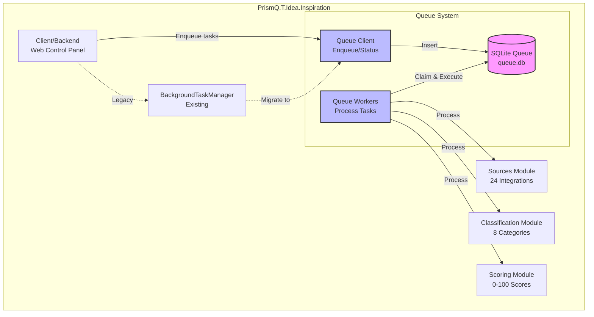
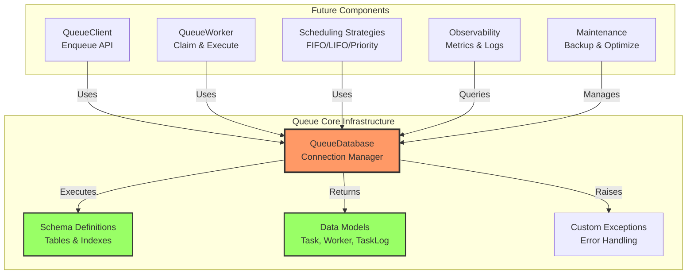
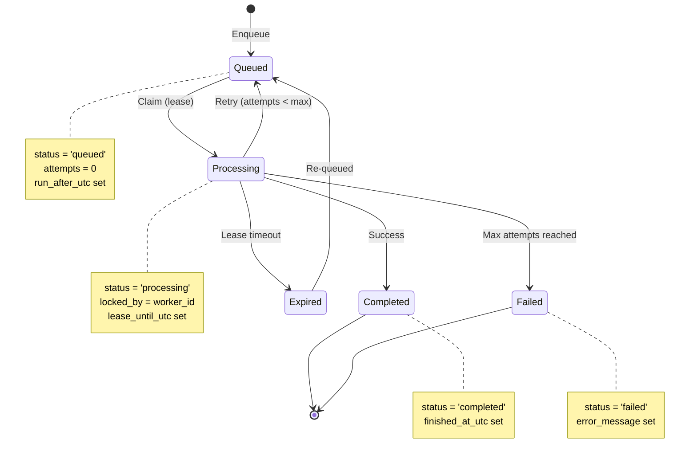
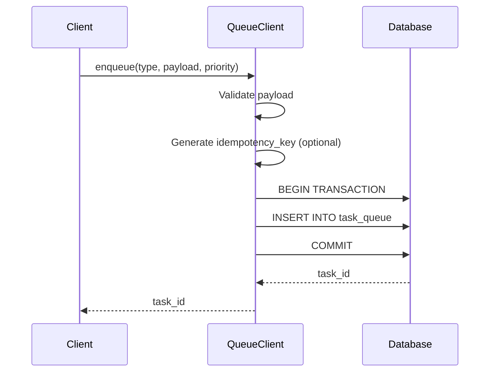
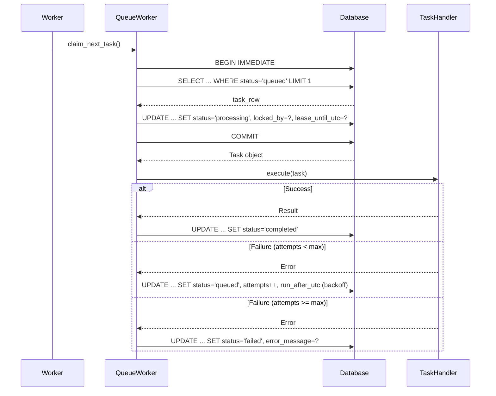
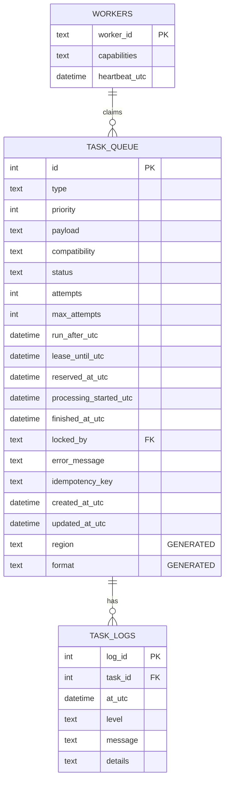
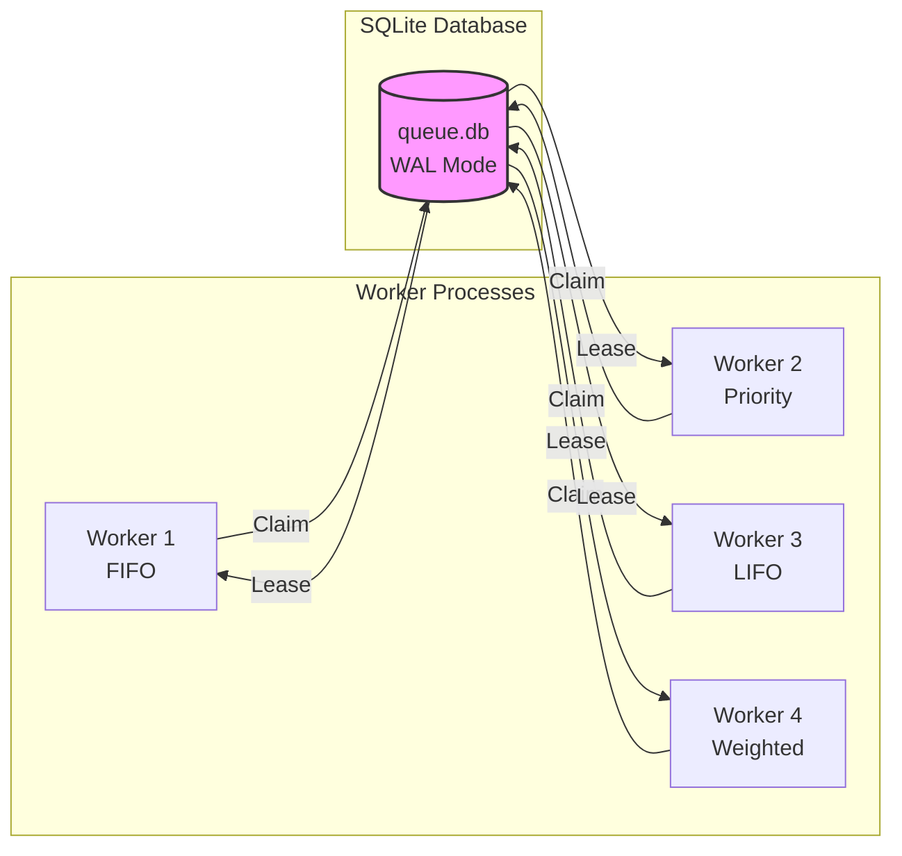

# SQLite Queue System Architecture

**Version**: 1.0  
**Status**: Implemented (Phase 1)  
**Created**: 2025-11-05  
**Last Updated**: 2025-11-05

---

## Table of Contents

- [Overview](#overview)
- [System Context](#system-context)
- [Component Architecture](#component-architecture)
- [Data Flow](#data-flow)
- [Database Schema](#database-schema)
- [Concurrency Model](#concurrency-model)
- [Design Decisions](#design-decisions)
- [Technology Stack](#technology-stack)
- [Integration Points](#integration-points)

---

## Overview

### Purpose and Goals

The PrismQ SQLite Queue System provides a **persistent, reliable task queue** for distributed work processing with the following goals:

**Primary Goals**:
1. **Persistence**: Tasks survive server crashes and restarts
2. **Atomic Claiming**: Prevent duplicate task execution across workers
3. **Priority Management**: Support FIFO, LIFO, Priority, and Weighted Random scheduling
4. **Retry Logic**: Automatic retry with exponential backoff for failed tasks
5. **Observability**: SQL-queryable metrics and comprehensive logging

**Why SQLite Queue?**

The current `BackgroundTaskManager` provides fire-and-forget execution but lacks persistence and distributed work capabilities. A SQLite-based queue provides a middle ground between:
- **In-Memory Queues** (current): Fast but not persistent
- **Full Message Brokers** (RabbitMQ, Redis): Powerful but complex infrastructure

### What Problems Does It Solve?

| Problem | Current State | SQLite Queue Solution |
|---------|--------------|---------------------|
| Task persistence | Lost on crash | Survived in database |
| Distributed work | Single process only | Multiple worker processes |
| Priority scheduling | None | FIFO/LIFO/Priority/Weighted |
| Retry logic | Limited | Exponential backoff |
| Observability | Minimal | SQL-queryable metrics |
| Atomic claiming | No protection | Lease-based locking |

### Component Overview

The queue system consists of five major components:

1. **Core Infrastructure** (`database.py`, `schema.py`, `models.py`)
   - SQLite connection management
   - Schema creation and migration
   - Data models and serialization

2. **Scheduling Strategies** (Future: Issue #327)
   - FIFO (First In, First Out)
   - LIFO (Last In, First Out)  
   - Priority (highest priority first)
   - Weighted Random (load balancing)

3. **Worker Engine** (Future: Issue #325)
   - Task claiming with atomic leases
   - Task execution and retry logic
   - Heartbeat and worker registration

4. **Observability** (Future: Issue #329)
   - Metrics collection and aggregation
   - Task logs and debugging
   - Worker monitoring

5. **Maintenance** (Future: Issue #331)
   - Database backup and recovery
   - WAL checkpoint management
   - VACUUM optimization

### Design Principles

The system follows these core design principles:

**SOLID Principles**:
- **Single Responsibility**: Each class has one clear purpose
- **Open/Closed**: Extensible without modification
- **Liskov Substitution**: Subtypes are interchangeable
- **Interface Segregation**: Minimal, focused interfaces
- **Dependency Inversion**: Depend on abstractions (Protocols)

**Additional Principles**:
- **Simplicity**: Simple architecture over complex infrastructure
- **Windows First**: Optimized for Windows RTX 5090 platform
- **Gradual Migration**: Can coexist with existing BackgroundTaskManager
- **Future-Proof**: Clear upgrade path to PostgreSQL if needed

---

## System Context

### Queue System in PrismQ Ecosystem



### External Dependencies

- **Python 3.10**: Required for compatibility with DaVinci Resolve
- **SQLite 3**: Built into Python standard library
- **Windows Platform**: Optimized for Windows 10/11 with NVIDIA RTX 5090
- **Local SSD**: Database must be on local storage (not network share)

---

## Component Architecture

### High-Level Components



### Component Responsibilities

#### QueueDatabase (Core)
**Responsibility**: Manage SQLite connection lifecycle and transactions

**Key Features**:
- Thread-safe connection management with RLock
- Windows-optimized PRAGMA settings
- Context manager support for transactions
- IMMEDIATE transaction mode for atomic claiming

**Dependencies**: None (foundational component)

#### Schema Definitions (Core)
**Responsibility**: Define database structure

**Key Features**:
- 3 tables: `task_queue`, `workers`, `task_logs`
- Performance-optimized indexes
- Generated columns for JSON filtering
- Foreign key constraints

**Dependencies**: None

#### Data Models (Core)
**Responsibility**: Type-safe data representation

**Key Features**:
- Dataclass-based models (Task, Worker, TaskLog)
- JSON serialization/deserialization
- Datetime handling (SQLite and ISO formats)
- Payload validation

**Dependencies**: None

#### QueueClient (Future - #323)
**Responsibility**: Task enqueueing and status polling

**Key Features**:
- Enqueue tasks with priority
- Idempotency key support
- Task status queries
- Bulk operations

**Dependencies**: QueueDatabase, Models

#### QueueWorker (Future - #325)
**Responsibility**: Task claiming and execution

**Key Features**:
- Atomic task claiming with leases
- Retry logic with exponential backoff
- Worker heartbeat registration
- Capability-based filtering

**Dependencies**: QueueDatabase, Models, SchedulingStrategy

#### Scheduling Strategies (Future - #327)
**Responsibility**: Task selection algorithms

**Key Features**:
- FIFO: First In, First Out (background jobs)
- LIFO: Last In, First Out (user actions)
- Priority: Highest priority first (time-sensitive)
- Weighted Random: Load balancing (distributed work)

**Dependencies**: QueueDatabase

---

## Data Flow

### Task Lifecycle



### Enqueue Flow



### Claim and Execute Flow



---

## Database Schema

### Entity-Relationship Diagram



### Table Details

#### task_queue
**Purpose**: Store all tasks with their execution state

**Key Columns**:
- `id`: Autoincrement primary key
- `type`: Task type identifier (e.g., "video_processing")
- `priority`: Priority level (lower = higher priority, default: 100)
- `payload`: JSON task data
- `compatibility`: JSON worker compatibility requirements
- `status`: Task state (queued, processing, completed, failed)
- `attempts`: Current execution attempt count
- `locked_by`: Worker ID that claimed the task
- `lease_until_utc`: Lease expiration time
- `idempotency_key`: Unique key to prevent duplicate tasks

**Generated Columns**:
- `region`: Extracted from `compatibility.region` for filtering
- `format`: Extracted from `payload.format` for filtering

**Indexes**:
1. `ix_task_status_prio_time`: Multi-column index (status, priority, run_after_utc, id)
   - **Purpose**: Fast task claiming queries
   - **Usage**: `SELECT ... WHERE status='queued' ORDER BY priority, run_after_utc LIMIT 1`

2. `ix_task_type_status`: Index (type, status)
   - **Purpose**: Filter tasks by type and status
   - **Usage**: `SELECT ... WHERE type='video_processing' AND status='completed'`

3. `ix_task_region`: Index (region)
   - **Purpose**: Worker capability matching
   - **Usage**: `SELECT ... WHERE region='us-west'`

4. `uq_task_idempotency`: Unique index (idempotency_key) WHERE idempotency_key IS NOT NULL
   - **Purpose**: Prevent duplicate task submissions
   - **Usage**: Automatic duplicate detection on INSERT

#### workers
**Purpose**: Register active workers and track heartbeats

**Key Columns**:
- `worker_id`: Unique worker identifier (e.g., "worker-01")
- `capabilities`: JSON worker capabilities
- `heartbeat_utc`: Last heartbeat timestamp

**Usage**: Workers update heartbeat every 30 seconds; stale workers (>2 minutes) are considered dead

#### task_logs
**Purpose**: Store task execution logs for debugging

**Key Columns**:
- `log_id`: Autoincrement primary key
- `task_id`: Foreign key to task_queue
- `at_utc`: Log timestamp
- `level`: Log level (INFO, WARNING, ERROR)
- `message`: Short log message
- `details`: Additional JSON details

**Index**:
- `ix_logs_task`: Index (task_id, at_utc)
  - **Purpose**: Fast log retrieval for a task
  - **Usage**: `SELECT ... WHERE task_id=? ORDER BY at_utc`

---

## Concurrency Model

### How Multiple Workers Interact



### Atomic Claiming with Leases

**Problem**: Multiple workers must claim tasks without duplicates

**Solution**: IMMEDIATE transactions + Lease-based locking

```python
# Atomic claim operation
with immediate_transaction(conn):
    # Step 1: SELECT next available task
    cursor = conn.execute("""
        SELECT * FROM task_queue
        WHERE status = 'queued'
          AND run_after_utc <= datetime('now')
        ORDER BY priority ASC, run_after_utc ASC
        LIMIT 1
    """)
    task = cursor.fetchone()
    
    if task:
        # Step 2: UPDATE to claim with lease
        conn.execute("""
            UPDATE task_queue
            SET status = 'processing',
                locked_by = ?,
                lease_until_utc = datetime('now', '+5 minutes'),
                reserved_at_utc = datetime('now'),
                processing_started_utc = datetime('now')
            WHERE id = ?
        """, (worker_id, task['id']))
```

**Why IMMEDIATE Transactions?**
- **BEGIN IMMEDIATE**: Acquires reserved lock immediately
- **Prevents**: Multiple workers from selecting the same task
- **Trade-off**: Slightly higher lock contention, but guaranteed atomicity

### WAL Mode Concurrency

**Write-Ahead Logging (WAL)** enables concurrent reads during writes:

- **Multiple Readers**: Can query while writer is active
- **Single Writer**: Only one write transaction at a time
- **Checkpoint**: Periodically merges WAL into main database

**Benefits**:
- Transaction overhead: 30ms → <1ms
- Read concurrency: Unlimited readers
- Write throughput: ~1000 tasks/min (single writer limit)

**Checkpoint Management**:
```python
# Auto-checkpoint every 1000 pages
PRAGMA wal_autocheckpoint = 1000

# Manual checkpoint (future: Issue #331)
PRAGMA wal_checkpoint(TRUNCATE)
```

### Lease Timeout and Recovery

**Problem**: Worker crashes while processing task

**Solution**: Lease timeout + Background cleanup

```python
# Lease expires after 5 minutes (configurable)
lease_until_utc = datetime('now', '+5 minutes')

# Background cleanup job (runs every 1 minute)
UPDATE task_queue
SET status = 'queued',
    locked_by = NULL,
    lease_until_utc = NULL
WHERE status = 'processing'
  AND lease_until_utc < datetime('now')
```

**Lease Renewal** (for long-running tasks):
```python
# Worker renews lease every 2 minutes
UPDATE task_queue
SET lease_until_utc = datetime('now', '+5 minutes')
WHERE id = ? AND locked_by = ?
```

---

## Design Decisions

### Why SQLite over MySQL/PostgreSQL/Redis?

#### Decision: Use SQLite for Initial Implementation ✅

**Rationale**:

| Criterion | SQLite | MySQL/PostgreSQL | Redis |
|-----------|--------|------------------|-------|
| **Infrastructure** | ✅ Zero (single file) | ❌ Separate server | ❌ Separate server |
| **RAM Usage** | ✅ Minimal (~20MB cache) | ❌ 150-500MB server | ❌ In-memory first |
| **Windows Support** | ✅ Native | ✅ Good | ⚠️ WSL required |
| **Throughput** | ✅ 200-500/min (sufficient) | ✅ 10k+/min (overkill) | ✅ 50k+/min (overkill) |
| **Persistence** | ✅ ACID guaranteed | ✅ ACID guaranteed | ⚠️ Requires config |
| **Observability** | ✅ SQL queries | ✅ SQL queries | ❌ Limited (no SQL) |
| **Complexity** | ✅ Simple | ❌ Complex setup | ❌ Complex setup |

**Pros of SQLite**:
- ✅ Zero infrastructure (no Redis, RabbitMQ, MySQL server)
- ✅ Single file database on local SSD
- ✅ ACID guarantees (same as MySQL/PostgreSQL)
- ✅ Windows-native support
- ✅ SQL-queryable metrics
- ✅ Simple backup and migration
- ✅ Perfect for 200-500 tasks/min workload
- ✅ Matches "simple architecture" principle

**Cons of SQLite**:
- ⚠️ Single writer (~1000 tasks/min limit)
- ⚠️ Requires periodic maintenance (VACUUM)
- ⚠️ Windows file locking differences

**Upgrade Path**: Can migrate to PostgreSQL when throughput exceeds 800-1000 tasks/min

### WAL Mode Selection

#### Decision: Use WAL (Write-Ahead Logging) Mode ✅

**Rationale**:
- **Concurrency**: WAL allows unlimited concurrent readers
- **Performance**: Reduces transaction overhead from 30ms to <1ms
- **Durability**: Still provides ACID guarantees with `synchronous=NORMAL`

**Benefits**:
```python
# Before WAL (DELETE journal mode)
PRAGMA journal_mode = DELETE  # 30ms per transaction

# After WAL
PRAGMA journal_mode = WAL  # <1ms per transaction
```

**Trade-offs**:
- Requires periodic checkpoints (managed automatically)
- Slightly larger disk usage (WAL + main database)
- Requires SQLite 3.7.0+ (we have 3.x)

### Scheduling Strategies

#### Decision: Support 4 Strategies (FIFO, LIFO, Priority, Weighted Random) ✅

**Rationale**: Different use cases require different scheduling

| Strategy | SQL ORDER BY | Use Case | Fairness | Starvation Risk |
|----------|--------------|----------|----------|-----------------|
| **FIFO** | `run_after_utc ASC, id ASC` | Background jobs | High | Low |
| **LIFO** | `run_after_utc DESC, id DESC` | User actions | Low | High (old tasks) |
| **Priority** | `priority ASC, run_after_utc ASC` | Time-sensitive | None | High (low priority) |
| **Weighted Random** | `RANDOM()` with priority weights | Load balancing | Medium | Low |

**Implementation** (Future: Issue #327):
- Each worker can choose its strategy
- Configurable per task type
- Default: Priority (most common)

### Windows Optimization

#### Decision: Tune PRAGMAs for Windows SSD ✅

**Rationale**: Windows file locking and NTFS behavior differ from POSIX

**Optimizations**:
```python
PRAGMAS = {
    'journal_mode': 'WAL',           # Concurrency
    'synchronous': 'NORMAL',         # Balance durability vs performance
    'busy_timeout': 5000,            # 5 sec lock retries (Windows needs higher)
    'wal_autocheckpoint': 1000,      # Checkpoint frequency
    'foreign_keys': 'ON',            # Data integrity
    'temp_store': 'MEMORY',          # Temp tables in RAM
    'mmap_size': 134217728,          # 128MB memory-mapped I/O
    'page_size': 4096,               # Match NTFS block size
    'cache_size': -20000,            # ~20MB cache
}
```

**Why These Values?**:
- `busy_timeout=5000`: Windows file locking is slower; 5 seconds prevents spurious SQLITE_BUSY errors
- `page_size=4096`: Matches NTFS allocation unit size for optimal I/O
- `mmap_size=128MB`: Memory-mapped I/O reduces system calls on Windows

### Future Migration Path

#### Decision: Design for PostgreSQL Migration ✅

**Rationale**: As workload grows, SQLite may become a bottleneck

**Migration Strategy**:
1. **Monitor Metrics**: Track throughput, SQLITE_BUSY rate
2. **Trigger**: Migrate when throughput exceeds 800 tasks/min or SQLITE_BUSY >5%
3. **PostgreSQL Benefits**:
   - Multiple writers (no single-writer bottleneck)
   - `SELECT FOR UPDATE SKIP LOCKED` (native atomic claiming)
   - Better concurrency (10k+ tasks/min)
   - Advanced features (partitioning, replication)

**Schema Compatibility**:
- Current schema is PostgreSQL-compatible
- Minimal changes needed (autoincrement → serial, datetime → timestamptz)
- Can export/import via CSV or pg_dump

---

## Technology Stack

### Core Technologies

| Technology | Version | Purpose |
|------------|---------|---------|
| **Python** | 3.10.x | Required for DaVinci Resolve compatibility |
| **SQLite** | 3.x | Embedded database (Python standard library) |
| **Windows** | 10/11 | Primary platform |
| **NVIDIA RTX 5090** | - | GPU for AI workloads (future) |

### Python Libraries

**Standard Library**:
- `sqlite3`: Database interface
- `dataclasses`: Type-safe data models
- `threading`: Thread synchronization (RLock)
- `pathlib`: Cross-platform path handling
- `json`: Payload serialization

**Third-Party** (Future):
- `aiosqlite`: Async SQLite support (Issue #325)
- `pytest`: Testing framework
- `pytest-cov`: Coverage reporting

### File Locations

```
Client/Backend/src/queue/
├── __init__.py              # Package exports
├── database.py              # QueueDatabase class
├── schema.py                # SQL schema constants
├── models.py                # Task, Worker, TaskLog dataclasses
├── exceptions.py            # Custom exceptions
├── demo.py                  # Usage examples
└── README.md                # Module documentation

_meta/docs/queue/
├── QUEUE_ARCHITECTURE.md    # This document
├── QUEUE_API_REFERENCE.md   # API documentation
├── QUEUE_CONFIGURATION.md   # Configuration guide
├── QUEUE_QUICK_START.md     # Getting started
├── QUEUE_INTEGRATION.md     # Integration examples
└── diagrams/
    ├── system-context.mmd   # System context diagram
    ├── components.mmd       # Component diagram
    ├── data-flow.mmd        # Task lifecycle diagram
    └── schema.mmd           # Database schema diagram

_meta/tests/Backend/queue/
├── test_queue_database.py   # Database tests
├── test_queue_models.py     # Model tests
└── test_queue_schema.py     # Schema tests
```

---

## Integration Points

### With BackgroundTaskManager (Existing)

**Current State**: In-memory task execution

```python
# Client/Backend/src/core/task_manager.py
task_manager = BackgroundTaskManager(registry)
task_manager.start_task(run, coroutine)
```

**Future State**: Queue-backed execution

```python
from queue import QueueDatabase, QueueClient

# Initialize queue
db = QueueDatabase()
db.initialize_schema()
client = QueueClient(db)

# Same API, different backend
task_manager = BackgroundTaskManager(registry, queue=client)
task_manager.start_task(run, coroutine)  # Now persisted!
```

### With PrismQ Modules

**Sources Module** (24 integrations):
- Enqueue content fetching tasks
- Priority: user-initiated (high), scheduled (low)
- Retry: network failures (max 5 attempts)

**Classification Module** (8 categories):
- Enqueue classification tasks
- Priority: real-time (high), batch (low)
- Payload: content data, model weights

**Scoring Module** (0-100 scores):
- Enqueue scoring tasks
- Priority: always high (blocking UI)
- Lease: short (1 minute, fast scoring)

### Future Components

**Worker 02: Client API** (Issue #323)
- `QueueClient` class for enqueueing tasks
- API: `enqueue()`, `get_status()`, `cancel()`
- Used by: Client/Backend web interface

**Worker 03: Worker Engine** (Issue #325)
- `QueueWorker` class for claiming and executing tasks
- API: `claim_next_task()`, `complete()`, `fail()`
- Used by: Background worker processes

**Worker 04: Scheduling Strategies** (Issue #327)
- FIFO, LIFO, Priority, Weighted Random
- API: `SchedulingStrategy` protocol
- Used by: QueueWorker

**Worker 05: Observability** (Issue #329)
- Metrics collection and dashboards
- API: `get_metrics()`, `get_task_logs()`
- Used by: Client monitoring UI

**Worker 06: Maintenance** (Issue #331)
- Backup, VACUUM, checkpoint management
- API: `backup()`, `optimize()`, `checkpoint()`
- Used by: Scheduled maintenance jobs

---

## References

### Internal Documents
- [Issue #320: SQLite Queue Analysis](../../issues/new/Infrastructure_DevOps/320-sqlite-queue-analysis-and-design.md)
- [Issue #335: Architecture Documentation](../../issues/new/Worker08/335-queue-system-architecture-documentation.md)
- [QUEUE_API_REFERENCE.md](./QUEUE_API_REFERENCE.md)
- [QUEUE_CONFIGURATION.md](./QUEUE_CONFIGURATION.md)

### External Resources
- [SQLite WAL Mode](https://sqlite.org/wal.html)
- [SQLite PRAGMA Cheatsheet](https://www.sqlite.org/pragma.html)
- [Python sqlite3 Documentation](https://docs.python.org/3/library/sqlite3.html)

---

**Document Version**: 1.0  
**Phase**: Phase 1 - Documentation Start  
**Status**: Complete  
**Next**: Phase 2 - Updates based on #323-#332 implementation
