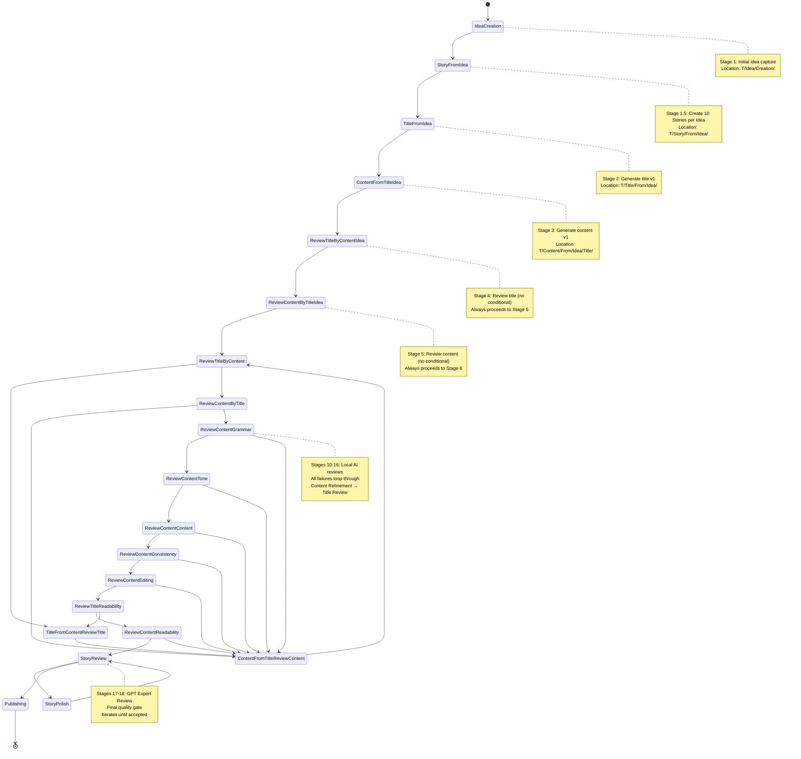

# PrismQ.T Workflow State Machine

**Visual State Diagram for Detailed Text Generation Workflow**

## State Machine Diagram



## State Definitions

### Primary States

| State | Full Name | Stage | Location |
|-------|-----------|-------|----------|
| IdeaCreation | PrismQ.T.Idea.Creation | 1 | T/Idea/Creation/ |
| StoryFromIdea | PrismQ.T.Story.From.Idea | 1.5 | T/Story/From/Idea/ |
| TitleFromIdea | PrismQ.T.Title.From.Idea | 2 | T/Title/From/Idea/ |
| ContentFromTitleIdea | PrismQ.T.Content.From.Title.Idea | 3 | T/Content/From/Idea/Title/ |
| ReviewTitleByContentIdea | PrismQ.T.Review.Title.By.Content.Idea | 4 | T/Review/Title/ByContentIdea/ |
| ReviewContentByTitleIdea | PrismQ.T.Review.Content.By.Title.Idea | 5 | T/Review/Content/ByTitleIdea/ |
| ReviewTitleByContent | PrismQ.T.Review.Title.By.Content | 6 | T/Review/Title/ByContent/ |
| TitleFromContentReviewTitle | PrismQ.T.Title.From.Content.Review.Title | 7 | T/Title/From/Title/Review/Content/ |
| ContentFromTitleReviewContent | PrismQ.T.Content.From.Title.Review.Content | 8 | T/Content/From/Title/Review/Content/ |
| ReviewContentByTitle | PrismQ.T.Review.Content.By.Title | 9 | T/Review/Content/ByTitle/ |

### Quality Review States

| State | Full Name | Stage | Location |
|-------|-----------|-------|----------|
| ReviewContentGrammar | PrismQ.T.Review.Content.Grammar | 10 | T/Review/Grammar/ |
| ReviewContentTone | PrismQ.T.Review.Content.Tone | 11 | T/Review/Tone/ |
| ReviewContentContent | PrismQ.T.Review.Content.Content | 12 | T/Review/Content/ |
| ReviewContentConsistency | PrismQ.T.Review.Content.Consistency | 13 | T/Review/Consistency/ |
| ReviewContentEditing | PrismQ.T.Review.Content.Editing | 14 | T/Review/Editing/ |
| ReviewTitleReadability | PrismQ.T.Review.Title.Readability | 15 | T/Review/Readability/ |
| ReviewContentReadability | PrismQ.T.Review.Content.Readability | 16 | T/Review/Readability/ |

### Expert Review Loop States

| State | Full Name | Stage | Location |
|-------|-----------|-------|----------|
| StoryReview | PrismQ.T.Story.Review | 17 | T/Story/Review/ |
| StoryPolish | PrismQ.T.Story.Polish | 18 | T/Story/Polish/ |

### Terminal State

| State | Full Name | Description |
|-------|-----------|-------------|
| Publishing | PrismQ.T.Publishing | Final stage leading to publication |

## State Transitions

### Linear Progression

Initial linear flow through the workflow:

```
IdeaCreation 
  → StoryFromIdea
  → TitleFromIdea 
  → ContentFromTitleIdea 
  → ReviewTitleByContentIdea
```

### Conditional Branches

#### Title Review Branch
```
ReviewTitleByContentIdea
  ├─ accepted → ReviewContentByTitleIdea
  └─ not accepted → TitleFromContentReviewTitle → ReviewContentByTitleIdea
```

#### Content Review Branch
```
ReviewContentByTitleIdea
  ├─ accepted → ReviewTitleByContent
  └─ not accepted → ContentFromTitleReviewContent → ReviewTitleByContent
```

#### Title Re-Review Branch
```
ReviewTitleByContent
  ├─ accepted → ReviewContentByTitle
  └─ not accepted → TitleFromContentReviewTitle → ReviewContentByTitle
```

#### Content Re-Review Branch
```
ReviewContentByTitle
  ├─ accepted → QualityReviews (ReviewContentGrammar)
  └─ not accepted → ContentFromTitleReviewContent → ReviewContentByTitle
```

### Quality Review Sequence

Sequential quality reviews with failure feedback:

```
QualityReviews:
  ReviewContentGrammar
    ├─ passes → ReviewContentTone
    └─ fails → ContentFromTitleReviewContent
    
  ReviewContentTone
    ├─ passes → ReviewContentContent
    └─ fails → ContentFromTitleReviewContent
    
  ReviewContentContent
    ├─ passes → ReviewContentConsistency
    └─ fails → ContentFromTitleReviewContent
    
  ReviewContentConsistency
    ├─ passes → ReviewContentEditing
    └─ fails → ContentFromTitleReviewContent
    
  ReviewContentEditing
    ├─ passes → ReviewTitleReadability
    └─ fails → ContentFromTitleReviewContent
    
  ReviewTitleReadability
    ├─ passes → ReviewContentReadability
    └─ fails → TitleFromContentReviewTitle
    
  ReviewContentReadability
    ├─ passes → ExpertReviewLoop (StoryReview)
    └─ fails → ContentFromTitleReviewContent
```

### Expert Review Loop

Iterative loop until expert acceptance:

```
ExpertReviewLoop:
  StoryReview
    ├─ accepted → Publishing
    └─ not accepted → StoryPolish → StoryReview (loop)
```

## Workflow Paths

### Ideal Path (All Reviews Pass First Time)

```
IdeaCreation
→ TitleFromIdea
→ ContentFromTitleIdea
→ ReviewTitleByContentIdea (accepted)
→ ReviewContentByTitleIdea (accepted)
→ ReviewTitleByContent (accepted)
→ ReviewContentByTitle (accepted)
→ ReviewContentGrammar (passes)
→ ReviewContentTone (passes)
→ ReviewContentContent (passes)
→ ReviewContentConsistency (passes)
→ ReviewContentEditing (passes)
→ ReviewTitleReadability (passes)
→ ReviewContentReadability (passes)
→ StoryReview (accepted)
→ Publishing
```

**Total Stages**: 14 stages

### Realistic Path (Some Reviews Require Refinement)

```
IdeaCreation
→ TitleFromIdea
→ ContentFromTitleIdea
→ ReviewTitleByContentIdea (not accepted)
→ TitleFromContentReviewTitle
→ ReviewContentByTitleIdea (accepted)
→ ReviewTitleByContent (accepted)
→ ReviewContentByTitle (not accepted)
→ ContentFromTitleReviewContent
→ ReviewContentByTitle (accepted)
→ ReviewContentGrammar (passes)
→ ReviewContentTone (fails)
→ ContentFromTitleReviewContent
→ ReviewContentByTitle (accepted)
→ ReviewContentGrammar (passes)
→ ReviewContentTone (passes)
→ ReviewContentContent (passes)
→ ReviewContentConsistency (passes)
→ ReviewContentEditing (passes)
→ ReviewTitleReadability (passes)
→ ReviewContentReadability (passes)
→ StoryReview (not accepted)
→ StoryPolish
→ StoryReview (accepted)
→ Publishing
```

**Total Stages**: ~22 stages (including loops)

### Maximum Iteration Path

If every review initially fails, the workflow could involve significantly more iterations. The workflow is designed to converge through iterative improvements.

## Composite States

### QualityReviews Composite State

The QualityReviews state encapsulates 7 sequential review stages (10-16). This composite state:
- Has a single entry point (ReviewContentGrammar)
- Has two exit conditions:
  - Success: All reviews pass → exits to StoryReview
  - Failure: Any review fails → exits to appropriate refinement stage
- Maintains internal sequential flow
- Represents the "quality gate" before expert review

### ExpertReviewLoop Composite State

The ExpertReviewLoop state encapsulates the final expert review cycle (17-18). This composite state:
- Has a single entry point (StoryReview)
- Has one exit condition: StoryReview accepted → Publishing
- Contains an internal loop: StoryReview → StoryPolish → StoryReview
- Represents the final quality gate before publication

## State Characteristics

### Entry Points
- **IdeaCreation**: The single entry point to the workflow

### Refinement States
States that improve artifacts based on feedback:
- **TitleFromContentReviewTitle**: Title refinement (used multiple times)
- **ContentFromTitleReviewContent**: Content refinement (used multiple times)
- **StoryPolish**: Expert-level polish

### Review States
States that evaluate quality and make accept/reject decisions:
- **ReviewTitleByContentIdea**: Title review with full context
- **ReviewContentByTitleIdea**: Content review with full context
- **ReviewTitleByContent**: Title review against content
- **ReviewContentByTitle**: Content review against title
- **ReviewContentGrammar**: Grammar validation
- **ReviewContentTone**: Tone validation
- **ReviewContentContent**: Content validation
- **ReviewContentConsistency**: Consistency validation
- **ReviewContentEditing**: Editing validation
- **ReviewTitleReadability**: Title readability validation
- **ReviewContentReadability**: Content readability validation
- **StoryReview**: Expert holistic review

### Terminal State
- **Publishing**: End of workflow, leads to publication

## Quality Gates

### Gate 1: Title-Content Initial Alignment (Stages 4-6)
- Ensures title and content are initially aligned with idea
- First iteration of mutual consistency

### Gate 2: Title-Content Refined Alignment (Stages 8-10)
- Ensures refined title and content are mutually aligned
- Second iteration of mutual consistency
- Final check before quality reviews

### Gate 3: Local AI Quality Reviews (Stages 10-16)
- Seven-dimensional quality assessment
- Grammar, Tone, Content, Consistency, Editing
- Readability for both Title and Script
- All must pass to proceed

### Gate 4: Expert Review (Stages 17-18)
- GPT-based holistic review
- Professional quality standard
- Final gate before publishing

## Workflow Properties

### Iterative Refinement
The workflow supports multiple iterations of refinement:
- Title can be refined multiple times
- Script can be refined multiple times
- Each refinement is informed by review feedback

### Progressive Quality
Quality increases through the workflow:
1. Initial creation (rough drafts acceptable)
2. Mutual alignment (title-script consistency)
3. Local quality checks (automated reviews)
4. Expert polish (professional standards)

### Fail-Fast Principles
- Reviews fail early if quality issues exist
- Immediate feedback loops to refinement stages
- Prevents low-quality content from progressing

### Convergence
The workflow is designed to converge:
- Each iteration improves quality
- Review feedback is specific and actionable
- Eventually all reviews pass

## Related Documentation

- **[Detailed Workflow Documentation](./WORKFLOW_DETAILED.md)** - Complete stage descriptions
- **[T Module Overview](./README.md)** - Text pipeline overview
- **[State Machine (Main)](_meta/docs/workflow/state-machine.md)** - Overall PrismQ state machine
- **[MVP Stages](_meta/docs/workflow/mvp-stages.md)** - 26-stage workflow

---

**Version:** 1.0  
**Created:** 2025-11-24  
**Part of:** PrismQ.T Text Generation Pipeline
