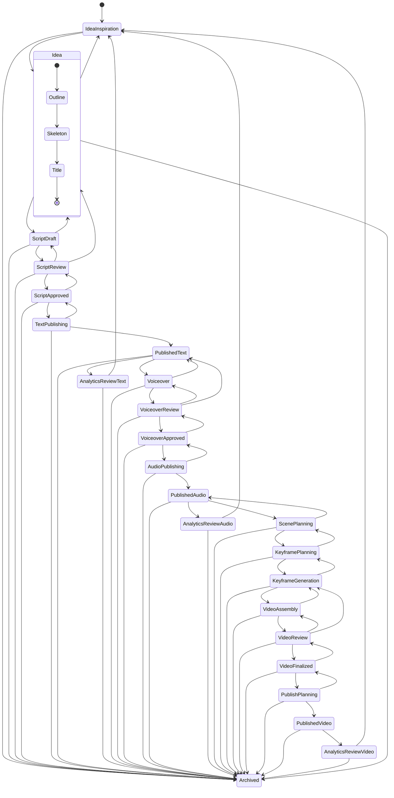

# PrismQ Content Production Workflow

**Complete State Machine for Content Production from Inspiration to Archive**

## Overview

This document defines the complete workflow state machine for PrismQ content production, from initial inspiration through publication and analytics to final archival.

## Workflow State Diagram



## Workflow Phases

The workflow is organized into **progressive enrichment phases** where each format builds on the previous:

### Phase 1: Inspiration & Ideation
- **[IdeaInspiration](./IdeaInspiration/)** - Content idea collection and scoring
- **[Idea](./Idea/)** - Distilled concept with sub-states:
  - **[Outline](./Outline/)** - Structured content outline
  - **[Skeleton](./Skeleton/)** - Basic structural framework
  - **[Title](./Title/)** - Finalized title and metadata

### Phase 2: Script Development
- **[ScriptDraft](./Script/ScriptDraft/)** - Initial script writing
- **[ScriptReview](./Script/ScriptReview/)** - Editorial review and enhancement
- **[ScriptApproved](./Script/ScriptApproved/)** - Final approved script

### Phase 3: Text Publication (First Format)
- **[TextPublishing](./Text/TextPublishing/)** - Text content publication
  - Platforms: Medium, Substack, Blog, LinkedIn, Twitter
  - **PublishedText** - Live text content
    - Can route to: AnalyticsReviewText, Voiceover (for audio production), or Archived
  - **AnalyticsReviewText** - Text performance analysis

### Phase 4: Audio Production (Uses Published Text)
- **[Voiceover](./Voiceover/)** - Voice recording/synthesis from published text
- **[VoiceoverReview](./Voiceover/VoiceoverReview/)** - Audio quality review
- **[VoiceoverApproved](./Voiceover/VoiceoverApproved/)** - Final approved audio

### Phase 5: Audio Publication (Second Format)
- **[AudioPublishing](./Audio/AudioPublishing/)** - Audio content publication
  - Platforms: Spotify, Apple Podcasts, SoundCloud, Audible
  - **PublishedAudio** - Live audio content
    - Can route to: AnalyticsReviewAudio, ScenePlanning (for video production), or Archived
  - **AnalyticsReviewAudio** - Audio performance analysis

### Phase 6: Visual Production (Uses Published Audio)
- **[ScenePlanning](./Visual/ScenePlanning/)** - Visual design from published audio
- **[KeyframePlanning](./Visual/KeyframePlanning/)** - Keyframe design and specification
- **[KeyframeGeneration](./Visual/KeyframeGeneration/)** - Visual asset creation

### Phase 7: Video Assembly
- **[VideoAssembly](./Video/VideoAssembly/)** - Timeline editing and assembly
- **[VideoReview](./Video/VideoReview/)** - Quality review and corrections
- **[VideoFinalized](./Video/VideoFinalized/)** - Final approved video

### Phase 8: Video Publishing (Third Format)
- **[PublishPlanning](./Publishing/PublishPlanning/)** - Publication strategy
- **PublishedVideo** - Live video content
  - Platforms: YouTube, TikTok, Instagram Reels
- **AnalyticsReviewVideo** - Video performance analysis

### Phase 9: Archive
- **[Archived](./Archived/)** - Terminal state for completed/terminated content

## Progressive Multi-Format Publishing Strategy

### Sequential Format Enrichment

The workflow follows a **progressive enrichment model** where each format builds on the previous:

**1. Text → 2. Audio → 3. Video**

**Stage 1: Text Publication (Foundation)**
```
ScriptApproved → TextPublishing → PublishedText
  ├─→ AnalyticsReviewText (optional early analytics)
  ├─→ Voiceover (continue to audio production)
  └─→ Archived (text-only release)
```
- **Timeline**: Hours to days
- **Use Case**: Immediate publication, SEO content, blog posts
- **Published text serves as source for voiceover recording**

**Stage 2: Audio Publication (Enrichment)**
```
PublishedText → Voiceover → VoiceoverReview → VoiceoverApproved → 
AudioPublishing → PublishedAudio
  ├─→ AnalyticsReviewAudio (optional early analytics)
  ├─→ ScenePlanning (continue to video production)
  └─→ Archived (audio-only release)
```
- **Timeline**: Days to week
- **Use Case**: Podcast distribution, audio storytelling
- **Published audio serves as foundation for video scenes**

**Stage 3: Video Publication (Full Experience)**
```
PublishedAudio → ScenePlanning → KeyframePlanning → 
KeyframeGeneration → VideoAssembly → VideoReview → VideoFinalized → 
PublishPlanning → PublishedVideo → AnalyticsReviewVideo
```
- **Timeline**: Weeks
- **Use Case**: YouTube, TikTok, maximum engagement
- **Video combines published audio with visual elements**

### Content Flow Benefits

- **Progressive Release**: Publish text immediately, audio days later, video weeks later
- **Quality Builds**: Each format uses the refined previous format as source
- **Platform Optimization**: Each format optimized for its specific platforms
- **Audience Reach**: Cover all consumption preferences sequentially
- **Early Feedback**: Text analytics inform audio production, audio analytics inform video
- **SEO Layering**: Multiple publication dates and formats boost discoverability
- **Reduced Waste**: Stop at any stage (text-only, audio-only, or full video)

## State Transitions

### Forward Progression (Sequential Format Enrichment)

The workflow follows a **progressive enrichment model**:

**Text-Only Path (Fastest - Stop after text):**
```
IdeaInspiration → Idea (Outline → Skeleton → Title) → ScriptDraft → 
ScriptReview → ScriptApproved → TextPublishing → PublishedText → 
AnalyticsReviewText → Archived
```

**Text + Audio Path (Medium - Stop after audio):**
```
... → ScriptApproved → TextPublishing → PublishedText → Voiceover → 
VoiceoverReview → VoiceoverApproved → AudioPublishing → PublishedAudio → 
AnalyticsReviewAudio → Archived
```

**Full Production Path (Complete - All formats):**
```
... → PublishedText → Voiceover → ... → PublishedAudio → ScenePlanning → 
KeyframePlanning → KeyframeGeneration → VideoAssembly → VideoReview → 
VideoFinalized → PublishPlanning → PublishedVideo → AnalyticsReviewVideo → 
Archived
```

**Key Data Flow:**
```
ScriptApproved
    ↓
TextPublishing → PublishedText (text is published)
    ↓
Voiceover (uses published text as source)
    ↓
VoiceoverApproved → AudioPublishing → PublishedAudio (audio is published)
    ↓
ScenePlanning (uses published audio as foundation)
    ↓
... → PublishedVideo (video is published)
```

### Backward Transitions (Revision Loops)

Quality issues or improvements trigger backward movement:

**Script Phase Revisions**
- `ScriptReview → ScriptDraft` - Major script revisions needed
- `ScriptReview → Idea` - Fundamental concept changes required
- `ScriptApproved → ScriptReview` - Issues found after approval

**Text Publishing Revisions**
- `TextPublishing → ScriptApproved` - Text formatting issues, need script revision
- `Voiceover → PublishedText` - Voiceover issues with published text source

**Voiceover Phase Revisions**
- `VoiceoverReview → Voiceover` - Re-recording needed
- `VoiceoverReview → PublishedText` - Need to revise published text source
- `Voiceover → PublishedText` - Published text has errors discovered during recording

**Audio Publishing Revisions**
- `AudioPublishing → VoiceoverApproved` - Audio file issues, need re-export
- `ScenePlanning → PublishedAudio` - Video planning issues with audio source

**Visual Phase Revisions**
- `KeyframePlanning → ScenePlanning` - Scene structure needs revision
- `KeyframeGeneration → KeyframePlanning` - Keyframe specs need adjustment
- `ScenePlanning → PublishedAudio` - Audio timing issues affect visuals

**Video Phase Revisions**
- `VideoReview → VideoAssembly` - Assembly/editing issues
- `VideoReview → KeyframeGeneration` - Visual asset problems
- `VideoFinalized → VideoReview` - Post-approval issues discovered

**Publishing Phase Revisions**
- `PublishPlanning → VideoFinalized` - Video changes needed before publish

### Feedback Loops

**Format-Specific Learning Loops**
- `AnalyticsReviewText → IdeaInspiration` - Text performance insights
- `AnalyticsReviewAudio → IdeaInspiration` - Audio performance insights  
- `AnalyticsReviewVideo → IdeaInspiration` - Video performance insights
- Cross-format insights inform future content strategy
- Early format analytics inform production decisions for later formats
- Performance data feeds back to improve future content

**Concept Refinement Loop**
- `ScriptDraft → Idea` - Concept needs fundamental rework
- `Idea → IdeaInspiration` - Return to inspiration sources

### Early Termination

Content can be archived from any stage:
```
[Any State] → Archived
```

**Reasons for Early Archive:**
- Concept no longer viable
- Resource constraints
- Strategic pivot
- Quality issues unresolvable
- Duplicate content
- External factors

## State Characteristics

### Entry States
- **IdeaInspiration** - Initial entry point for new content

### Intermediate States
- All states between IdeaInspiration and Archived
- Can transition forward, backward, or to Archived
- Support iterative refinement

### Composite States
- **Idea** - Contains sub-states (Outline → Skeleton → Title)
- Must complete all sub-states before exiting

### Terminal State
- **Archived** - Final destination for all content
- No exits from this state

## State Documentation

Each state has comprehensive documentation covering:

1. **Purpose** - What this state achieves
2. **Key Activities** - Actions performed in this state
3. **Deliverables** - Outputs produced
4. **Quality Gates** - Criteria for moving forward
5. **Transition Criteria** - When to move to next state
6. **Common Issues** - Typical problems and solutions

## Workflow Management

### Progress Tracking

**Status Indicators**
- ⏳ Not Started
- 🔄 In Progress
- ⏸️ Blocked/Waiting
- ✅ Complete
- ⚠️ Issues/Review Needed
- 🗄️ Archived

**Metadata Tracking**
```json
{
  "project_id": "PQ001",
  "current_state": "ScriptReview",
  "state_history": [
    {"state": "IdeaInspiration", "entered": "2025-01-01", "exited": "2025-01-02"},
    {"state": "Idea", "entered": "2025-01-02", "exited": "2025-01-03"},
    {"state": "ScriptDraft", "entered": "2025-01-03", "exited": "2025-01-05"},
    {"state": "ScriptReview", "entered": "2025-01-05", "exited": null}
  ],
  "revision_count": 2,
  "days_in_production": 5,
  "team_assigned": ["Writer A", "Editor B", "Reviewer C"]
}
```

### Quality Gates

Each state has defined quality criteria that must be met before progression:

**Documentation Gates**
- All required fields completed
- Metadata accurate and complete
- Version control updated

**Review Gates**
- Peer review completed
- Stakeholder approval received
- Quality standards verified

**Technical Gates**
- File formats correct
- Technical specifications met
- No critical errors present

### Automation Opportunities

**Automated Transitions**
- File upload triggers state change
- Approval workflows trigger progression
- Scheduled tasks (e.g., publication timing)
- Analytics collection and reporting

**Manual Transitions**
- Creative decisions
- Quality assessments
- Strategic pivots
- Resource allocation

## Best Practices

### General Principles

1. **Complete Each State** - Don't skip quality gates
2. **Document Everything** - Track decisions and changes
3. **Iterate When Needed** - Use backward transitions to improve
4. **Archive Promptly** - Don't let dead projects linger
5. **Learn Continuously** - Feed insights back to ideation

### State-Specific Tips

**Idea Phase**
- Invest time in outline and skeleton
- Clear title before moving to script
- Validate concept with stakeholders early

**Script Phase**
- Multiple review passes prevent downstream issues
- Lock approved scripts to prevent scope creep
- Keep revision history for learning

**Production Phase**
- Audio and visual quality gates are critical
- Test on target platforms early
- Build in buffer time for revisions

**Publishing Phase**
- Plan timing strategically
- Monitor early performance closely
- Engage with audience actively

**Analytics Phase**
- Collect comprehensive data
- Extract actionable insights
- Feed learnings back to ideation

## Metrics & Monitoring

### Workflow Efficiency Metrics

**Time Metrics**
- Average time per state
- Total production time
- Bottleneck identification
- Revision cycle time

**Quality Metrics**
- Revision frequency per state
- Defect escape rate
- Final quality scores
- Stakeholder satisfaction

**Resource Metrics**
- Team utilization
- Cost per state
- Asset reuse rate
- Automation savings

### Performance Dashboards

Track workflow health with key indicators:
- Projects by state (distribution)
- Average time in each state
- Revision/rework rate
- Completion rate
- Archive reasons breakdown

## Related Documentation

- **[IdeaInspiration Module](./IdeaInspiration/README.md)** - Inspiration and collection
- **[Idea Model](./Idea/Model/README.md)** - Core data model
- **[Content Production Workflow States Research](./_ meta/research/content-production-workflow-states.md)** - Detailed research
- **[YouTube Metadata Optimization](../_meta/research/youtube-metadata-optimization-smart-strategy.md)** - Platform strategy

## Version History

- **v2.0** (2025-01-19) - Complete state machine with Mermaid diagram
- **v1.0** (2025-01-10) - Initial 14-stage workflow documentation

---

*PrismQ Content Production Workflow - Complete State Machine Documentation*
