# Workflow produkce obsahu PrismQ

**Kompletní stavový automat pro produkci obsahu od inspirace po archivaci**

## Přehled

Tento dokument definuje kompletní stavový automat workflow pro produkci obsahu v PrismQ, od počáteční inspirace přes publikaci a analytiku až po finální archivaci.

## Diagram stavů workflow

```mermaid
stateDiagram-v2
    [*] --> IdeaInspiration
    IdeaInspiration --> Idea
    IdeaInspiration --> Archived

    state Idea {
        [*] --> Creation
        Creation --> Outline
        Outline --> Title

        Title --> [*]   %% Title je finální podstav před opuštěním Idea
    }

    Idea --> ScriptDraft
    Idea --> IdeaInspiration
    Idea --> Archived
    
    ScriptDraft --> ScriptReview
    ScriptDraft --> Idea
    ScriptDraft --> Archived

    ScriptReview --> ScriptApproved
    ScriptReview --> ScriptDraft
    ScriptReview --> Idea
    ScriptReview --> Archived

    ScriptApproved --> TextPublishing
    ScriptApproved --> ScriptReview
    ScriptApproved --> Archived

    %% Větev publikace textu
    TextPublishing --> PublishedText
    TextPublishing --> ScriptApproved
    TextPublishing --> Archived

    PublishedText --> Voiceover
    PublishedText --> AnalyticsReviewText
    PublishedText --> Archived

    AnalyticsReviewText --> Archived
    AnalyticsReviewText --> IdeaInspiration

    %% Produkce audia používá publikovaný text
    Voiceover --> VoiceoverReview
    Voiceover --> PublishedText
    Voiceover --> Archived

    VoiceoverReview --> VoiceoverApproved
    VoiceoverReview --> Voiceover
    VoiceoverReview --> PublishedText
    VoiceoverReview --> Archived

    VoiceoverApproved --> AudioPublishing
    VoiceoverApproved --> VoiceoverReview
    VoiceoverApproved --> Archived

    %% Větev publikace audia
    AudioPublishing --> PublishedAudio
    AudioPublishing --> VoiceoverApproved
    AudioPublishing --> Archived

    PublishedAudio --> ScenePlanning
    PublishedAudio --> AnalyticsReviewAudio
    PublishedAudio --> Archived

    AnalyticsReviewAudio --> Archived
    AnalyticsReviewAudio --> IdeaInspiration

    %% Produkce videa používá publikované audio
    ScenePlanning --> KeyframePlanning
    ScenePlanning --> PublishedAudio
    ScenePlanning --> Archived

    KeyframePlanning --> KeyframeGeneration
    KeyframePlanning --> ScenePlanning
    KeyframePlanning --> Archived

    KeyframeGeneration --> VideoAssembly
    KeyframeGeneration --> KeyframePlanning
    KeyframeGeneration --> Archived

    VideoAssembly --> VideoReview
    VideoAssembly --> KeyframeGeneration
    VideoAssembly --> Archived

    VideoReview --> VideoFinalized
    VideoReview --> VideoAssembly
    VideoReview --> KeyframeGeneration
    VideoReview --> Archived

    VideoFinalized --> PublishPlanning
    VideoFinalized --> VideoReview
    VideoFinalized --> Archived

    %% Větev publikace videa
    PublishPlanning --> PublishedVideo
    PublishPlanning --> VideoFinalized
    PublishPlanning --> Archived

    PublishedVideo --> AnalyticsReviewVideo
    PublishedVideo --> Archived

    AnalyticsReviewVideo --> Archived
    AnalyticsReviewVideo --> IdeaInspiration
```



## Fáze workflow

Workflow je organizováno do **fází postupného obohacování**, kde každý formát staví na předchozím:

### Fáze 1: Inspirace a vytváření nápadů
- **[IdeaInspiration](./T/Idea/Inspiration/)** - Sběr a hodnocení nápadů na obsah
- **[Idea](./T/Idea/)** - Destilovaný koncept s podstavy:
  - **[Creation](./T/Idea/)** - Počáteční formování nápadu a vývoj konceptu
  - **[Outline](./T/Idea/Outline/)** - Strukturovaná osnova obsahu
  - **[Title](./T/Title/)** - Finalizovaný titulek a metadata

### Fáze 2: Vývoj skriptu
- **[ScriptDraft](./Script/ScriptDraft/)** - Počáteční psaní skriptu
- **[ScriptReview](./Script/ScriptReview/)** - Redakční revize a vylepšení
- **[ScriptApproved](./Script/ScriptApproved/)** - Finální schválený skript

### Fáze 3: Publikace textu (První formát)
- **[TextPublishing](./Text/TextPublishing/)** - Publikace textového obsahu
  - Platformy: Medium, Substack, Blog, LinkedIn, Twitter
  - **PublishedText** - Živý textový obsah
    - Může směřovat k: AnalyticsReviewText, Voiceover (pro audio produkci), nebo Archived
  - **AnalyticsReviewText** - Analýza výkonu textu

### Fáze 4: Produkce audia (Používá publikovaný text)
- **[Voiceover](./Voiceover/)** - Nahrávání/syntéza hlasu z publikovaného textu
- **[VoiceoverReview](./Voiceover/VoiceoverReview/)** - Revize kvality audia
- **[VoiceoverApproved](./Voiceover/VoiceoverApproved/)** - Finální schválené audio

### Fáze 5: Publikace audia (Druhý formát)
- **[AudioPublishing](./Audio/AudioPublishing/)** - Publikace audio obsahu
  - Platformy: Spotify, Apple Podcasts, SoundCloud, Audible
  - **PublishedAudio** - Živý audio obsah
    - Může směřovat k: AnalyticsReviewAudio, ScenePlanning (pro video produkci), nebo Archived
  - **AnalyticsReviewAudio** - Analýza výkonu audia

### Fáze 6: Vizuální produkce (Používá publikované audio)
- **[ScenePlanning](./Visual/ScenePlanning/)** - Vizuální design z publikovaného audia
- **[KeyframePlanning](./Visual/KeyframePlanning/)** - Design a specifikace klíčových snímků
- **[KeyframeGeneration](./Visual/KeyframeGeneration/)** - Tvorba vizuálních assetů

### Fáze 7: Skládání videa
- **[VideoAssembly](./Video/VideoAssembly/)** - Editace časové osy a skládání
- **[VideoReview](./Video/VideoReview/)** - Kontrola kvality a opravy
- **[VideoFinalized](./Video/VideoFinalized/)** - Finální schválené video

### Fáze 8: Publikace videa (Třetí formát)
- **[PublishPlanning](./Publishing/PublishPlanning/)** - Strategie publikace
- **PublishedVideo** - Živý video obsah
  - Platformy: YouTube, TikTok, Instagram Reels
- **AnalyticsReviewVideo** - Analýza výkonu videa

### Fáze 9: Archivace
- **[Archived](./Archived/)** - Terminální stav pro dokončený/ukončený obsah

## Strategie postupné publikace ve více formátech

### Postupné obohacování formátů

Workflow následuje **model postupného obohacování**, kde každý formát staví na předchozím:

**1. Text → 2. Audio → 3. Video**

**Fáze 1: Publikace textu (Základ)**
```
ScriptApproved → TextPublishing → PublishedText
  ├─→ AnalyticsReviewText (volitelná časná analytika)
  ├─→ Voiceover (pokračování do audio produkce)
  └─→ Archived (vydání pouze textu)
```
- **Časový horizont**: Hodiny až dny
- **Případ použití**: Okamžitá publikace, SEO obsah, blog příspěvky
- **Publikovaný text slouží jako zdroj pro nahrávání hlasu**

**Fáze 2: Publikace audia (Obohacení)**
```
PublishedText → Voiceover → VoiceoverReview → VoiceoverApproved → 
AudioPublishing → PublishedAudio
  ├─→ AnalyticsReviewAudio (volitelná časná analytika)
  ├─→ ScenePlanning (pokračování do video produkce)
  └─→ Archived (vydání pouze audia)
```
- **Časový horizont**: Dny až týden
- **Případ použití**: Distribuce podcastů, audio storytelling
- **Publikované audio slouží jako základ pro video scény**

**Fáze 3: Publikace videa (Kompletní zážitek)**
```
PublishedAudio → ScenePlanning → KeyframePlanning → 
KeyframeGeneration → VideoAssembly → VideoReview → VideoFinalized → 
PublishPlanning → PublishedVideo → AnalyticsReviewVideo
```
- **Časový horizont**: Týdny
- **Případ použití**: YouTube, TikTok, maximální zapojení
- **Video kombinuje publikované audio s vizuálními elementy**

### Výhody toku obsahu

- **Postupné vydávání**: Publikujte text okamžitě, audio o dny později, video o týdny později
- **Kvalita se buduje**: Každý formát používá rafinovaný předchozí formát jako zdroj
- **Optimalizace platformy**: Každý formát optimalizován pro své specifické platformy
- **Dosah publika**: Pokrývá všechny preference konzumace postupně
- **Časná zpětná vazba**: Analytika textu informuje audio produkci, analytika audia informuje video
- **SEO vrstvení**: Více dat publikace a formátů zvyšuje objevitelnost
- **Snížení plýtvání**: Zastavení v jakékoli fázi (pouze text, pouze audio, nebo plné video)

## Přechody stavů

### Dopředná progrese (Postupné obohacování formátů)

Workflow následuje **model postupného obohacování**:

**Cesta pouze textu (Nejrychlejší - Zastavení po textu):**
```
IdeaInspiration → Idea (Creation → Outline → Title) → ScriptDraft → 
ScriptReview → ScriptApproved → TextPublishing → PublishedText → 
AnalyticsReviewText → Archived
```

**Cesta text + audio (Střední - Zastavení po audiu):**
```
... → ScriptApproved → TextPublishing → PublishedText → Voiceover → 
VoiceoverReview → VoiceoverApproved → AudioPublishing → PublishedAudio → 
AnalyticsReviewAudio → Archived
```

**Cesta plné produkce (Kompletní - Všechny formáty):**
```
... → PublishedText → Voiceover → ... → PublishedAudio → ScenePlanning → 
KeyframePlanning → KeyframeGeneration → VideoAssembly → VideoReview → 
VideoFinalized → PublishPlanning → PublishedVideo → AnalyticsReviewVideo → 
Archived
```

**Klíčový tok dat:**
```
ScriptApproved
    ↓
TextPublishing → PublishedText (text je publikován)
    ↓
Voiceover (používá publikovaný text jako zdroj)
    ↓
VoiceoverApproved → AudioPublishing → PublishedAudio (audio je publikováno)
    ↓
ScenePlanning (používá publikované audio jako základ)
    ↓
... → PublishedVideo (video je publikováno)
```

### Zpětné přechody (Revizní smyčky)

Problémy s kvalitou nebo vylepšení spouštějí zpětný pohyb:

**Revize fáze skriptu**
- `ScriptReview → ScriptDraft` - Potřeba velkých revizí skriptu
- `ScriptReview → Idea` - Vyžadovány zásadní změny konceptu
- `ScriptApproved → ScriptReview` - Problémy nalezeny po schválení

**Revize publikace textu**
- `TextPublishing → ScriptApproved` - Problémy s formátováním textu, potřeba revize skriptu
- `Voiceover → PublishedText` - Problémy s hlasem vzhledem ke zdroji publikovaného textu

**Revize fáze hlasu**
- `VoiceoverReview → Voiceover` - Potřeba nového nahrávání
- `VoiceoverReview → PublishedText` - Potřeba revize zdroje publikovaného textu
- `Voiceover → PublishedText` - Chyby v publikovaném textu objeveny během nahrávání

**Revize publikace audia**
- `AudioPublishing → VoiceoverApproved` - Problémy se souborem audia, potřeba re-exportu
- `ScenePlanning → PublishedAudio` - Problémy s plánováním videa vzhledem ke zdroji audia

**Revize vizuální fáze**
- `KeyframePlanning → ScenePlanning` - Potřeba revize struktury scény
- `KeyframeGeneration → KeyframePlanning` - Potřeba úpravy specifikací klíčových snímků
- `ScenePlanning → PublishedAudio` - Problémy s časováním audia ovlivňují vizuály

**Revize fáze videa**
- `VideoReview → VideoAssembly` - Problémy se skládáním/editací
- `VideoReview → KeyframeGeneration` - Problémy s vizuálními assety
- `VideoFinalized → VideoReview` - Problémy objeveny po schválení

**Revize fáze publikace**
- `PublishPlanning → VideoFinalized` - Potřeba změn videa před publikací

### Zpětnovazební smyčky

**Učební smyčky specifické pro formát**
- `AnalyticsReviewText → IdeaInspiration` - Poznatky z výkonu textu
- `AnalyticsReviewAudio → IdeaInspiration` - Poznatky z výkonu audia
- `AnalyticsReviewVideo → IdeaInspiration` - Poznatky z výkonu videa
- Poznatky napříč formáty informují budoucí obsahovou strategii
- Analytika raného formátu informuje produkční rozhodnutí pro pozdější formáty
- Data o výkonu se vracejí zpět pro vylepšení budoucího obsahu

**Smyčka vylepšení konceptu**
- `ScriptDraft → Idea` - Koncept potřebuje zásadní přepracování
- `Idea → IdeaInspiration` - Návrat ke zdrojům inspirace

### Časné ukončení

Obsah může být archivován z jakéhokoli stavu:
```
[Jakýkoli stav] → Archived
```

**Důvody pro časnou archivaci:**
- Koncept již není životaschopný
- Omezení zdrojů
- Strategický pivot
- Problémy s kvalitou neřešitelné
- Duplicitní obsah
- Externí faktory

## Charakteristiky stavů

### Vstupní stavy
- **IdeaInspiration** - Počáteční vstupní bod pro nový obsah

### Mezilehlé stavy
- Všechny stavy mezi IdeaInspiration a Archived
- Mohou přecházet dopředu, dozadu nebo do Archived
- Podporují iterativní vylepšování

### Složené stavy
- **Idea** - Obsahuje podstavy (Creation → Outline → Title)
- Musí být dokončeny všechny podstavy před opuštěním

### Terminální stav
- **Archived** - Finální destinace pro veškerý obsah
- Žádné výstupy z tohoto stavu

## Dokumentace stavů

Každý stav má komplexní dokumentaci pokrývající:

1. **Účel** - Co tento stav dosahuje
2. **Klíčové aktivity** - Akce prováděné v tomto stavu
3. **Výstupy** - Vytvořené výstupy
4. **Kvalitní brány** - Kritéria pro postup vpřed
5. **Kritéria přechodu** - Kdy přejít do dalšího stavu
6. **Běžné problémy** - Typické problémy a řešení

## Správa workflow

### Sledování pokroku

**Indikátory stavu**
- ⏳ Nezahájeno
- 🔄 Probíhá
- ⏸️ Blokováno/Čeká
- ✅ Dokončeno
- ⚠️ Problémy/Vyžaduje revizi
- 🗄️ Archivováno

**Sledování metadat**
```json
{
  "project_id": "PQ001",
  "current_state": "ScriptReview",
  "state_history": [
    {"state": "IdeaInspiration", "entered": "2025-01-01", "exited": "2025-01-02"},
    {"state": "Idea", "entered": "2025-01-02", "exited": "2025-01-03"},
    {"state": "ScriptDraft", "entered": "2025-01-03", "exited": "2025-01-05"},
    {"state": "ScriptReview", "entered": "2025-01-05", "exited": null}
  ],
  "revision_count": 2,
  "days_in_production": 5,
  "team_assigned": ["Autor A", "Editor B", "Recenzent C"]
}
```

### Kvalitní brány

Každý stav má definovaná kvalitní kritéria, která musí být splněna před postupem:

**Dokumentační brány**
- Všechna požadovaná pole vyplněna
- Metadata přesná a kompletní
- Verzovací kontrola aktualizována

**Revizní brány**
- Peer review dokončena
- Schválení zainteresovaných stran získáno
- Standardy kvality ověřeny

**Technické brány**
- Formáty souborů správné
- Technické specifikace splněny
- Žádné kritické chyby přítomny

### Příležitosti pro automatizaci

**Automatizované přechody**
- Nahrání souboru spouští změnu stavu
- Workflow schvalování spouští postup
- Naplánované úkoly (např. časování publikace)
- Sběr a reportování analytiky

**Manuální přechody**
- Kreativní rozhodnutí
- Hodnocení kvality
- Strategické pivoty
- Alokace zdrojů

## Osvědčené postupy

### Obecné principy

1. **Dokončete každý stav** - Nepřeskakujte kvalitní brány
2. **Dokumentujte vše** - Sledujte rozhodnutí a změny
3. **Iterujte když potřeba** - Používejte zpětné přechody pro vylepšení
4. **Archivujte rychle** - Nenechávejte mrtvé projekty viset
5. **Učte se neustále** - Vraťte poznatky zpět do vytváření nápadů

### Tipy specifické pro stavy

**Fáze nápadu**
- Investujte čas do osnovy a kostry
- Jasný titulek před přechodem na skript
- Validujte koncept se zainteresovanými stranami brzy

**Fáze skriptu**
- Více revizních průchodů předchází problémům downstream
- Uzamkněte schválené skripty pro prevenci rozšiřování rozsahu
- Udržujte historii revizí pro učení

**Produkční fáze**
- Kvalitní brány audia a videa jsou kritické
- Testujte na cílových platformách brzy
- Zabudujte čas na rezervu pro revize

**Fáze publikace**
- Plánujte časování strategicky
- Monitorujte časný výkon pozorně
- Aktivně zapojujte publikum

**Fáze analytiky**
- Sbírejte komplexní data
- Extrahujte použitelné poznatky
- Vraťte poznatky zpět do vytváření nápadů

## Metriky a monitorování

### Metriky efektivity workflow

**Časové metriky**
- Průměrný čas na stav
- Celkový čas produkce
- Identifikace úzkých hrdel
- Čas cyklu revizí

**Metriky kvality**
- Frekvence revizí na stav
- Míra úniku defektů
- Finální skóre kvality
- Spokojenost zainteresovaných stran

**Metriky zdrojů**
- Využití týmu
- Cena na stav
- Míra znovupoužití assetů
- Úspory z automatizace

### Nástěnky výkonu

Sledujte zdraví workflow pomocí klíčových indikátorů:
- Projekty podle stavu (distribuce)
- Průměrný čas v každém stavu
- Míra revizí/přepracování
- Míra dokončení
- Rozpad důvodů archivace

## Související dokumentace

- **[Modul IdeaInspiration](./T/Idea/Inspiration/README.md)** - Inspirace a sběr
- **[Model Idea](./T/Idea/Model/README.md)** - Základní datový model
- **[Výzkum stavů workflow produkce obsahu](./_meta/research/content-production-workflow-states.md)** - Detailní výzkum
- **[Optimalizace metadat YouTube](../_meta/research/youtube-metadata-optimization-smart-strategy.md)** - Strategie platformy

## Historie verzí

- **v2.0** (2025-01-19) - Kompletní stavový automat s diagramem Mermaid
- **v1.0** (2025-01-10) - Počáteční dokumentace 14fázového workflow

---

*Workflow produkce obsahu PrismQ - Kompletní dokumentace stavového automatu*
