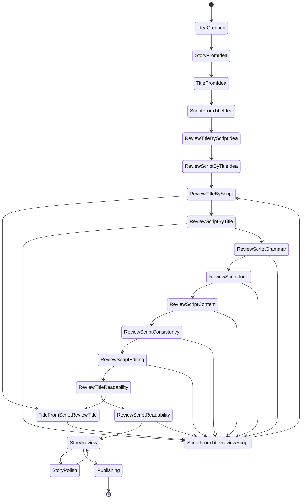
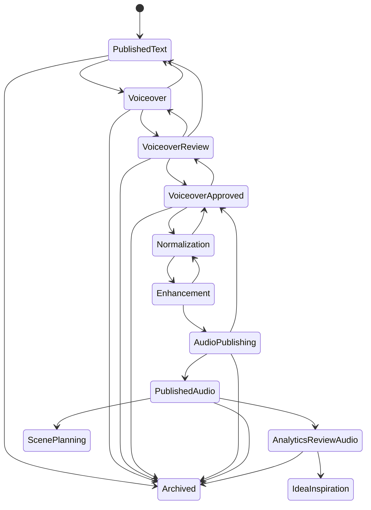
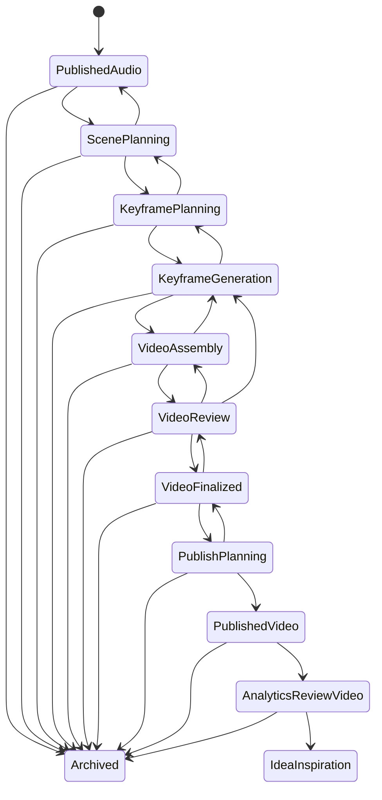
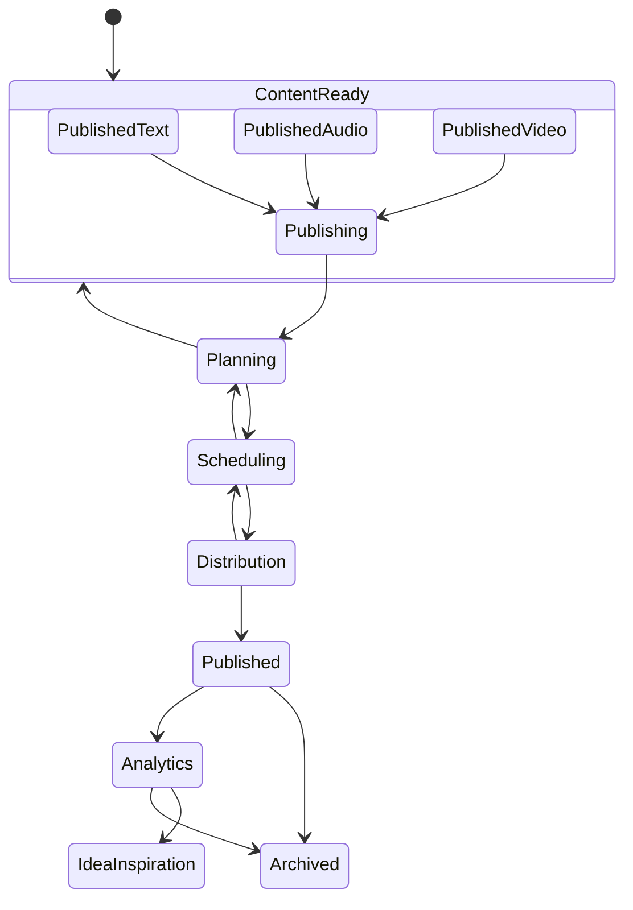
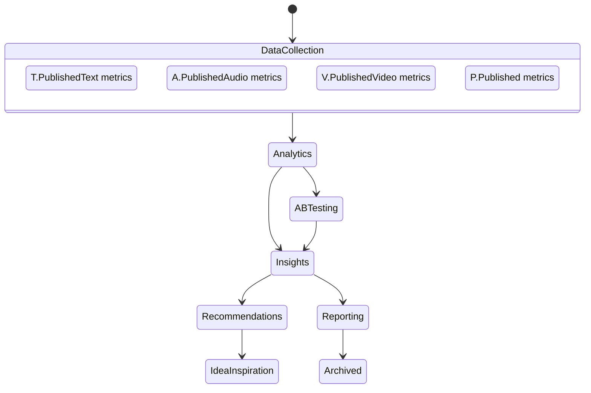

# State Transitions Report - PrismQ Modules

**Comprehensive Documentation of State Transitions for All PrismQ Platform Modules**

> **Version**: 1.0  
> **Created**: 2025-12-04  
> **Language**: English

---

## Table of Contents

1. [Architecture Overview](#architecture-overview)
2. [T Module - Text Generation](#t-module---text-generation)
3. [A Module - Audio Generation](#a-module---audio-generation)
4. [V Module - Video Generation](#v-module---video-generation)
5. [P Module - Publishing](#p-module---publishing)
6. [M Module - Metrics & Analytics](#m-module---metrics--analytics)
7. [Transitions Summary](#transitions-summary)

---

## Architecture Overview

PrismQ implements a sequential workflow for content production with progressive format enrichment:

```
┌─────────────────────────────────────────────────────────────────────────────┐
│                           PrismQ State Machine                               │
├─────────────────────────────────────────────────────────────────────────────┤
│                                                                              │
│   T (Text)  ──►  A (Audio)  ──►  V (Video)  ──►  P (Publishing)  ──►  M    │
│                                                                   (Metrics) │
│                                        │                                     │
│                                        ▼                                     │
│                              T.IdeaInspiration                               │
│                              (feedback loop)                                 │
│                                                                              │
└─────────────────────────────────────────────────────────────────────────────┘
```

### Core Transition Principles

| Principle | Description |
|-----------|-------------|
| **Sequential Pipeline** | T → A → V → P → M (linear flow between main modules) |
| **Quality Gates** | Explicit acceptance criteria at each transition |
| **Iterative Refinement** | Loops and feedback cycles within each module |
| **Progressive Publication** | Content can be released at any stage |
| **Feedback Loop** | M module provides metrics back to T.IdeaInspiration |

---

## T Module - Text Generation

**Namespace**: `PrismQ.T`

### State Overview

T module contains **18 main states** organized into an iterative workflow with co-improvement cycles.

### State Transition Diagram



### State Transition Table

#### Phase 1: Idea Creation

| State | Name | Phase | Location | Transitions To |
|-------|------|-------|----------|----------------|
| IdeaCreation | PrismQ.T.Idea.From.User | 1 | T/Idea/From/User/ | StoryFromIdea |
| StoryFromIdea | PrismQ.T.Story.From.Idea | 1.5 | T/Story/From/Idea/ | TitleFromIdea |
| TitleFromIdea | PrismQ.T.Title.From.Idea | 2 | T/Title/From/Idea/ | ScriptFromTitleIdea |
| ScriptFromTitleIdea | PrismQ.T.Content.From.Title.Idea | 3 | T/Content/From/Idea/Title/ | ReviewTitleByScriptIdea |

**Transition descriptions:**
- `IdeaCreation → StoryFromIdea`: Creates 10 stories from one idea
- `StoryFromIdea → TitleFromIdea`: Generates title v1 from idea
- `TitleFromIdea → ScriptFromTitleIdea`: Generates script v1 from title and idea
- `ScriptFromTitleIdea → ReviewTitleByScriptIdea`: Initiates review cycle

#### Phase 2: Title and Script Review

| State | Name | Phase | Transitions To (approved) | Transitions To (rejected) |
|-------|------|-------|---------------------------|---------------------------|
| ReviewTitleByScriptIdea | PrismQ.T.Review.Title.From.Script.Idea | 4 | ReviewScriptByTitleIdea | - |
| ReviewScriptByTitleIdea | PrismQ.T.Review.Script.From.Title.Idea | 5 | ReviewTitleByScript | - |
| ReviewTitleByScript | PrismQ.T.Review.Title.From.Script | 6 | ReviewScriptByTitle | TitleFromScriptReviewTitle |
| TitleFromScriptReviewTitle | PrismQ.T.Title.From.Script.Review.Title | 7 | ScriptFromTitleReviewScript | - |
| ScriptFromTitleReviewScript | PrismQ.T.Content.From.Title.Review.Script | 8 | ReviewTitleByScript | - |
| ReviewScriptByTitle | PrismQ.T.Review.Script.From.Title | 9 | ReviewScriptGrammar | ScriptFromTitleReviewScript |

**Iterative loop:**
```
ReviewTitleByScript
    ├─ approved → ReviewScriptByTitle
    └─ rejected → TitleFromScriptReviewTitle → ScriptFromTitleReviewScript → ReviewTitleByScript
```

#### Phase 3: Quality Reviews (Local AI)

| State | Name | Phase | Transitions To (passes) | Transitions To (fails) |
|-------|------|-------|-------------------------|------------------------|
| ReviewScriptGrammar | PrismQ.T.Review.Script.Grammar | 10 | ReviewScriptTone | ScriptFromTitleReviewScript |
| ReviewScriptTone | PrismQ.T.Review.Script.Tone | 11 | ReviewScriptContent | ScriptFromTitleReviewScript |
| ReviewScriptContent | PrismQ.T.Review.Script.Content | 12 | ReviewScriptConsistency | ScriptFromTitleReviewScript |
| ReviewScriptConsistency | PrismQ.T.Review.Script.Consistency | 13 | ReviewScriptEditing | ScriptFromTitleReviewScript |
| ReviewScriptEditing | PrismQ.T.Review.Script.Editing | 14 | ReviewTitleReadability | ScriptFromTitleReviewScript |
| ReviewTitleReadability | PrismQ.T.Review.Title.Readability | 15 | ReviewScriptReadability | TitleFromScriptReviewTitle |
| ReviewScriptReadability | PrismQ.T.Review.Script.Readability | 16 | StoryReview | ScriptFromTitleReviewScript |

#### Phase 4: Expert Review (GPT)

| State | Name | Phase | Transitions To (approved) | Transitions To (rejected) |
|-------|------|-------|---------------------------|---------------------------|
| StoryReview | PrismQ.T.Story.Review | 17 | Publishing | StoryPolish |
| StoryPolish | PrismQ.T.Story.Polish | 18 | StoryReview | - |

**Expert loop:**
```
StoryReview
    ├─ approved → Publishing → [*]
    └─ rejected → StoryPolish → StoryReview (iterate until approved)
```

### Quality Gates (T Module)

| Gate | Phase | Description |
|------|-------|-------------|
| Title-Script Alignment (initial) | 4-6 | Ensures initial alignment of title and script with idea |
| Title-Script Alignment (refined) | 8-10 | Ensures refined alignment of title and script |
| Local AI Quality Reviews | 10-16 | Seven-dimensional quality assessment |
| Expert Review | 17-18 | GPT-based holistic review |

### T Module Output

| Output | Description |
|--------|-------------|
| PublishedText | SEO-optimized published text |
| → PrismQ.A.Voiceover | Input for audio pipeline |

---

## A Module - Audio Generation

**Namespace**: `PrismQ.A`

### State Overview

A module transforms published text into professional audio content with the following main states.

### State Transition Diagram



### State Transition Table

| State | Name | Input | Transitions To | Description |
|-------|------|-------|----------------|-------------|
| PublishedText | PrismQ.T.PublishedText | T module | Voiceover, Archived | Entry state from T module |
| Voiceover | PrismQ.A.Voiceover | PublishedText | VoiceoverReview, PublishedText, Archived | Voice recording from published text |
| VoiceoverReview | PrismQ.A.Voiceover.Review | Voiceover | VoiceoverApproved, Voiceover, PublishedText, Archived | Recording quality check |
| VoiceoverApproved | PrismQ.A.Voiceover.Approved | VoiceoverReview | Normalization, VoiceoverReview, Archived | Approved recording |
| Normalization | PrismQ.A.Normalized | VoiceoverApproved | Enhancement, VoiceoverApproved | Loudness normalization (LUFS) |
| Enhancement | PrismQ.A.Enhancement | Normalization | AudioPublishing, Normalization | EQ, compression, final polish |
| AudioPublishing | PrismQ.A.Publishing | Enhancement | PublishedAudio, VoiceoverApproved, Archived | Audio platform publishing |
| PublishedAudio | PrismQ.A.PublishedAudio | AudioPublishing | ScenePlanning, AnalyticsReviewAudio, Archived | Published audio |
| AnalyticsReviewAudio | PrismQ.A.Analytics.Review | PublishedAudio | IdeaInspiration, Archived | Audio performance analysis |

### Review Transitions (A Module)

**Backward transitions:**
```
VoiceoverReview → Voiceover: Re-recording needed
VoiceoverReview → PublishedText: Source text issues
Voiceover → PublishedText: Errors discovered during recording
AudioPublishing → VoiceoverApproved: Audio file issues
```

### Quality Gates (A Module)

| Gate | State | Criteria |
|------|-------|----------|
| Recording Quality | VoiceoverReview | Audio clarity, correct pronunciation, tempo |
| Technical Standards | Normalization | -16 LUFS (Spotify/Apple Podcasts) |
| Final Quality | AudioPublishing | MP3 format (320kbps), metadata |

### A Module Output

| Output | Description |
|--------|-------------|
| PublishedAudio | Professional podcast/audio content |
| → PrismQ.V.ScenePlanning | Input for video pipeline |
| → PrismQ.M.Analytics | Performance metrics |

---

## V Module - Video Generation

**Namespace**: `PrismQ.V`

### State Overview

V module combines published audio with synchronized visuals for video platforms.

### State Transition Diagram



### State Transition Table

| State | Name | Phase | Forward Transition | Backward Transition |
|-------|------|-------|-------------------|---------------------|
| PublishedAudio | PrismQ.A.PublishedAudio | Input | ScenePlanning | Archived |
| ScenePlanning | PrismQ.V.Scene.Planning | Visual Planning | KeyframePlanning | PublishedAudio |
| KeyframePlanning | PrismQ.V.Keyframe.Planning | Keyframe Specs | KeyframeGeneration | ScenePlanning |
| KeyframeGeneration | PrismQ.V.Keyframe.Generation | Visual Generation | VideoAssembly | KeyframePlanning |
| VideoAssembly | PrismQ.V.Video.Assembly | Video Assembly | VideoReview | KeyframeGeneration |
| VideoReview | PrismQ.V.Video.Review | Quality Review | VideoFinalized | VideoAssembly, KeyframeGeneration |
| VideoFinalized | PrismQ.V.Video.Finalized | Finalization | PublishPlanning | VideoReview |
| PublishPlanning | PrismQ.V.Publish.Planning | Publish Planning | PublishedVideo | VideoFinalized |
| PublishedVideo | PrismQ.V.PublishedVideo | Output | AnalyticsReviewVideo | Archived |
| AnalyticsReviewVideo | PrismQ.V.Analytics.Review | Analysis | IdeaInspiration | Archived |

### Sequential Transitions (V Module)

**Linear progression:**
```
PublishedAudio
    → ScenePlanning (plan scenes based on audio)
    → KeyframePlanning (identify key visual moments)
    → KeyframeGeneration (generate visual assets)
    → VideoAssembly (assemble timeline)
    → VideoReview (quality check)
    → VideoFinalized (approval)
    → PublishPlanning (publishing strategy)
    → PublishedVideo (output)
```

**Backward transitions:**
```
VideoReview → VideoAssembly: Assembly issues
VideoReview → KeyframeGeneration: Visual asset problems
KeyframePlanning → ScenePlanning: Scene structure revision
ScenePlanning → PublishedAudio: Audio timing issues
```

### Platform Specifications (V Module)

| Platform | Format | Resolution | Special Requirements |
|----------|--------|------------|---------------------|
| YouTube | 16:9 | 1920x1080 | Thumbnails, chapters, SEO |
| TikTok | 9:16 | 1080x1920 | Hook in first 3 seconds |
| Instagram Reels | 9:16 | 1080x1920 | Captions, short format |
| YouTube Shorts | 9:16 | 1080x1920 | Max 60 seconds |

### V Module Output

| Output | Description |
|--------|-------------|
| PublishedVideo | Complete video with audio + visuals |
| → PrismQ.P.Publishing | Input for bulk publishing |
| → PrismQ.M.Analytics | Performance metrics |

---

## P Module - Publishing

**Namespace**: `PrismQ.P`

### State Overview

P module coordinates bulk distribution across multiple platforms after content completion.

### State Transition Diagram



### State Transition Table

| State | Name | Input | Transitions To | Description |
|-------|------|-------|----------------|-------------|
| ContentReady | PrismQ.P.Content.Ready | T/A/V | Publishing | Ready content (text/audio/video) |
| Publishing | PrismQ.P.Publishing | ContentReady | Planning | Start publishing process |
| Planning | PrismQ.P.Publishing.Planning | Publishing | Scheduling, ContentReady | Publication strategy planning |
| Scheduling | PrismQ.P.Publishing.Scheduling | Planning | Distribution, Planning | Timing and order setup |
| Distribution | PrismQ.P.Publishing.Distribution | Scheduling | Published, Scheduling | Execute publication |
| Published | PrismQ.P.Published | Distribution | Analytics, Archived | Published content across platforms |
| Analytics | PrismQ.P.Analytics | Published | IdeaInspiration, Archived | Performance tracking |

### Input Sources (P Module)

```
PrismQ.T.PublishedText ─┐
PrismQ.A.PublishedAudio ─┼→ PrismQ.P.Publishing → Multi-Platform Distribution
PrismQ.V.PublishedVideo ─┘
```

### Publishing Strategies

| Content Type | Timeline | Platforms |
|--------------|----------|-----------|
| Text Only | Hours to days | Medium, Substack, Blog, LinkedIn, Twitter/X |
| Text + Audio | Days to week | + Spotify, Apple Podcasts, SoundCloud |
| Complete Multi-format | Weeks | + YouTube, TikTok, Instagram Reels |

---

## M Module - Metrics & Analytics

**Namespace**: `PrismQ.M`

### Architecture Overview

M module is a **cross-cutting meta-module** that monitors published content performance across all formats.

### State Transition Diagram



### State Transition Table

| State | Name | Input | Transitions To | Description |
|-------|------|-------|----------------|-------------|
| DataCollection | PrismQ.M.Data.Collection | T/A/V/P | Analytics | Collect metrics from published content |
| Analytics | PrismQ.M.Analytics | DataCollection | ABTesting, Insights | Performance analysis |
| ABTesting | PrismQ.M.ABTesting | Analytics | Insights | Variant testing |
| Insights | PrismQ.M.Insights | Analytics, ABTesting | Recommendations, Reporting | Insights generation |
| Recommendations | PrismQ.M.Recommendations | Insights | IdeaInspiration | Content recommendations |
| Reporting | PrismQ.M.Reporting | Insights | Archived | Performance reports |

### Data Sources (M Module)

```
┌─ T.PublishedText metrics ────┐
├─ A.PublishedAudio metrics ───┤
├─ V.PublishedVideo metrics ───┼→ M.Analytics → M.Insights → T.IdeaInspiration
└─ P.Published platform metrics┘
```

---

## Transitions Summary

### Complete Pipeline Flow

```
┌─────────────────────────────────────────────────────────────────────────────────┐
│                           PrismQ Complete Workflow                               │
├─────────────────────────────────────────────────────────────────────────────────┤
│                                                                                  │
│  IdeaInspiration                                                                 │
│       │                                                                          │
│       ▼                                                                          │
│  ┌─────────────────────────────────────────────────────────────────────────┐    │
│  │ T MODULE: 18 states                                                     │    │
│  │ IdeaCreation → StoryFromIdea → TitleFromIdea → ScriptFromTitleIdea      │    │
│  │     → ReviewTitleByScriptIdea → ReviewScriptByTitleIdea                 │    │
│  │     → ReviewTitleByScript ↔ TitleFromScriptReviewTitle                  │    │
│  │     → ScriptFromTitleReviewScript ↔ ReviewScriptByTitle                 │    │
│  │     → ReviewScriptGrammar → ReviewScriptTone → ReviewScriptContent      │    │
│  │     → ReviewScriptConsistency → ReviewScriptEditing                     │    │
│  │     → ReviewTitleReadability → ReviewScriptReadability                  │    │
│  │     → StoryReview ↔ StoryPolish → Publishing                            │    │
│  └─────────────────────────────────────────────────────────────────────────┘    │
│       │ PublishedText                                                            │
│       ▼                                                                          │
│  ┌─────────────────────────────────────────────────────────────────────────┐    │
│  │ A MODULE: 8 main states                                                 │    │
│  │ Voiceover → VoiceoverReview → VoiceoverApproved                         │    │
│  │     → Normalization → Enhancement → AudioPublishing → PublishedAudio    │    │
│  └─────────────────────────────────────────────────────────────────────────┘    │
│       │ PublishedAudio                                                           │
│       ▼                                                                          │
│  ┌─────────────────────────────────────────────────────────────────────────┐    │
│  │ V MODULE: 9 main states                                                 │    │
│  │ ScenePlanning → KeyframePlanning → KeyframeGeneration                   │    │
│  │     → VideoAssembly → VideoReview → VideoFinalized                      │    │
│  │     → PublishPlanning → PublishedVideo                                  │    │
│  └─────────────────────────────────────────────────────────────────────────┘    │
│       │ PublishedVideo                                                           │
│       ▼                                                                          │
│  ┌─────────────────────────────────────────────────────────────────────────┐    │
│  │ P MODULE: 5 main states                                                 │    │
│  │ Publishing → Planning → Scheduling → Distribution → Published           │    │
│  └─────────────────────────────────────────────────────────────────────────┘    │
│       │ Published (multi-platform)                                               │
│       ▼                                                                          │
│  ┌─────────────────────────────────────────────────────────────────────────┐    │
│  │ M MODULE: 6 main states (cross-cutting)                                 │    │
│  │ DataCollection → Analytics → ABTesting → Insights → Recommendations     │    │
│  │     → Reporting                                                          │    │
│  └─────────────────────────────────────────────────────────────────────────┘    │
│       │ Recommendations                                                          │
│       ▼                                                                          │
│  IdeaInspiration (feedback loop)                                                 │
│                                                                                  │
└─────────────────────────────────────────────────────────────────────────────────┘
```

### Transition Statistics

| Module | State Count | Linear Transitions | Backward Transitions | Loops |
|--------|-------------|-------------------|----------------------|-------|
| T | 18 | 16 | 11 | 3 |
| A | 8 | 7 | 4 | 1 |
| V | 9 | 8 | 5 | 2 |
| P | 5 | 4 | 2 | 0 |
| M | 6 | 5 | 1 | 0 |
| **Total** | **46** | **40** | **23** | **6** |

### Transition Types

| Type | Description | Example |
|------|-------------|---------|
| **Linear** | Forward progression when conditions met | ScriptDraft → ScriptReview |
| **Backward** | Return to previous state for revision | ScriptReview → ScriptDraft |
| **Loop** | Iterative cycle until approved | StoryReview ↔ StoryPolish |
| **Archive** | Early termination | [Any State] → Archived |
| **Feedback** | Information for future content | Analytics → IdeaInspiration |

---

**Version**: 1.0  
**Created**: 2025-12-04  
**Part of**: PrismQ Content Production Platform

---

**Navigation**: [← Main README](../../README.md) | [← Workflow](../WORKFLOW.md) | [T Module →](../../T/README.md) | [A Module →](../../A/README.md) | [V Module →](../../V/README.md)
