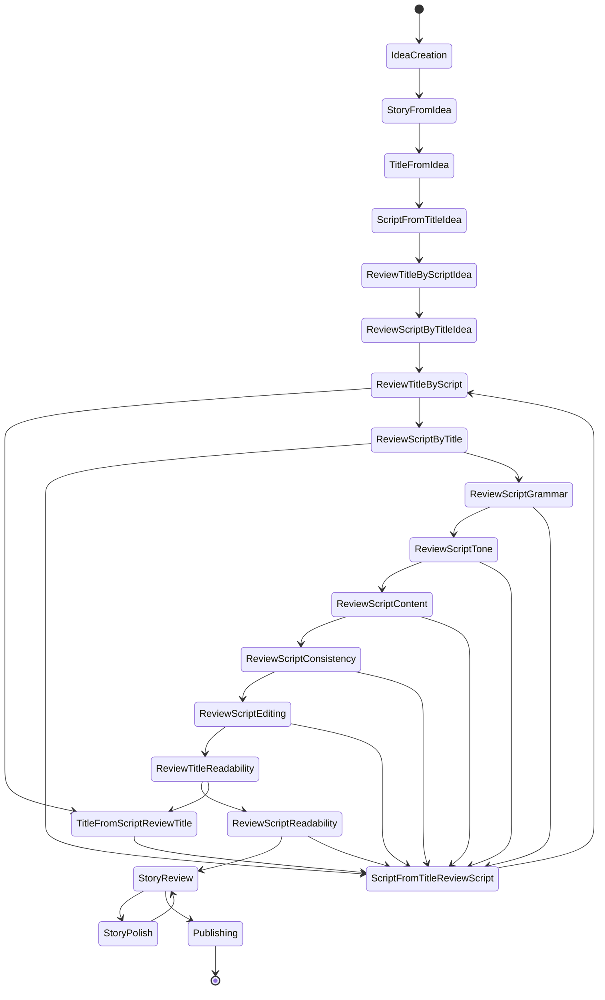
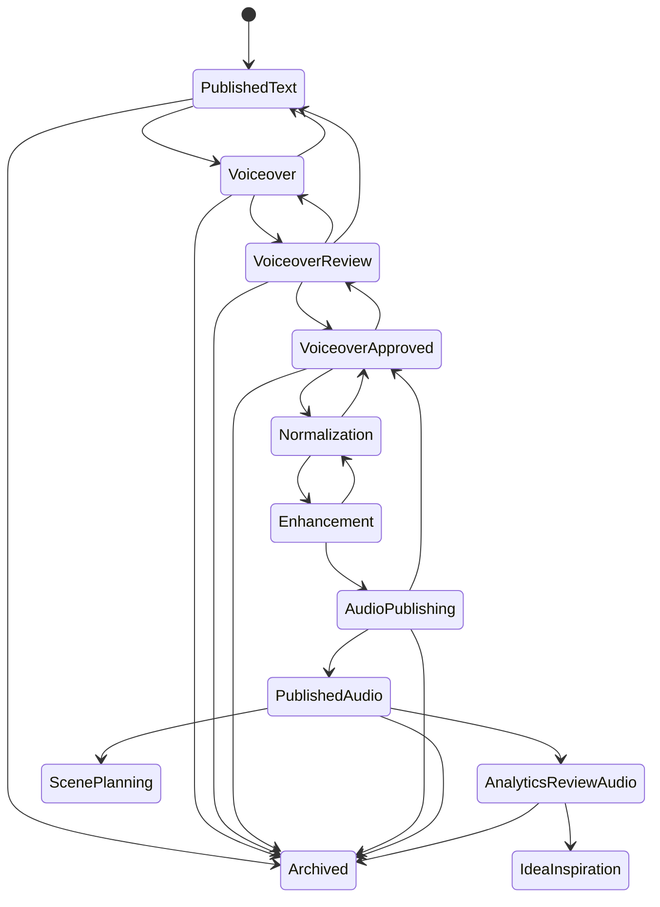
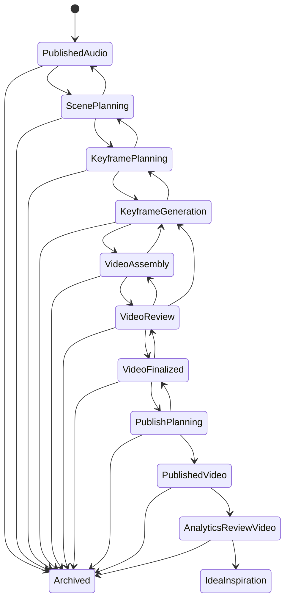
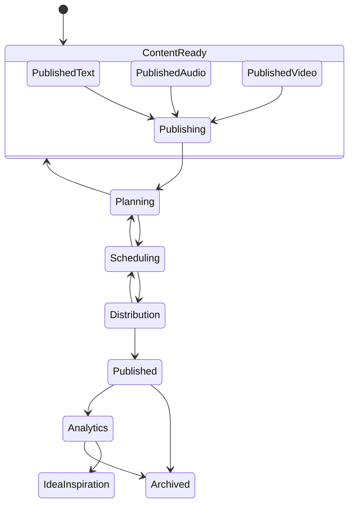
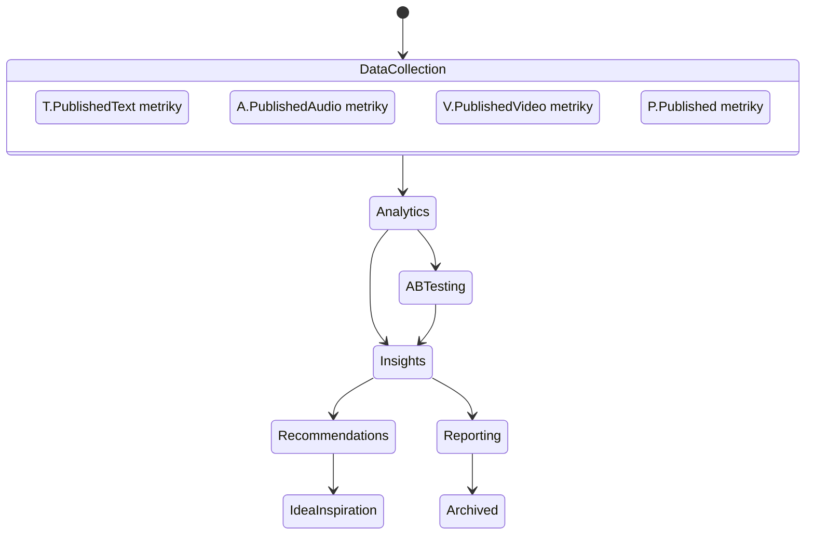

# Report přechodů stavů - PrismQ Moduly

**Komplexní dokumentace stavových přechodů pro všechny moduly platformy PrismQ**

> **Verze**: 1.0  
> **Vytvořeno**: 2025-12-04  
> **Jazyk**: Čeština

---

## Obsah

1. [Přehled architektury](#přehled-architektury)
2. [T Modul - Generování textu](#t-modul---generování-textu)
3. [A Modul - Generování audia](#a-modul---generování-audia)
4. [V Modul - Generování videa](#v-modul---generování-videa)
5. [P Modul - Publikování](#p-modul---publikování)
6. [M Modul - Metriky a analytika](#m-modul---metriky-a-analytika)
7. [Shrnutí přechodů](#shrnutí-přechodů)

---

## Přehled architektury

PrismQ implementuje sekvenční workflow pro tvorbu obsahu s postupným obohacováním formátů:

```
┌─────────────────────────────────────────────────────────────────────────────┐
│                           PrismQ Stavový automat                             │
├─────────────────────────────────────────────────────────────────────────────┤
│                                                                              │
│   T (Text)  ──►  A (Audio)  ──►  V (Video)  ──►  P (Publikování)            │
│      │              │               │                │                       │
│      └──────────────┴───────────────┴────────────────┘                       │
│                              │                                               │
│                     M (Metriky/Analytika)                                    │
│                              │                                               │
│                     T.IdeaInspiration (zpětná vazba)                         │
│                                                                              │
└─────────────────────────────────────────────────────────────────────────────┘
```

### Základní principy přechodů

| Princip | Popis |
|---------|-------|
| **Sekvenční pipeline** | T → A → V → P (každá fáze staví na předchozí) |
| **Kvalitní kontrolní body** | Explicitní kritéria přijetí při každém přechodu |
| **Iterativní vylepšování** | Smyčky a zpětnovazební cykly v rámci každého modulu |
| **Postupná publikace** | Možnost uvolnění obsahu v jakékoli fázi |
| **Průřezová observabilita** | M modul sleduje metriky napříč všemi fázemi |

---

## T Modul - Generování textu

**Jmenný prostor**: `PrismQ.T`

### Přehled stavů

T modul obsahuje **18 hlavních stavů** organizovaných do iterativního workflow s cykly společného vylepšování.

### Diagram přechodů stavů



### Tabulka stavů a přechodů

#### Fáze 1: Vytvoření nápadu

| Stav | Název | Fáze | Umístění | Přechod na |
|------|-------|------|----------|------------|
| IdeaCreation | PrismQ.T.Idea.Creation | 1 | T/Idea/Creation/ | StoryFromIdea |
| StoryFromIdea | PrismQ.T.Story.From.Idea | 1.5 | T/Story/From/Idea/ | TitleFromIdea |
| TitleFromIdea | PrismQ.T.Title.From.Idea | 2 | T/Title/From/Idea/ | ScriptFromTitleIdea |
| ScriptFromTitleIdea | PrismQ.T.Script.From.Title.Idea | 3 | T/Script/From/Idea/Title/ | ReviewTitleByScriptIdea |

**Popis přechodů:**
- `IdeaCreation → StoryFromIdea`: Vytvoření 10 příběhů z jednoho nápadu
- `StoryFromIdea → TitleFromIdea`: Generování titulku v1 z nápadu
- `TitleFromIdea → ScriptFromTitleIdea`: Generování skriptu v1 z titulku a nápadu
- `ScriptFromTitleIdea → ReviewTitleByScriptIdea`: Zahájení revizního cyklu

#### Fáze 2: Revize titulku a skriptu

| Stav | Název | Fáze | Přechod na (schváleno) | Přechod na (zamítnuto) |
|------|-------|------|------------------------|------------------------|
| ReviewTitleByScriptIdea | PrismQ.T.Review.Title.By.Script.Idea | 4 | ReviewScriptByTitleIdea | - |
| ReviewScriptByTitleIdea | PrismQ.T.Review.Script.By.Title.Idea | 5 | ReviewTitleByScript | - |
| ReviewTitleByScript | PrismQ.T.Review.Title.By.Script | 6 | ReviewScriptByTitle | TitleFromScriptReviewTitle |
| TitleFromScriptReviewTitle | PrismQ.T.Title.From.Script.Review.Title | 7 | ScriptFromTitleReviewScript | - |
| ScriptFromTitleReviewScript | PrismQ.T.Script.From.Title.Review.Script | 8 | ReviewTitleByScript | - |
| ReviewScriptByTitle | PrismQ.T.Review.Script.By.Title | 9 | ReviewScriptGrammar | ScriptFromTitleReviewScript |

**Iterativní smyčka:**
```
ReviewTitleByScript
    ├─ schváleno → ReviewScriptByTitle
    └─ zamítnuto → TitleFromScriptReviewTitle → ScriptFromTitleReviewScript → ReviewTitleByScript
```

#### Fáze 3: Kvalitní revize (lokální AI)

| Stav | Název | Fáze | Přechod na (projde) | Přechod na (selže) |
|------|-------|------|--------------------|--------------------|
| ReviewScriptGrammar | PrismQ.T.Review.Script.Grammar | 10 | ReviewScriptTone | ScriptFromTitleReviewScript |
| ReviewScriptTone | PrismQ.T.Review.Script.Tone | 11 | ReviewScriptContent | ScriptFromTitleReviewScript |
| ReviewScriptContent | PrismQ.T.Review.Script.Content | 12 | ReviewScriptConsistency | ScriptFromTitleReviewScript |
| ReviewScriptConsistency | PrismQ.T.Review.Script.Consistency | 13 | ReviewScriptEditing | ScriptFromTitleReviewScript |
| ReviewScriptEditing | PrismQ.T.Review.Script.Editing | 14 | ReviewTitleReadability | ScriptFromTitleReviewScript |
| ReviewTitleReadability | PrismQ.T.Review.Title.Readability | 15 | ReviewScriptReadability | TitleFromScriptReviewTitle |
| ReviewScriptReadability | PrismQ.T.Review.Script.Readability | 16 | StoryReview | ScriptFromTitleReviewScript |

**Sekvenční kvalitní kontroly:**
```
ReviewScriptGrammar
    ├─ projde → ReviewScriptTone
    │               ├─ projde → ReviewScriptContent
    │               │               ├─ projde → ReviewScriptConsistency
    │               │               │               └─ ... → ReviewScriptEditing → ReviewTitleReadability → ReviewScriptReadability
    │               │               └─ selže → ScriptFromTitleReviewScript
    │               └─ selže → ScriptFromTitleReviewScript
    └─ selže → ScriptFromTitleReviewScript
```

#### Fáze 4: Expertní revize (GPT)

| Stav | Název | Fáze | Přechod na (schváleno) | Přechod na (zamítnuto) |
|------|-------|------|------------------------|------------------------|
| StoryReview | PrismQ.T.Story.Review | 17 | Publishing | StoryPolish |
| StoryPolish | PrismQ.T.Story.Polish | 18 | StoryReview | - |

**Expertní smyčka:**
```
StoryReview
    ├─ schváleno → Publishing → [*]
    └─ zamítnuto → StoryPolish → StoryReview (iterace dokud není schváleno)
```

### Kvalitní kontrolní body (T modul)

| Kontrolní bod | Fáze | Popis |
|---------------|------|-------|
| Soulad titulek-skript (počáteční) | 4-6 | Zajištění počátečního souladu titulku a skriptu s nápadem |
| Soulad titulek-skript (upřesněný) | 8-10 | Zajištění upřesněného souladu titulku a skriptu |
| Lokální AI kvalitní revize | 10-16 | Sedmidimenzionální hodnocení kvality |
| Expertní revize | 17-18 | GPT-based holistická revize |

### Výstup T modulu

| Výstup | Popis |
|--------|-------|
| PublishedText | SEO-optimalizovaný publikovaný text |
| → PrismQ.A.Voiceover | Vstup pro audio pipeline |

---

## A Modul - Generování audia

**Jmenný prostor**: `PrismQ.A`

### Přehled stavů

A modul transformuje publikovaný text na profesionální audio obsah s následujícími hlavními stavy:

### Diagram přechodů stavů



### Tabulka stavů a přechodů

| Stav | Název | Vstup | Přechod na | Popis |
|------|-------|-------|------------|-------|
| PublishedText | PrismQ.T.PublishedText | T modul | Voiceover, Archived | Vstupní stav z T modulu |
| Voiceover | PrismQ.A.Voiceover | PublishedText | VoiceoverReview, PublishedText, Archived | Nahrávání hlasu z publikovaného textu |
| VoiceoverReview | PrismQ.A.Voiceover.Review | Voiceover | VoiceoverApproved, Voiceover, PublishedText, Archived | Kontrola kvality nahrávky |
| VoiceoverApproved | PrismQ.A.Voiceover.Approved | VoiceoverReview | Normalization, VoiceoverReview, Archived | Schválená nahrávka |
| Normalization | PrismQ.A.Normalized | VoiceoverApproved | Enhancement, VoiceoverApproved | Normalizace hlasitosti (LUFS) |
| Enhancement | PrismQ.A.Enhancement | Normalization | AudioPublishing, Normalization | EQ, komprese, finální úpravy |
| AudioPublishing | PrismQ.A.Publishing | Enhancement | PublishedAudio, VoiceoverApproved, Archived | Publikace na audio platformy |
| PublishedAudio | PrismQ.A.PublishedAudio | AudioPublishing | ScenePlanning, AnalyticsReviewAudio, Archived | Publikované audio |
| AnalyticsReviewAudio | PrismQ.A.Analytics.Review | PublishedAudio | IdeaInspiration, Archived | Analýza výkonu audia |

### Přechody revizí (A modul)

**Zpětné přechody:**
```
VoiceoverReview → Voiceover: Potřeba přenahrání
VoiceoverReview → PublishedText: Problém se zdrojovým textem
Voiceover → PublishedText: Chyby objevené během nahrávání
AudioPublishing → VoiceoverApproved: Problémy s audio souborem
```

### Kvalitní kontrolní body (A modul)

| Kontrolní bod | Stav | Kritéria |
|---------------|------|----------|
| Kvalita nahrávky | VoiceoverReview | Čistota zvuku, správná výslovnost, tempo |
| Technické standardy | Normalization | -16 LUFS (Spotify/Apple Podcasts) |
| Finální kvalita | AudioPublishing | Formát MP3 (320kbps), metadata |

### Výstup A modulu

| Výstup | Popis |
|--------|-------|
| PublishedAudio | Profesionální podcast/audio obsah |
| → PrismQ.V.ScenePlanning | Vstup pro video pipeline |
| → PrismQ.M.Analytics | Metriky výkonu |

---

## V Modul - Generování videa

**Jmenný prostor**: `PrismQ.V`

### Přehled stavů

V modul kombinuje publikované audio se synchronizovanými vizuály pro video platformy.

### Diagram přechodů stavů



### Tabulka stavů a přechodů

| Stav | Název | Fáze | Přechod vpřed | Přechod zpět |
|------|-------|------|---------------|--------------|
| PublishedAudio | PrismQ.A.PublishedAudio | Vstup | ScenePlanning | Archived |
| ScenePlanning | PrismQ.V.Scene.Planning | Vizuální plánování | KeyframePlanning | PublishedAudio |
| KeyframePlanning | PrismQ.V.Keyframe.Planning | Specifikace klíčových snímků | KeyframeGeneration | ScenePlanning |
| KeyframeGeneration | PrismQ.V.Keyframe.Generation | Generování vizuálů | VideoAssembly | KeyframePlanning |
| VideoAssembly | PrismQ.V.Video.Assembly | Sestavení videa | VideoReview | KeyframeGeneration |
| VideoReview | PrismQ.V.Video.Review | Revize kvality | VideoFinalized | VideoAssembly, KeyframeGeneration |
| VideoFinalized | PrismQ.V.Video.Finalized | Finalizace | PublishPlanning | VideoReview |
| PublishPlanning | PrismQ.V.Publish.Planning | Plánování publikace | PublishedVideo | VideoFinalized |
| PublishedVideo | PrismQ.V.PublishedVideo | Výstup | AnalyticsReviewVideo | Archived |
| AnalyticsReviewVideo | PrismQ.V.Analytics.Review | Analýza | IdeaInspiration | Archived |

### Sekvenční přechody (V modul)

**Lineární postup:**
```
PublishedAudio
    → ScenePlanning (plánování scén na základě audia)
    → KeyframePlanning (identifikace klíčových vizuálních momentů)
    → KeyframeGeneration (generování vizuálních assetů)
    → VideoAssembly (sestavení timeline)
    → VideoReview (kontrola kvality)
    → VideoFinalized (schválení)
    → PublishPlanning (strategie publikace)
    → PublishedVideo (výstup)
```

**Zpětné přechody:**
```
VideoReview → VideoAssembly: Problémy se sestavením
VideoReview → KeyframeGeneration: Problémy s vizuálními assety
KeyframePlanning → ScenePlanning: Revize struktury scén
ScenePlanning → PublishedAudio: Problémy s časováním audia
```

### Platformové specifikace (V modul)

| Platforma | Formát | Rozlišení | Speciální požadavky |
|-----------|--------|-----------|---------------------|
| YouTube | 16:9 | 1920x1080 | Miniatury, kapitoly, SEO |
| TikTok | 9:16 | 1080x1920 | Háček v prvních 3 sekundách |
| Instagram Reels | 9:16 | 1080x1920 | Titulky, krátký formát |
| YouTube Shorts | 9:16 | 1080x1920 | Max 60 sekund |

### Výstup V modulu

| Výstup | Popis |
|--------|-------|
| PublishedVideo | Kompletní video s audiem + vizuály |
| → PrismQ.P.Publishing | Vstup pro bulk publikaci |
| → PrismQ.M.Analytics | Metriky výkonu |

---

## P Modul - Publikování

**Jmenný prostor**: `PrismQ.P`

### Přehled stavů

P modul koordinuje hromadnou distribuci napříč více platformami po dokončení obsahu.

### Diagram přechodů stavů



### Tabulka stavů a přechodů

| Stav | Název | Vstup | Přechod na | Popis |
|------|-------|-------|------------|-------|
| ContentReady | PrismQ.P.Content.Ready | T/A/V | Publishing | Připravený obsah (text/audio/video) |
| Publishing | PrismQ.P.Publishing | ContentReady | Planning | Zahájení publikačního procesu |
| Planning | PrismQ.P.Publishing.Planning | Publishing | Scheduling, ContentReady | Plánování strategie publikace |
| Scheduling | PrismQ.P.Publishing.Scheduling | Planning | Distribution, Planning | Nastavení časování a pořadí |
| Distribution | PrismQ.P.Publishing.Distribution | Scheduling | Published, Scheduling | Provedení publikace |
| Published | PrismQ.P.Published | Distribution | Analytics, Archived | Publikovaný obsah napříč platformami |
| Analytics | PrismQ.P.Analytics | Published | IdeaInspiration, Archived | Sledování výkonu |

### Vstupní zdroje (P modul)

```
PrismQ.T.PublishedText ─┐
PrismQ.A.PublishedAudio ─┼→ PrismQ.P.Publishing → Multi-Platform Distribution
PrismQ.V.PublishedVideo ─┘
```

### Publikační strategie

| Typ obsahu | Časový rámec | Platformy |
|------------|--------------|-----------|
| Pouze text | Hodiny až dny | Medium, Substack, Blog, LinkedIn, Twitter/X |
| Text + Audio | Dny až týden | + Spotify, Apple Podcasts, SoundCloud |
| Kompletní multi-formát | Týdny | + YouTube, TikTok, Instagram Reels |

### Příklad multi-formátové kampaně

```
Den 1: Text (blog, sociální snippety)
    ↓
Den 3: Audio (podcastová epizoda)
    ↓
Den 7: Video (YouTube, krátké klipy)
    ↓
Průběžně: Křížová propagace napříč platformami
```

---

## M Modul - Metriky a analytika

**Jmenný prostor**: `PrismQ.M`

### Přehled architektury

M modul je **průřezový meta-modul**, který monitoruje výkon publikovaného obsahu napříč všemi formáty.

### Diagram přechodů stavů



### Tabulka stavů a přechodů

| Stav | Název | Vstup | Přechod na | Popis |
|------|-------|-------|------------|-------|
| DataCollection | PrismQ.M.Data.Collection | T/A/V/P | Analytics | Sběr metrik z publikovaného obsahu |
| Analytics | PrismQ.M.Analytics | DataCollection | ABTesting, Insights | Analýza výkonu |
| ABTesting | PrismQ.M.ABTesting | Analytics | Insights | Testování variant |
| Insights | PrismQ.M.Insights | Analytics, ABTesting | Recommendations, Reporting | Generování poznatků |
| Recommendations | PrismQ.M.Recommendations | Insights | IdeaInspiration | Doporučení pro obsah |
| Reporting | PrismQ.M.Reporting | Insights | Archived | Reporty výkonu |

### Zdroje dat (M modul)

```
┌─ T.PublishedText metriky ────┐
├─ A.PublishedAudio metriky ───┤
├─ V.PublishedVideo metriky ───┼→ M.Analytics → M.Insights → T.IdeaInspiration
└─ P.Published platform metriky┘
```

### Kategorie metrik

#### Textové metriky
| Kategorie | Metriky |
|-----------|---------|
| Zapojení | Zobrazení, čtení, doba čtení, hloubka scrollování |
| Interakce | Lajky, komentáře, sdílení, tlesky |
| SEO | Pozice ve vyhledávání, organický traffic, zpětné odkazy |
| Konverze | E-mailové přihlášky, proklikovost |

#### Audio metriky
| Kategorie | Metriky |
|-----------|---------|
| Zapojení | Přehrání, stažení, míra dokončení |
| Růst | Odběratelé, sledující, hodnocení epizody |
| Retence | Průměrná doba poslechu, body odpojení |
| Platforma | Spotify streamy, Apple Podcasts stažení |

#### Video metriky
| Kategorie | Metriky |
|-----------|---------|
| Výkon | Zobrazení, doba sledování, průměrná doba zobrazení |
| Zapojení | Lajky, komentáře, sdílení, uložení |
| Objevování | CTR, imprese, traffic z vyhledávání |
| Retence | Křivka retence publika, míra opakovaného sledování |

### Zpětnovazební smyčka

```
Poznatky z metrik informují budoucí obsah:

1. Vysoce výkonná témata → Více obsahu v dané oblasti
2. Preference publika → Úpravy formátu a stylu
3. Výkon platformy → Rozhodování o alokaci zdrojů
4. Vzorce zapojení → Optimalizace času publikace
5. Mezery v obsahu → Průzkum nových témat
```

---

## Shrnutí přechodů

### Celkový tok pipeline

```
┌─────────────────────────────────────────────────────────────────────────────────┐
│                           PrismQ Kompletní workflow                              │
├─────────────────────────────────────────────────────────────────────────────────┤
│                                                                                  │
│  IdeaInspiration                                                                 │
│       │                                                                          │
│       ▼                                                                          │
│  ┌─────────────────────────────────────────────────────────────────────────┐    │
│  │ T MODUL: 18 stavů                                                       │    │
│  │ IdeaCreation → StoryFromIdea → TitleFromIdea → ScriptFromTitleIdea      │    │
│  │     → ReviewTitleByScriptIdea → ReviewScriptByTitleIdea                 │    │
│  │     → ReviewTitleByScript ↔ TitleFromScriptReviewTitle                  │    │
│  │     → ScriptFromTitleReviewScript ↔ ReviewScriptByTitle                 │    │
│  │     → ReviewScriptGrammar → ReviewScriptTone → ReviewScriptContent      │    │
│  │     → ReviewScriptConsistency → ReviewScriptEditing                     │    │
│  │     → ReviewTitleReadability → ReviewScriptReadability                  │    │
│  │     → StoryReview ↔ StoryPolish → Publishing                            │    │
│  └─────────────────────────────────────────────────────────────────────────┘    │
│       │ PublishedText                                                            │
│       ▼                                                                          │
│  ┌─────────────────────────────────────────────────────────────────────────┐    │
│  │ A MODUL: 8 hlavních stavů                                               │    │
│  │ Voiceover → VoiceoverReview → VoiceoverApproved                         │    │
│  │     → Normalization → Enhancement → AudioPublishing → PublishedAudio    │    │
│  └─────────────────────────────────────────────────────────────────────────┘    │
│       │ PublishedAudio                                                           │
│       ▼                                                                          │
│  ┌─────────────────────────────────────────────────────────────────────────┐    │
│  │ V MODUL: 9 hlavních stavů                                               │    │
│  │ ScenePlanning → KeyframePlanning → KeyframeGeneration                   │    │
│  │     → VideoAssembly → VideoReview → VideoFinalized                      │    │
│  │     → PublishPlanning → PublishedVideo                                  │    │
│  └─────────────────────────────────────────────────────────────────────────┘    │
│       │ PublishedVideo                                                           │
│       ▼                                                                          │
│  ┌─────────────────────────────────────────────────────────────────────────┐    │
│  │ P MODUL: 5 hlavních stavů                                               │    │
│  │ Publishing → Planning → Scheduling → Distribution → Published           │    │
│  └─────────────────────────────────────────────────────────────────────────┘    │
│       │ Published (multi-platform)                                               │
│       ▼                                                                          │
│  ┌─────────────────────────────────────────────────────────────────────────┐    │
│  │ M MODUL: 6 hlavních stavů (průřezový)                                   │    │
│  │ DataCollection → Analytics → ABTesting → Insights → Recommendations     │    │
│  │     → Reporting                                                          │    │
│  └─────────────────────────────────────────────────────────────────────────┘    │
│       │ Recommendations                                                          │
│       ▼                                                                          │
│  IdeaInspiration (zpětná vazba)                                                  │
│                                                                                  │
└─────────────────────────────────────────────────────────────────────────────────┘
```

### Statistika přechodů

| Modul | Počet stavů | Lineární přechody | Zpětné přechody | Smyčky |
|-------|-------------|-------------------|-----------------|--------|
| T | 18 | 16 | 11 | 3 |
| A | 8 | 7 | 4 | 1 |
| V | 9 | 8 | 5 | 2 |
| P | 5 | 4 | 2 | 0 |
| M | 6 | 5 | 1 | 0 |
| **Celkem** | **46** | **40** | **23** | **6** |

### Typy přechodů

| Typ přechodu | Popis | Příklad |
|--------------|-------|---------|
| **Lineární** | Postup vpřed při splnění podmínek | ScriptDraft → ScriptReview |
| **Zpětný** | Návrat na předchozí stav pro revizi | ScriptReview → ScriptDraft |
| **Smyčka** | Iterativní cyklus do schválení | StoryReview ↔ StoryPolish |
| **Archivace** | Předčasné ukončení | [Jakýkoli stav] → Archived |
| **Zpětná vazba** | Informace pro budoucí obsah | Analytics → IdeaInspiration |

### Kvalitní kontrolní body (všechny moduly)

| Modul | Kontrolní bod | Účel |
|-------|---------------|------|
| T | Soulad titulek-skript | Zajištění konzistence |
| T | Lokální AI revize (7x) | Automatizovaná kvalita |
| T | Expertní GPT revize | Profesionální standard |
| A | Revize nahrávky | Kvalita hlasu |
| A | Normalizace LUFS | Technické standardy |
| V | Revize videa | Kvalita sestavení |
| V | Finalizace | Schválení před publikací |
| P | Distribuce | Úspěšná publikace |
| M | Insights | Validace poznatků |

---

## Závěr

Tento report dokumentuje přechody stavů pro všechny moduly platformy PrismQ:

1. **T Modul** implementuje nejsložitější workflow s 18 stavy a 3 iterativními smyčkami
2. **A Modul** zpracovává audio s důrazem na kvalitu a normalizaci
3. **V Modul** kombinuje audio s vizuály pro více platforem
4. **P Modul** koordinuje hromadnou distribuci
5. **M Modul** poskytuje průřezovou analytiku a zpětnou vazbu

Celkový systém obsahuje **46 stavů** s **40 lineárními přechody**, **23 zpětnými přechody** a **6 iterativními smyčkami**, což umožňuje robustní a flexibilní tvorbu obsahu s důrazem na kvalitu.

---

**Verze**: 1.0  
**Vytvořeno**: 2025-12-04  
**Součást**: PrismQ Content Production Platform

---

**Navigace**: [← Hlavní README](../../README.md) | [← Workflow](../WORKFLOW_CS.md) | [T Modul →](../../T/README.md) | [A Modul →](../../A/README.md) | [V Modul →](../../V/README.md)
