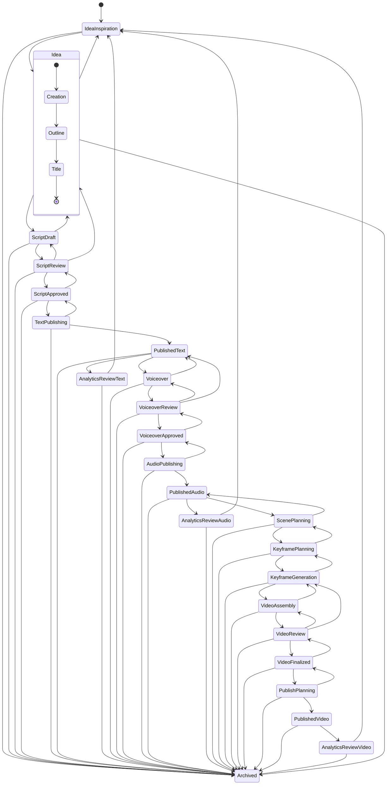

# PrismQ Content Production Workflow

**Complete State Machine for Content Production from Inspiration to Archive**

> 📖 **See also**: 
> - [MVP Workflow Overview](./mvp-overview.md) for detailed 26-stage workflow principles
> - [Workflow Documentation Index](./README.md) for complete navigation

## Overview

This document defines the complete workflow state machine for PrismQ content production, from initial inspiration through publication and analytics to final archival.

## Workflow State Diagram

