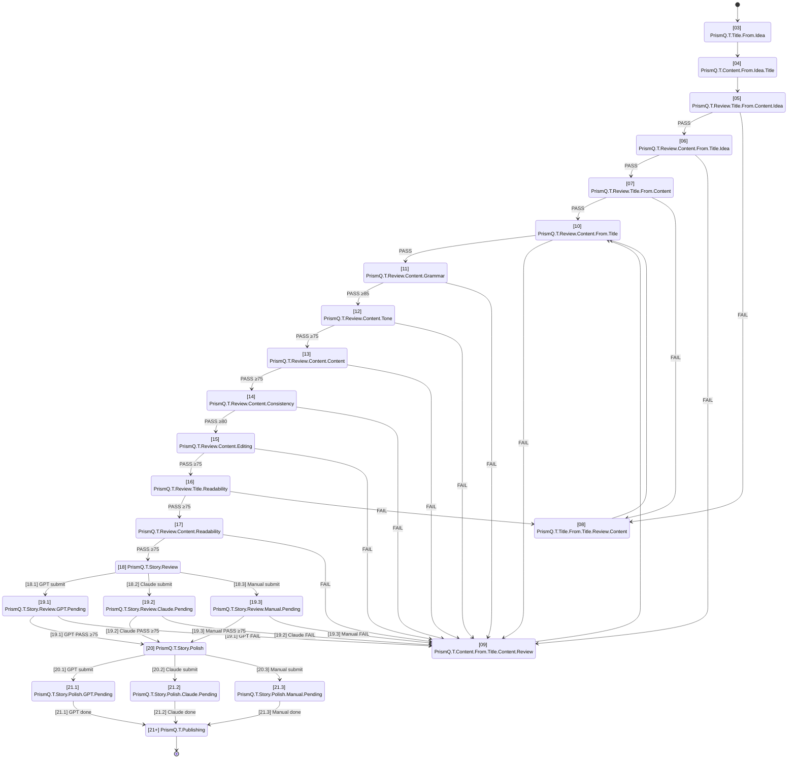

# PrismQ.T Content Production — State Machine

**Complete state diagram for Story production pipeline (modules 03–21)**

> 📖 **See also**:
> - [Workflow Documentation Index](./README.md)
> - Module reports in `_meta/reports/`

---

## State Diagram

```mermaid
stateDiagram-v2
    direction TB

    %% ── State aliases (short ID → actual PrismQ.T state string) ──────────
    TitleFromIdea          : [03] PrismQ.T.Title.From.Idea
    ContentFromIdeaTitle   : [04] PrismQ.T.Content.From.Idea.Title
    RevTitleFromContentIdea: [05] PrismQ.T.Review.Title.From.Content.Idea
    RevContentFromTitleIdea: [06] PrismQ.T.Review.Content.From.Title.Idea
    RevTitleFromContent    : [07] PrismQ.T.Review.Title.From.Content
    TitleRegen             : [08] PrismQ.T.Title.From.Title.Review.Content
    ContentRegen09         : [09] PrismQ.T.Content.From.Title.Content.Review
    RevContentFromTitle    : [10] PrismQ.T.Review.Content.From.Title
    Grammar                : [11] PrismQ.T.Review.Content.Grammar
    Tone                   : [12] PrismQ.T.Review.Content.Tone
    Content                : [13] PrismQ.T.Review.Content.Content
    Consistency            : [14] PrismQ.T.Review.Content.Consistency
    Editing                : [15] PrismQ.T.Review.Content.Editing
    TitleReadability       : [16] PrismQ.T.Review.Title.Readability
    ContentReadability     : [17] PrismQ.T.Review.Content.Readability

    %% ── Expert review + polish entry points ──────────────────────────────
    StoryReview            : [18] PrismQ.T.Story.Review
    StoryPolish            : [20] PrismQ.T.Story.Polish
    Publishing             : [21+] PrismQ.T.Publishing

    %% ── Expert review pending states (one per model track) ───────────────
    RevGPTPending    : [19.1] PrismQ.T.Story.Review.GPT.Pending
    RevClaudePending : [19.2] PrismQ.T.Story.Review.Claude.Pending
    RevManualPending : [19.3] PrismQ.T.Story.Review.Manual.Pending

    %% ── Polish pending states (one per model track) ──────────────────────
    PolGPTPending    : [21.1] PrismQ.T.Story.Polish.GPT.Pending
    PolClaudePending : [21.2] PrismQ.T.Story.Polish.Claude.Pending
    PolManualPending : [21.3] PrismQ.T.Story.Polish.Manual.Pending

    %% ── Phase 1–2: Generation ────────────────────────────────────────────
    [*]                    --> TitleFromIdea
    TitleFromIdea          --> ContentFromIdeaTitle

    %% ── Phase 3: Initial Review Cycle (modules 05–07) ───────────────────
    ContentFromIdeaTitle   --> RevTitleFromContentIdea

    RevTitleFromContentIdea --> RevContentFromTitleIdea : PASS
    RevTitleFromContentIdea --> TitleRegen              : FAIL

    RevContentFromTitleIdea --> RevTitleFromContent     : PASS
    RevContentFromTitleIdea --> ContentRegen09          : FAIL

    RevTitleFromContent     --> RevContentFromTitle     : PASS
    RevTitleFromContent     --> TitleRegen              : FAIL

    %% ── Phase 4: Regeneration loops (modules 08–09) ─────────────────────
    TitleRegen     --> RevContentFromTitle
    ContentRegen09 --> RevContentFromTitle

    %% ── Phase 5: Pre-Quality Gate (module 10) ───────────────────────────
    RevContentFromTitle --> Grammar        : PASS
    RevContentFromTitle --> ContentRegen09 : FAIL

    %% ── Phase 6: Quality Review Chain (modules 11–17) ───────────────────
    Grammar     --> Tone             : PASS ≥85
    Grammar     --> ContentRegen09   : FAIL

    Tone        --> Content          : PASS ≥75
    Tone        --> ContentRegen09   : FAIL

    Content     --> Consistency      : PASS ≥75
    Content     --> ContentRegen09   : FAIL

    Consistency --> Editing          : PASS ≥80
    Consistency --> ContentRegen09   : FAIL

    Editing     --> TitleReadability : PASS ≥75
    Editing     --> ContentRegen09   : FAIL

    TitleReadability --> ContentReadability : PASS ≥75
    TitleReadability --> TitleRegen         : FAIL

    ContentReadability --> StoryReview    : PASS ≥75
    ContentReadability --> ContentRegen09 : FAIL

    %% ── Phase 7: Expert Review — Submit [18] ────────────────────────────
    %% One model is active per run (PRISMQ_REVIEW_MODE env var)
    StoryReview --> RevGPTPending    : [18.1] GPT submit
    StoryReview --> RevClaudePending : [18.2] Claude submit
    StoryReview --> RevManualPending : [18.3] Manual submit

    %% ── Phase 7: Expert Review — Poll [19] ──────────────────────────────
    RevGPTPending    --> StoryPolish    : [19.1] GPT PASS ≥75
    RevGPTPending    --> ContentRegen09 : [19.1] GPT FAIL
    RevClaudePending --> StoryPolish    : [19.2] Claude PASS ≥75
    RevClaudePending --> ContentRegen09 : [19.2] Claude FAIL
    RevManualPending --> StoryPolish    : [19.3] Manual PASS ≥75
    RevManualPending --> ContentRegen09 : [19.3] Manual FAIL

    %% ── Phase 8: Polish — Submit [20] ───────────────────────────────────
    StoryPolish --> PolGPTPending    : [20.1] GPT submit
    StoryPolish --> PolClaudePending : [20.2] Claude submit
    StoryPolish --> PolManualPending : [20.3] Manual submit

    %% ── Phase 8: Polish — Poll [21] ─────────────────────────────────────
    PolGPTPending    --> Publishing : [21.1] GPT done
    PolClaudePending --> Publishing : [21.2] Claude done
    PolManualPending --> Publishing : [21.3] Manual done

    Publishing --> [*]
```

---

## State Reference Table

| Module | State (PrismQ.T string) | Description |
|--------|------------------------|-------------|
| 03 | `PrismQ.T.Title.From.Idea` | AI title generation from Idea |
| 04 | `PrismQ.T.Content.From.Idea.Title` | AI content generation from Idea + Title |
| 05 | `PrismQ.T.Review.Title.From.Content.Idea` | AI review: title vs. content + idea |
| 06 | `PrismQ.T.Review.Content.From.Title.Idea` | AI review: content vs. title + idea |
| 07 | `PrismQ.T.Review.Title.From.Content` | AI review: title vs. content (final pre-chain) |
| 08 | `PrismQ.T.Title.From.Title.Review.Content` | Title regeneration from review feedback |
| 09 | `PrismQ.T.Content.From.Title.Content.Review` | Content regeneration from early review feedback |
| 10 | `PrismQ.T.Review.Content.From.Title` | **Quality gate**: final review before grammar chain |
| 11 | `PrismQ.T.Review.Content.Grammar` | Grammar, punctuation, syntax (threshold ≥ 85) |
| 12 | `PrismQ.T.Review.Content.Tone` | Tone, voice, emotional register (threshold ≥ 75) |
| 13 | `PrismQ.T.Review.Content.Content` | Factual accuracy, coherence (threshold ≥ 75) |
| 14 | `PrismQ.T.Review.Content.Consistency` | Character/timeline/detail consistency (threshold ≥ 80) |
| 15 | `PrismQ.T.Review.Content.Editing` | Clarity, flow, wordiness, pacing (threshold ≥ 75) |
| 16 | `PrismQ.T.Review.Title.Readability` | Title clarity, catchiness, length (threshold ≥ 75) |
| 17 | `PrismQ.T.Review.Content.Readability` | Voice-over suitability, spoken flow (threshold ≥ 75) |
| 18 | `PrismQ.T.Story.Review` | Expert review entry — routes to model track |
| 18.1 | `PrismQ.T.Story.Review.GPT.Pending` | OpenAI Batch in flight |
| 18.2 | `PrismQ.T.Story.Review.Claude.Pending` | Anthropic Batch in flight |
| 18.3 | `PrismQ.T.Story.Review.Manual.Pending` | Waiting for user review file |
| 19 | *(poll step — no DB state)* | Poll active review batches / manual files |
| 20 | `PrismQ.T.Story.Polish` | Polish entry — routes to model track |
| 20.1 | `PrismQ.T.Story.Polish.GPT.Pending` | OpenAI Batch in flight |
| 20.2 | `PrismQ.T.Story.Polish.Claude.Pending` | Anthropic Batch in flight |
| 20.3 | `PrismQ.T.Story.Polish.Manual.Pending` | Waiting for user polish file |
| 21 | *(poll step — no DB state)* | Poll active polish batches / manual files |
| 22 | `PrismQ.T.Publishing` | Terminal state — ready for publication |

### Improvement States (FAIL destinations)

| Module | State | Triggered by | Next state |
|--------|-------|--------------|------------|
| 08 | `PrismQ.T.Title.From.Title.Review.Content` | Mod 05 FAIL, Mod 07 FAIL, Mod 16 FAIL | Module 10 |
| 09 | `PrismQ.T.Content.From.Title.Content.Review` | Mod 06 FAIL, Mod 10 FAIL, Mods 11–15 FAIL, Mod 17 FAIL, Mods 19.x FAIL | Module 10 |

---

## AI Model Assignment

| Phase | Modules | Model | Notes |
|-------|---------|-------|-------|
| Generation | 03–04 | `qwen3:14b` | Via `PRISMQ_AI_MODEL` env var |
| Initial reviews | 05–07 | `qwen3:14b` | Via `PRISMQ_AI_MODEL_REVIEW` env var |
| Regeneration | 08–09 | `qwen3:32b` | Via `PRISMQ_AI_MODEL_CONTENT_IMPROVE` env var |
| Quality gate | 10 | `qwen3:14b` | |
| Quality reviews | 11–17 | `qwen3:14b` (local Ollama) | Via `PRISMQ_AI_MODEL_REVIEW` |
| Expert review submit | 18.x | GPT / Claude / Manual | `PRISMQ_REVIEW_MODE=gpt\|claude\|manual` |
| Expert review poll | 19 | *(polls all pending states)* | |
| Polish submit | 20.x | GPT / Claude / Manual | Same env var |
| Polish poll | 21 | *(polls all pending states)* | |

### Expert Review / Polish Model Defaults

| Track | Model | API |
|-------|-------|-----|
| GPT   | `gpt-5.2` + `reasoning_effort=medium` (override: `PRISMQ_GPT_MODEL`) | OpenAI Batch `/v1/chat/completions` |
| Claude | `claude-opus-4-6` (override: `PRISMQ_CLAUDE_MODEL`) | Anthropic Batch `/v1/messages/batches` |
| Manual | *(user)* | File in `PRISMQ_MANUAL_DIR` (default: `C:/PrismQ/manual`) |
