# Workflow produkce obsahu PrismQ

**Kompletní stavový automat pro produkci obsahu od inspirace po archivaci**

> 📖 **Viz také**: 
> - [Přehled MVP workflow](./mvp-overview_CS.md) pro podrobné principy 26fázového workflow
> - [Index dokumentace workflow](./README.md) pro kompletní navigaci

## Přehled

Tento dokument definuje kompletní stavový automat workflow pro produkci obsahu v PrismQ, od počáteční inspirace přes publikaci a analytiku až po finální archivaci.

## Diagram stavů workflow

```mermaid
stateDiagram-v2
    [*] --> IdeaInspiration
    IdeaInspiration --> Idea
    IdeaInspiration --> Archived

    state Idea {
        [*] --> Creation
        Creation --> Outline
        Outline --> Title

        Title --> [*]   %% Title je finální podstav před opuštěním Idea
    }

    Idea --> ScriptDraft
    Idea --> IdeaInspiration
    Idea --> Archived
    
    ScriptDraft --> ScriptReview
    ScriptDraft --> Idea
    ScriptDraft --> Archived

    ScriptReview --> ScriptApproved
    ScriptReview --> ScriptDraft
    ScriptReview --> Idea
    ScriptReview --> Archived

    ScriptApproved --> TextPublishing
    ScriptApproved --> ScriptReview
    ScriptApproved --> Archived

    %% Větev publikace textu
    TextPublishing --> PublishedText
    TextPublishing --> ScriptApproved
    TextPublishing --> Archived

    PublishedText --> Voiceover
    PublishedText --> AnalyticsReviewText
    PublishedText --> Archived

    AnalyticsReviewText --> Archived
    AnalyticsReviewText --> IdeaInspiration

    %% Produkce audia používá publikovaný text
    Voiceover --> VoiceoverReview
    Voiceover --> PublishedText
    Voiceover --> Archived

    VoiceoverReview --> VoiceoverApproved
    VoiceoverReview --> Voiceover
    VoiceoverReview --> PublishedText
    VoiceoverReview --> Archived

    VoiceoverApproved --> AudioPublishing
    VoiceoverApproved --> VoiceoverReview
    VoiceoverApproved --> Archived

    %% Větev publikace audia
    AudioPublishing --> PublishedAudio
    AudioPublishing --> VoiceoverApproved
    AudioPublishing --> Archived

    PublishedAudio --> ScenePlanning
    PublishedAudio --> AnalyticsReviewAudio
    PublishedAudio --> Archived

    AnalyticsReviewAudio --> Archived
    AnalyticsReviewAudio --> IdeaInspiration

    %% Produkce videa používá publikované audio
    ScenePlanning --> KeyframePlanning
    ScenePlanning --> PublishedAudio
    ScenePlanning --> Archived

    KeyframePlanning --> KeyframeGeneration
    KeyframePlanning --> ScenePlanning
    KeyframePlanning --> Archived

    KeyframeGeneration --> VideoAssembly
    KeyframeGeneration --> KeyframePlanning
    KeyframeGeneration --> Archived

    VideoAssembly --> VideoReview
    VideoAssembly --> KeyframeGeneration
    VideoAssembly --> Archived

    VideoReview --> VideoFinalized
    VideoReview --> VideoAssembly
    VideoReview --> KeyframeGeneration
    VideoReview --> Archived

    VideoFinalized --> PublishPlanning
    VideoFinalized --> VideoReview
    VideoFinalized --> Archived

    %% Větev publikace videa
    PublishPlanning --> PublishedVideo
    PublishPlanning --> VideoFinalized
    PublishPlanning --> Archived

    PublishedVideo --> AnalyticsReviewVideo
    PublishedVideo --> Archived

    AnalyticsReviewVideo --> Archived
    AnalyticsReviewVideo --> IdeaInspiration
```

