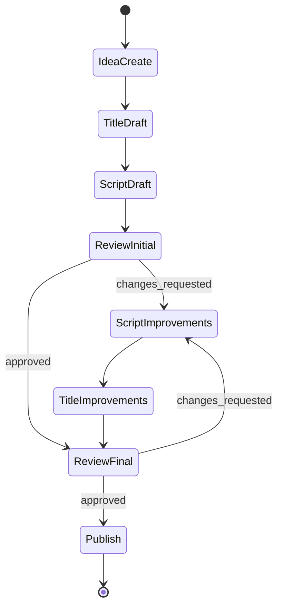

# PARALLEL_RUN_NEXT - MVP Sprint Execution

**Sprint**: Sprint 1-2 (4 weeks) - MVP Core Workflow  
**Date**: 2025-11-21  
**Status**: Planning  
**Goal**: Build MVP end-to-end workflow following: **Idea.Create → T.Title.Draft → T.Script.Draft → T.Review.Initial → T.Script.Improvements → T.Title.Improvements → T.Review.Final → T.Publish**

---

## MVP Approach

### Why MVP First?
- **Fast validation**: 4 weeks to working product (vs 7 weeks for full features)
- **Reduced risk**: 8 issues vs 120 issues
- **Resource efficiency**: 3-4 workers vs 10-12 workers
- **Early feedback**: Learn from real usage before building advanced features

### MVP Workflow

```
Idea.Create
    ↓
T.Title.Draft (generate 3-5 title variants)
    ↓
T.Script.Draft (generate basic script)
    ↓
T.Review.Initial (manual review, approve/changes requested)
    ↓
T.Script.Improvements (edit based on feedback)
    ↓
T.Title.Improvements (update title if needed)
    ↓
T.Review.Final (final approval gate)
    ↓
T.Publish (mark as published)
```

---

## Sprint 1: Core Creation (Weeks 1-2)

### Week 1: Foundation

**Goal**: Idea → Title generation working  
**Active Workers**: 4

| Worker | Issue | Effort | Description |
|--------|-------|--------|-------------|
| **Worker02** | #MVP-001 | 2d | Basic Idea Creation |
| **Worker13** | #MVP-002 | 2d | Basic Title Generator |
| **Worker15** | Documentation | 2d | MVP workflow docs |
| **Worker04** | Test Setup | 2d | Test framework |

**Commands**:
```
Worker02: Implement #MVP-001 in T/Idea/
- Dependencies: None
- Priority: Critical
- Effort: 2 days
- Deliverable: Basic idea capture and storage working

Worker13: Implement #MVP-002 in T/Title/
- Dependencies: #MVP-001 (can start in parallel)
- Priority: Critical
- Effort: 2 days
- Deliverable: Generate 3-5 title variants from idea
```

**Week 1 Deliverable**: ✅ Create idea → generate titles

---

### Week 2: Script & Review

**Goal**: Script generation and review system working  
**Active Workers**: 4

| Worker | Issue | Effort | Description |
|--------|-------|--------|-------------|
| **Worker02** | #MVP-003 | 3d | Basic Script Generator |
| **Worker10** | #MVP-004 | 2d | Simple Review System |
| **Worker15** | API Docs | 2d | Document MVP APIs |
| **Worker04** | Integration Tests | 2d | Test end-to-end flow |

**Commands**:
```
Worker02: Implement #MVP-003 in T/Script/
- Dependencies: #MVP-001, #MVP-002
- Priority: Critical
- Effort: 3 days
- Deliverable: Generate basic script from idea + selected title

Worker10: Implement #MVP-004 in T/Rewiew/
- Dependencies: #MVP-003 (can start design in parallel)
- Priority: Critical
- Effort: 2 days
- Deliverable: Review workflow with approve/request changes states
```

**Week 2 Deliverable**: ✅ Generate script → perform review

---

## Sprint 2: Iteration & Publishing (Weeks 3-4)

### Week 3: Improvements

**Goal**: Improvement cycle working  
**Active Workers**: 4

| Worker | Issue | Effort | Description |
|--------|-------|--------|-------------|
| **Worker02** | #MVP-005 | 2d | Manual Script Editing |
| **Worker13** | #MVP-006 | 1d | Title Update |
| **Worker10** | #MVP-007 | 1d | Final Review Approval |
| **Worker04** | E2E Tests | 2d | Complete workflow tests |

**Commands**:
```
Worker02: Implement #MVP-005 in T/Script/
- Dependencies: #MVP-004
- Priority: Critical
- Effort: 2 days
- Deliverable: Edit script based on review feedback

Worker13: Implement #MVP-006 in T/Title/
- Dependencies: #MVP-005
- Priority: High
- Effort: 1 day
- Deliverable: Update title after script changes

Worker10: Implement #MVP-007 in T/Rewiew/
- Dependencies: #MVP-005, #MVP-006
- Priority: Critical
- Effort: 1 day
- Deliverable: Final approval gate before publishing
```

**Week 3 Deliverable**: ✅ Improvement cycle complete

---

### Week 4: Publishing

**Goal**: End-to-end flow complete  
**Active Workers**: 3

| Worker | Issue | Effort | Description |
|--------|-------|--------|-------------|
| **Worker02** | #MVP-008 | 2d | Basic Publishing |
| **Worker15** | User Guide | 2d | Complete documentation |
| **Worker04** | Final Testing | 2d | Validate all scenarios |

**Commands**:
```
Worker02: Implement #MVP-008 in T/Publishing/
- Dependencies: #MVP-007
- Priority: Critical
- Effort: 2 days
- Deliverable: Publish approved content (mark as published, export)

Worker15: Complete user guide
- Dependencies: All MVP features
- Priority: High
- Effort: 2 days
- Deliverable: End-to-end user documentation

Worker04: Final MVP testing
- Dependencies: All MVP features
- Priority: High
- Effort: 2 days
- Deliverable: Full E2E test suite passing
```

**Week 4 Deliverable**: ✅ MVP complete and ready for use

---

## MVP Issues Summary

| Issue | Stage | Worker | Effort | Description |
|-------|-------|--------|--------|-------------|
| #MVP-001 | Idea.Create | Worker02 | 2d | Basic idea capture |
| #MVP-002 | T.Title.Draft | Worker13 | 2d | Title generation |
| #MVP-003 | T.Script.Draft | Worker02 | 3d | Script generation |
| #MVP-004 | T.Review.Initial | Worker10 | 2d | Review workflow |
| #MVP-005 | T.Script.Improvements | Worker02 | 2d | Script editing |
| #MVP-006 | T.Title.Improvements | Worker13 | 1d | Title update |
| #MVP-007 | T.Review.Final | Worker10 | 1d | Final approval |
| #MVP-008 | T.Publish | Worker02 | 2d | Publishing |

**Total**: 8 issues, 15 days of work, 4 weeks calendar time with 3-4 workers

---

## Workflow State Machine



---

## Success Metrics

### MVP Completion Criteria
- ✅ All 8 MVP issues implemented
- ✅ End-to-end workflow tested
- ✅ Documentation complete
- ✅ At least one content piece published through full workflow

### Quality Standards
- Test coverage: >80% for MVP features
- All happy path E2E tests passing
- API documentation complete
- User guide available

---

## Post-MVP Roadmap

See `ISSUE_PLAN_T_*.md` files for full feature plans (120 issues total) to be added after MVP validates the workflow.

### Phase 2 (After MVP)
- AI-powered improvements
- SEO optimization
- Automated quality checks
- Multi-platform publishing

### Phase 3 (Future)
- A/B testing
- Analytics integration
- Collaboration features
- Batch processing

---

## Related Documents

- **MVP_WORKFLOW.md**: Detailed MVP planning and issue specifications
- **PARALLEL_RUN_NEXT_FULL.md**: Full 120-issue plan for post-MVP
- **ISSUE_PLAN_T_*.md**: Comprehensive feature plans for each module
- **Worker*/README.md**: Worker role definitions

---

**Status**: Ready for MVP Sprint 1  
**Next Action**: Worker01 to create 8 MVP issues in GitHub  
**Timeline**: 4 weeks to working MVP  
**Approach**: MVP-first, iterative development

---

**Owner**: Worker01  
**Created**: 2025-11-21  
**Last Updated**: 2025-11-21  
**Focus**: MVP workflow following Idea → Title → Script → Review → Improvements → Publish
