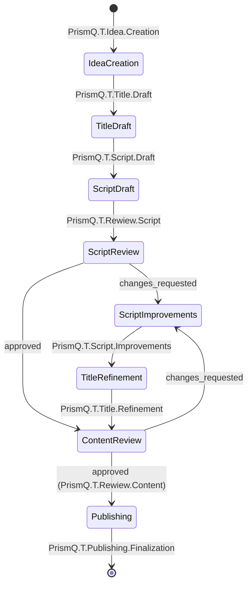

# PARALLEL_RUN_NEXT - MVP Sprint Execution

**Sprint**: Sprint 1-2 (4 weeks) - MVP Core Workflow  
**Date**: 2025-11-21  
**Status**: Planning  
**Goal**: Build MVP end-to-end workflow following: **Idea.Create → T.Title.Draft → T.Script.Draft → T.Review.Initial → T.Script.Improvements → T.Title.Improvements → T.Review.Final → T.Publish**

---

## MVP Approach

### Why MVP First?
- **Fast validation**: 4 weeks to working product (vs 7 weeks for full features)
- **Reduced risk**: 8 issues vs 120 issues
- **Resource efficiency**: 3-4 workers vs 10-12 workers
- **Early feedback**: Learn from real usage before building advanced features

### MVP Workflow with Real Folder Names

**Reference**: See `T/TITLE_SCRIPT_WORKFLOW.md` for complete workflow documentation.

**MVP Simplified Path** (9 stages with feedback loops):

```
PrismQ.T.Idea.Creation          → Basic idea capture
    ↓
PrismQ.T.Title.Draft            → Generate 3-5 title variants
    ↓
PrismQ.T.Rewiew.Idea            → Title review ←──────────┐
    ↓                                                      │
    ├─→ If changes: return to Title.Draft ────────────────┘
    ↓ (If approved)
PrismQ.T.Script.Draft           → Generate basic script
    ↓
PrismQ.T.Rewiew.Script          → Script review ←─────────┐
    ↓                                                      │
    ├─→ If changes: Script.Improvements ──────────────────┘
    ↓ (If approved)
PrismQ.T.Rewiew.Content         → Final content review ←──┐
    ↓                                                      │
    ├─→ Script changes: Script.Improvements → Rewiew.Script ─┘
    ├─→ Title changes: Title.Refinement → Rewiew.Idea ───────┘
    ↓ (If approved)
PrismQ.T.Publishing.Finalization → Mark as published
```

**Full Workflow** (from TITLE_SCRIPT_WORKFLOW.md):
```
Idea.Creation → Outline → Skeleton → Title → 
ScriptDraft → ScriptReview → ScriptApproved → 
TextPublishing (SEO: Keywords/Tags/Categories) → PublishedText
```

**MVP Simplifications**:
- Skips Idea.Outline and Idea.Skeleton (direct to Title.Draft)
- **Adds explicit Title Review** with feedback loop (#MVP-003)
- **Adds explicit feedback loops** at all review stages
- Combines review stages (Script + Content vs. Grammar/Readability/Tone/Content/Consistency/Editing)
- Basic publishing (skips comprehensive SEO optimization modules)
- Iterative improvements instead of formal "Approved" state

**Folder Paths:**
- `T/Idea/Creation/` - Idea creation
- `T/Title/Draft/` - Title drafting
- `T/Rewiew/Idea/` - **Title review** (NEW)
- `T/Script/Draft/` - Script drafting
- `T/Rewiew/Script/` - Script review (with feedback loop)
- `T/Script/Improvements/` - Script improvements
- `T/Title/Refinement/` - Title refinement (if needed)
- `T/Rewiew/Content/` - Content review (multi-path feedback)
- `T/Publishing/Finalization/` - Publishing

---

## Sprint 1: Core Creation (Weeks 1-2)

### Week 1: Foundation + Title Review Loop

**Goal**: Idea → Title → Title Review (with feedback loop) working  
**Active Workers**: 4

| Worker | Issue | Effort | Description |
|--------|-------|--------|-------------|
| **Worker02** | #MVP-001 | 2d | Basic Idea Creation |
| **Worker13** | #MVP-002 | 2d | Basic Title Generator |
| **Worker10** | #MVP-003 | 1d | Title Review with Feedback Loop |
| **Worker15** | Documentation | 2d | MVP workflow docs with feedback loops |
| **Worker04** | Test Setup | 2d | Test framework |

**Commands**:
```
Worker02: Implement #MVP-001 in T/Idea/Creation/
- Module: PrismQ.T.Idea.Creation
- Dependencies: None
- Priority: Critical
- Effort: 2 days
- Deliverable: Basic idea capture and storage working

Worker13: Implement #MVP-002 in T/Title/Draft/
- Module: PrismQ.T.Title.Draft
- Dependencies: #MVP-001 (can start in parallel)
- Priority: Critical
- Effort: 2 days
- Deliverable: Generate 3-5 title variants from idea

Worker10: Implement #MVP-003 in T/Rewiew/Idea/
- Module: PrismQ.T.Rewiew.Idea
- Dependencies: #MVP-002
- Priority: Critical
- Effort: 1 day
- Deliverable: Title review with feedback loop (approve or return to Title.Draft)
```

**Week 1 Deliverable**: ✅ Create idea → generate titles → review titles (with feedback loop)

---

### Week 2: Script & Script Review Loop

**Goal**: Script generation and script review with feedback loop working  
**Active Workers**: 4

| Worker | Issue | Effort | Description |
|--------|-------|--------|-------------|
| **Worker02** | #MVP-004 | 3d | Basic Script Generator |
| **Worker10** | #MVP-005 | 2d | Script Review with Feedback Loop |
| **Worker02** | #MVP-006 | 2d | Script Improvements (for loop) |
| **Worker15** | API Docs | 2d | Document MVP APIs |
| **Worker04** | Integration Tests | 2d | Test end-to-end flow with loops |

**Commands**:
```
Worker02: Implement #MVP-004 in T/Script/Draft/
- Module: PrismQ.T.Script.Draft
- Dependencies: #MVP-003 (approved title)
- Priority: Critical
- Effort: 3 days
- Deliverable: Generate basic script from idea + approved title

Worker10: Implement #MVP-005 in T/Rewiew/Script/
- Module: PrismQ.T.Rewiew.Script
- Dependencies: #MVP-004
- Priority: Critical
- Effort: 2 days
- Deliverable: Script review with feedback loop (approve or send to Improvements)

Worker02: Implement #MVP-006 in T/Script/Improvements/
- Module: PrismQ.T.Script.Improvements
- Dependencies: #MVP-005
- Priority: Critical
- Effort: 2 days
- Deliverable: Script editing that returns to Rewiew.Script for re-approval
```

**Week 2 Deliverable**: ✅ Generate script → review script (with feedback loop to improvements)

---

## Sprint 2: Iteration & Publishing (Weeks 3-4)

### Week 3: Final Content Review with Multi-Path Feedback

**Goal**: Final content review with feedback loops for both script and title  
**Active Workers**: 4

| Worker | Issue | Effort | Description |
|--------|-------|--------|-------------|
| **Worker10** | #MVP-007 | 1d | Final Content Review with Multi-Path Feedback |
| **Worker13** | #MVP-008 | 1d | Title Refinement (if needed) |
| **Worker04** | E2E Tests | 2d | Complete workflow tests with all loops |

**Commands**:
```
Worker10: Implement #MVP-007 in T/Rewiew/Content/
- Module: PrismQ.T.Rewiew.Content
- Dependencies: #MVP-005 (approved script), #MVP-003 (approved title)
- Priority: Critical
- Effort: 1 day
- Deliverable: Final review with multi-path feedback (script → Improvements, title → Refinement, or approve → Publishing)

Worker13: Implement #MVP-008 in T/Title/Refinement/
- Module: PrismQ.T.Title.Refinement
- Dependencies: #MVP-007
- Priority: High
- Effort: 1 day
- Deliverable: Title update that returns to Rewiew.Idea then Rewiew.Content
```

**Week 3 Deliverable**: ✅ Final content review with multi-path feedback loops working

---

### Week 4: Publishing

**Goal**: End-to-end flow complete with all feedback loops validated  
**Active Workers**: 3

| Worker | Issue | Effort | Description |
|--------|-------|--------|-------------|
| **Worker02** | #MVP-009 | 2d | Basic Publishing |
| **Worker15** | User Guide | 2d | Complete documentation with feedback loops |
| **Worker04** | Final Testing | 2d | Validate all scenarios (happy path + all feedback loops) |

**Commands**:
```
Worker02: Implement #MVP-009 in T/Publishing/Finalization/
- Module: PrismQ.T.Publishing.Finalization
- Dependencies: #MVP-007 (final approval)
- Priority: Critical
- Effort: 2 days
- Deliverable: Publish approved content (mark as published, export)

Worker15: Complete user guide with feedback loop documentation
- Dependencies: All MVP features
- Priority: High
- Effort: 2 days
- Deliverable: End-to-end user documentation including how to handle revisions

Worker04: Final MVP testing of all paths
- Dependencies: All MVP features
- Priority: High
- Effort: 2 days
- Deliverable: Full test suite covering happy path + all feedback loop variations
```

**Week 4 Deliverable**: ✅ MVP complete with full feedback loop support

---

## MVP Issues Summary

| Issue | Module | Stage | Worker | Effort | Description |
|-------|--------|-------|--------|--------|-------------|
| #MVP-001 | PrismQ.T.Idea.Creation | Idea.Create | Worker02 | 2d | Basic idea capture |
| #MVP-002 | PrismQ.T.Title.Draft | Title.Draft | Worker13 | 2d | Title generation |
| #MVP-003 | PrismQ.T.Rewiew.Idea | **Title.Review** | Worker10 | 1d | **Title review with feedback loop** |
| #MVP-004 | PrismQ.T.Script.Draft | Script.Draft | Worker02 | 3d | Script generation |
| #MVP-005 | PrismQ.T.Rewiew.Script | **Script.Review** | Worker10 | 2d | **Script review with feedback loop** |
| #MVP-006 | PrismQ.T.Script.Improvements | Script.Improvements | Worker02 | 2d | Script editing (for feedback loop) |
| #MVP-007 | PrismQ.T.Rewiew.Content | **Content.Review** | Worker10 | 1d | **Final review with multi-path feedback** |
| #MVP-008 | PrismQ.T.Title.Refinement | Title.Refinement | Worker13 | 1d | Title update (if final review requires) |
| #MVP-009 | PrismQ.T.Publishing.Finalization | Publish | Worker02 | 2d | Publishing |

**Total**: 9 issues, 16 days of work, 4 weeks calendar time with 3-4 workers

**Key Features**:
- **3 Review stages** with feedback loops (Title, Script, Content)
- **Iterative improvement** at each review stage
- **Multi-path feedback** at final content review

**Folder Paths:**
- `T/Idea/Creation/`
- `T/Title/Draft/`
- `T/Rewiew/Idea/` ← **NEW: Title review**
- `T/Script/Draft/`
- `T/Rewiew/Script/`
- `T/Script/Improvements/`
- `T/Title/Refinement/`
- `T/Rewiew/Content/`
- `T/Publishing/Finalization/`

---

## Workflow State Machine



---

## Success Metrics

### MVP Completion Criteria
- ✅ All 8 MVP issues implemented
- ✅ End-to-end workflow tested
- ✅ Documentation complete
- ✅ At least one content piece published through full workflow

### Quality Standards
- Test coverage: >80% for MVP features
- All happy path E2E tests passing
- API documentation complete
- User guide available

---

## Post-MVP Roadmap

See `ISSUE_PLAN_T_*.md` files for full feature plans (120 issues total) to be added after MVP validates the workflow.

### Phase 2 (After MVP)
- AI-powered improvements
- SEO optimization
- Automated quality checks
- Multi-platform publishing

### Phase 3 (Future)
- A/B testing
- Analytics integration
- Collaboration features
- Batch processing

---

## Related Documents

- **MVP_WORKFLOW.md**: Detailed MVP planning and issue specifications
- **PARALLEL_RUN_NEXT_FULL.md**: Full 120-issue plan for post-MVP
- **ISSUE_PLAN_T_*.md**: Comprehensive feature plans for each module
- **Worker*/README.md**: Worker role definitions

---

**Status**: Ready for MVP Sprint 1  
**Next Action**: Worker01 to create 8 MVP issues in GitHub  
**Timeline**: 4 weeks to working MVP  
**Approach**: MVP-first, iterative development

---

**Owner**: Worker01  
**Created**: 2025-11-21  
**Last Updated**: 2025-11-21  
**Focus**: MVP workflow following Idea → Title → Script → Review → Improvements → Publish
