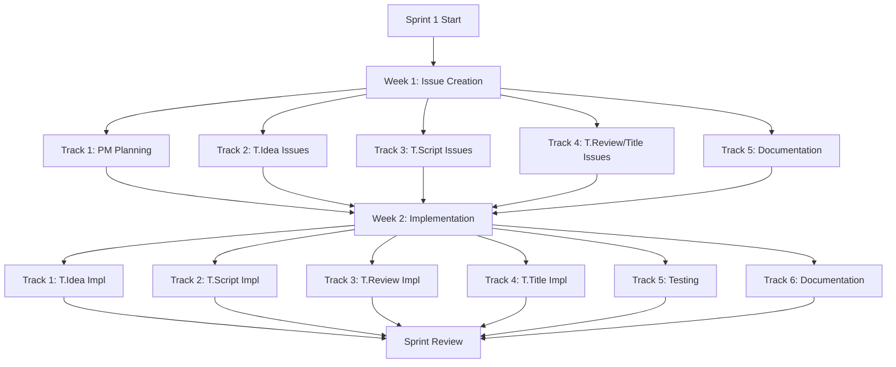

# PARALLEL_RUN_NEXT_FULL - Complete Post-MVP Roadmap

**Project**: PrismQ  
**Phase**: Post-MVP Enhancement (Sprints 4-11)  
**Date**: 2025-11-24 (Updated)  
**Status**: Sprint 4 Active, Sprints 5-11 Planned  
**Total Issues**: 48 (POST-001 through POST-048)

---

## Purpose

This document provides the **complete roadmap** of all Post-MVP enhancement issues across all PrismQ modules (T, A, V, P, M) and infrastructure.

> **Current Sprint**: See [PARALLEL_RUN_NEXT.md](PARALLEL_RUN_NEXT.md) for active sprint execution tracking  
> **Completed MVP**: All 24 MVP issues (MVP-001 through MVP-024) completed ✅  
> **Issue Details**: See module-specific directories for detailed specifications

---

## Roadmap Overview

### Timeline: 24 Weeks (Sprints 4-11)
- **Sprint 4-5**: Text Pipeline Enhancements (Weeks 9-12) - 12 issues
- **Sprint 6**: Audio Pipeline Initial (Weeks 13-14) - 6 issues
- **Sprint 7**: Video Pipeline Initial (Weeks 15-16) - 6 issues
- **Sprint 8**: Publishing Platform (Weeks 17-18) - 6 issues
- **Sprint 9**: Metrics & Analytics (Weeks 19-20) - 6 issues
- **Sprint 10-11**: Infrastructure & Polish (Weeks 21-24) - 12 issues

### Parallelization Strategy
- **3-6 workers** active per sprint
- **Multiple tracks** running in parallel
- **Clear dependencies** managed between issues
- **~8-10x speedup** vs. sequential execution

---

## Sprint 4: Text Pipeline Enhancement - Part 1 (Weeks 9-10)

**Status**: 🎯 ACTIVE  
**Timeline**: 2 weeks  
**Workers**: Worker02, Worker12, Worker13, Worker17  
**Focus**: SEO, Multi-format, Batch Processing

### Issues (6 total)

| Issue | Title | Worker | Priority | Effort | Status |
|-------|-------|--------|----------|--------|--------|
| **POST-001** | T.Publishing.SEO - Keyword Research & Optimization | Worker17 + Worker13 | High | 2d | 🆕 Ready |
| **POST-002** | T.Publishing.SEO - Tags & Categories | Worker17 | High | 1.5d | 🔒 Blocked by POST-001 |
| **POST-003** | T.Script.MultiFormat - Blog Format Optimization | Worker12 | High | 2d | 🆕 Ready |
| **POST-004** | T.Script.MultiFormat - Social Media Adaptation | Worker12 | High | 2d | 🔒 Blocked by POST-003 |
| **POST-005** | T.Idea.Batch - Batch Idea Processing | Worker02 | Medium | 2d | 🆕 Ready |
| **POST-006** | T.Title.ABTesting - A/B Testing Framework | Worker17 | Medium | 2d | 🔒 Blocked by POST-001, POST-002 |

**Details**: See [T/_meta/issues/new/POST-MVP-Enhancements/](../T/_meta/issues/new/POST-MVP-Enhancements/)

---

## Sprint 5: Text Pipeline Enhancement - Part 2 (Weeks 11-12)

**Status**: 🔜 Upcoming  
**Timeline**: 2 weeks  
**Workers**: Worker06, Worker08, Worker18  
**Focus**: Inspiration Sources, Versioning, Collaboration

### Issues (6 total)

| Issue | Title | Worker | Priority | Effort | Status |
|-------|-------|--------|----------|--------|--------|
| **POST-007** | T.Idea.Inspiration - YouTube API Integration | Worker08 | High | 2d | 🔜 Planned |
| **POST-008** | T.Idea.Inspiration - RSS Feed Integration | Worker08 | Medium | 1.5d | 🔜 Planned |
| **POST-009** | T.Idea.Inspiration - Twitter/X API Integration | Worker08 | Medium | 1.5d | 🔜 Planned |
| **POST-010** | T.Script.Versioning - Version History & Rollback | Worker06 | High | 2d | 🔜 Planned |
| **POST-011** | T.Review.Collaboration - Multi-Reviewer Workflow | Worker18 | Medium | 2d | 🔜 Planned |
| **POST-012** | T.Review.Comments - Inline Comments & Annotations | Worker18 | Medium | 2d | 🔜 Planned |

**Details**: See [T/_meta/issues/new/POST-MVP-Enhancements/](../T/_meta/issues/new/POST-MVP-Enhancements/)

---

## Sprint 6: Audio Pipeline Initial (Weeks 13-14)

**Status**: 📋 Planning  
**Timeline**: 2 weeks  
**Workers**: Worker08, Worker09, Worker14  
**Focus**: TTS, Voice Management, Audio Processing

### Planned Issues (6 total)

| Issue | Title | Module | Priority | Effort |
|-------|-------|--------|----------|--------|
| **POST-013** | TTS Integration - ElevenLabs & OpenAI | A.Narrator.TTS | High | 3d |
| **POST-014** | Voice Library Management | A.Narrator.Voice | High | 2d |
| **POST-015** | Audio Processing & Enhancement | A.Narrator.Processing | Medium | 2d |
| **POST-016** | Background Music & Sound Effects | A.Voiceover.Music | Medium | 2d |
| **POST-017** | Podcast Episode Creation | A.Publishing.Podcast | High | 2.5d |
| **POST-018** | Multi-Platform Audio Distribution | A.Publishing.Distribution | Medium | 2d |

**Location**: To be created in `A/_meta/issues/new/POST-MVP-Enhancements/`

---

## Sprint 7: Video Pipeline Initial (Weeks 15-16)

**Status**: 📋 Planning  
**Timeline**: 2 weeks  
**Workers**: Worker08, Worker11, Worker16  
**Focus**: Scene Generation, Image AI, Video Assembly

### Planned Issues (6 total)

| Issue | Title | Module | Priority | Effort |
|-------|-------|--------|----------|--------|
| **POST-019** | Scene Planning & Breakdown | V.Scene.Planning | High | 2d |
| **POST-020** | AI Image Generation - DALL-E & Midjourney | V.Keyframe.Generation | High | 3d |
| **POST-021** | Stock Media Integration | V.Keyframe.Stock | Medium | 2d |
| **POST-022** | Video Assembly - FFmpeg | V.Video.Assembly | High | 3d |
| **POST-023** | Captions & Subtitles | V.Video.Subtitles | Medium | 1.5d |
| **POST-024** | Video Template System | V.Video.Templates | Medium | 2d |

**Location**: To be created in `V/_meta/issues/new/POST-MVP-Enhancements/`

---

## Sprint 8: Publishing Platform (Weeks 17-18)

**Status**: 📋 Planning  
**Timeline**: 2 weeks  
**Workers**: Worker03, Worker14, Worker16  
**Focus**: Platform Integrations, Scheduling, Cross-posting

### Planned Issues (6 total)

| Issue | Title | Module | Priority | Effort |
|-------|-------|--------|----------|--------|
| **POST-025** | YouTube API Integration & Upload | P.Platform.YouTube | High | 2.5d |
| **POST-026** | WordPress & Medium Integration | P.Platform.Blog | High | 2d |
| **POST-027** | Social Media Multi-Post (Twitter, LinkedIn, etc) | P.Platform.Social | High | 2.5d |
| **POST-028** | Content Scheduling System | P.Scheduler | Medium | 2d |
| **POST-029** | Publishing Queue Management | P.Queue | Medium | 2d |
| **POST-030** | Cross-Platform Analytics Dashboard | P.Analytics | Medium | 2.5d |

**Location**: To be created in `P/_meta/issues/new/POST-MVP-Enhancements/`

---

## Sprint 9: Metrics & Analytics (Weeks 19-20)

**Status**: 📋 Planning  
**Timeline**: 2 weeks  
**Workers**: Worker17, Worker19, Worker20  
**Focus**: Data Collection, Analysis, Feedback Loops

### Planned Issues (6 total)

| Issue | Title | Module | Priority | Effort |
|-------|-------|--------|----------|--------|
| **POST-031** | Automated Metrics Collection | M.Collection | High | 2d |
| **POST-032** | Performance Analysis & Insights | M.Analysis | High | 2.5d |
| **POST-033** | Analytics to Idea Feedback Loop | M.Feedback | High | 2d |
| **POST-034** | Metrics Visualization Dashboard | M.Visualization | Medium | 2.5d |
| **POST-035** | Performance Alerts & Notifications | M.Alerts | Medium | 1.5d |
| **POST-036** | Automated Reporting System | M.Reports | Medium | 2d |

**Location**: To be created in `M/_meta/issues/new/POST-MVP-Enhancements/`

---

## Sprint 10-11: Infrastructure & Production (Weeks 21-24)

**Status**: 📋 Planning  
**Timeline**: 4 weeks  
**Workers**: Worker03, Worker04, Worker05, Worker06, Worker07  
**Focus**: Production Readiness, Optimization, Polish

### Planned Issues (12 total)

#### Infrastructure (6 issues)
| Issue | Title | Area | Priority | Effort |
|-------|-------|------|----------|--------|
| **POST-037** | CI/CD Pipeline Automation | DevOps | High | 3d |
| **POST-038** | Monitoring & Logging System | Operations | High | 2.5d |
| **POST-039** | Database Optimization & Indexing | Backend | High | 2d |
| **POST-040** | Caching Layer (Redis) | Performance | Medium | 2d |
| **POST-041** | Security Audit & Hardening | Security | High | 3d |
| **POST-042** | Async Task Processing (Celery) | Backend | Medium | 2.5d |

#### User Interface & API (6 issues)
| Issue | Title | Area | Priority | Effort |
|-------|-------|------|----------|--------|
| **POST-043** | Enhanced Web UI Dashboard | Frontend | High | 3d |
| **POST-044** | RESTful API & OpenAPI Documentation | API | High | 2.5d |
| **POST-045** | GraphQL API Layer | API | Medium | 2d |
| **POST-046** | Workflow Automation Engine | Automation | Medium | 3d |
| **POST-047** | Real-Time Collaboration Features | Frontend | Low | 2d |
| **POST-048** | Content Template Library | Content | Medium | 2d |

**Location**: To be created across relevant module directories

---

## Dependency Graph

### Cross-Module Dependencies

```
MVP-024 (Publishing) ──┐
                       ├──> POST-001 to POST-006 (Text Enhancements)
                       ├──> POST-007 to POST-012 (Text Advanced)
                       │    └──> POST-013 to POST-018 (Audio)
                       │         └──> POST-019 to POST-024 (Video)
                       │              └──> POST-025 to POST-030 (Publishing)
                       │                   └──> POST-031 to POST-036 (Metrics)
                       │
                       └──> POST-037 to POST-048 (Infrastructure)
                            ↑ (Can run in parallel with other sprints)
```

### Key Blocking Relationships
- **Audio** depends on Text completion (need script for voiceover)
- **Video** depends on Audio completion (need voiceover for video)
- **Publishing** depends on Content pipelines (need content to publish)
- **Metrics** depends on Publishing (need published content to track)
- **Infrastructure** can run in parallel (supports all modules)

---

## Success Metrics

### Sprint-Level Metrics
- **Velocity**: 6-12 issues per 2-week sprint
- **Quality**: >80% test coverage for new code
- **Reviews**: 100% code review by Worker10
- **Documentation**: 100% of public APIs documented

### Project-Level Metrics
- **Timeline**: Complete 48 issues in 24 weeks
- **Parallelization**: Maintain 3-6 workers active per sprint
- **Quality Gates**: All issues pass acceptance criteria
- **Integration**: Full end-to-end testing at each sprint boundary

---

## Risk Management

### Identified Risks

#### High Priority
1. **API Dependencies**: External API changes (YouTube, Twitter, TTS providers)
   - Mitigation: Abstract integrations, maintain fallbacks
   
2. **Worker Availability**: Key workers becoming unavailable
   - Mitigation: Cross-training, backup assignments

3. **Technical Complexity**: Advanced features (real-time collaboration, GraphQL)
   - Mitigation: Spike solutions, phased implementation

#### Medium Priority
4. **Integration Complexity**: Cross-module dependencies
   - Mitigation: Clear interfaces, comprehensive integration tests

5. **Performance Issues**: Scale challenges with batch processing
   - Mitigation: Early load testing, optimization sprints

---

## Current State Summary

### Completed
✅ **MVP Phase**: All 24 issues (MVP-001 to MVP-024) completed  
✅ **Foundation**: Text pipeline fully functional  
✅ **Architecture**: SOLID principles established  
✅ **Testing**: >80% coverage across MVP modules  
✅ **Documentation**: Complete API docs and workflow guides

### In Progress
🔄 **Sprint 4**: POST-001, POST-003, POST-005 ready to start  
🔄 **Planning**: Sprints 5-11 fully specified  
🔄 **Infrastructure**: CI/CD and monitoring partially implemented

### Next Actions
1. **Begin Sprint 4**: Workers start POST-001, POST-003, POST-005
2. **Prepare Sprint 5**: Review POST-007 to POST-012 specifications
3. **API Setup**: Register for YouTube, Twitter/X, TTS provider APIs
4. **Create GitHub Issues**: Convert markdown specs to GitHub issues

---

## Related Documentation

### Active Documents
- **[PARALLEL_RUN_NEXT.md](PARALLEL_RUN_NEXT.md)**: Current sprint tracking (Sprint 4)
- **[ISSUE_MANAGEMENT_STRUCTURE.md](ISSUE_MANAGEMENT_STRUCTURE.md)**: Issue organization standards
- **[T/_meta/issues/new/POST-MVP-Enhancements/INDEX.md](../T/_meta/issues/new/POST-MVP-Enhancements/INDEX.md)**: Text pipeline POST issues

### Completed Work
- **[_meta/issues/done/](done/)**: Completed MVP issues (MVP-001 to MVP-024)
- **[_meta/issues/archive/MVP_REVIEWS_CONSOLIDATED.md](archive/MVP_REVIEWS_CONSOLIDATED.md)**: MVP completion summary

### Module Documentation
- **[T/README.md](../../T/README.md)**: Text Pipeline documentation
- **[A/README.md](../../A/README.md)**: Audio Pipeline documentation
- **[V/README.md](../../V/README.md)**: Video Pipeline documentation

---

**Last Updated**: 2025-11-24  
**Status**: Sprint 4 Active (POST-001 to POST-006)  
**Owner**: Worker01 (Project Manager)  
**Next Sprint**: Sprint 5 (POST-007 to POST-012)

---

## Quick Navigation

- 🎯 **Current Sprint**: [Sprint 4 Details](#sprint-4-text-pipeline-enhancement---part-1-weeks-9-10)
- 🔜 **Next Sprint**: [Sprint 5 Details](#sprint-5-text-pipeline-enhancement---part-2-weeks-11-12)
- 📊 **Full Timeline**: [Roadmap Overview](#roadmap-overview)
- 📋 **Issue Details**: Module-specific `_meta/issues/new/` directories
- ✅ **Completed Work**: [_meta/issues/done/](done/)

---

## MVP Sprint Overview

### Approach: MVP-First Development
Following the workflow: **Idea.Create → T.Title.Draft → T.Script.Draft → T.Review.Initial → T.Script.Improvements → T.Title.From.Title.Review.Script → T.Review.Final → T.Publish**

### Sprint 1 Objectives
1. Implement core MVP workflow (8 issues)
2. Build minimal features for each stage
3. Enable end-to-end content creation
4. Validate workflow before adding advanced features

### Success Criteria
- ✅ 8 MVP issues defined (see MVP_WORKFLOW.md)
- ⏳ Idea creation working
- ⏳ Title generation working
- ⏳ Script generation working
- ⏳ Basic review system working
- ⏳ End-to-end flow validated

---

## MVP Execution Strategy

### MVP Philosophy
- **Start Simple**: Build only what's needed for working product
- **Iterate Fast**: Quick cycles of build-test-improve
- **Validate Early**: Get feedback before building advanced features
- **Incremental Value**: Each stage adds concrete value

### MVP Workflow Stages

```
1. Idea.Create          → Basic idea capture
2. T.Title.Draft        → Generate title variants
3. T.Script.Draft       → Generate initial script
4. T.Review.Initial     → Manual review & feedback
5. T.Script.Improvements → Edit based on feedback
6. T.Title.From.Title.Review.Script → Update title if needed
7. T.Review.Final       → Final approval gate
8. T.Publish            → Publish content
```

**Total MVP Issues**: 8 (vs 120 in full plan)  
**Timeline**: 4 weeks (vs 7 weeks for full plan)  
**Active Workers**: 3-4 (vs 10-12 for full plan)

---

## Sprint 1: Week-by-Week Execution

---

## Worker Allocation Matrix - Sprint 1

### Week 1: Foundation & Planning

```
Timeline: Day 1-5 (Mon-Fri)
Goal: Worker setup and issue creation
```

#### Parallel Track 1: Project Management & Planning
| Worker | Role | Tasks | Effort | Dependencies |
|--------|------|-------|--------|--------------|
| **Worker01** | PM/Scrum Master | Sprint planning, issue templates, coordination | 40h | None |

#### Parallel Track 2: Issue Expansion (T.Idea)
| Worker | Role | Tasks | Effort | Dependencies |
|--------|------|-------|--------|--------------|
| **Worker12** | Content Specialist | Create content-focused T.Idea issues | 20h | None |
| **Worker13** | Prompt Master | Create AI/prompt-related T.Idea issues | 20h | None |
| **Worker08** | AI/ML Specialist | Create ML integration T.Idea issues | 15h | None |

#### Parallel Track 3: Issue Expansion (T.Script)
| Worker | Role | Tasks | Effort | Dependencies |
|--------|------|-------|--------|--------------|
| **Worker12** | Content Specialist | Create script generation issues | 20h | None |
| **Worker13** | Prompt Master | Create script prompt template issues | 20h | None |
| **Worker02** | Python Specialist | Create script automation issues | 15h | None |

#### Parallel Track 4: Issue Expansion (T.Review & T.Title)
| Worker | Role | Tasks | Effort | Dependencies |
|--------|------|-------|--------|--------------|
| **Worker10** | Review Master | Create review workflow issues | 20h | None |
| **Worker12** | Content Specialist | Create title optimization issues | 15h | None |
| **Worker17** | Analytics Specialist | Create analytics/scoring issues | 15h | None |

#### Parallel Track 5: Documentation & Infrastructure
| Worker | Role | Tasks | Effort | Dependencies |
|--------|------|-------|--------|--------------|
| **Worker15** | Documentation | Document worker structure, update READMEs | 20h | None |
| **Worker06** | Database | Plan database schemas for new features | 10h | None |

**Week 1 Summary**:
- 10 Workers active in parallel
- 5 parallel tracks
- 250+ total hours capacity
- 0 blocking dependencies

---

### Week 2: Implementation Kickoff

```
Timeline: Day 6-10 (Mon-Fri)
Goal: Begin implementation of highest priority issues
```

#### Parallel Track 1: T.Idea Implementation
| Worker | Role | Issue | Effort | Dependencies | Priority |
|--------|------|-------|--------|--------------|----------|
| **Worker02** | Python | #T.Idea-001: Idea expansion API | 3d | None | High |
| **Worker08** | AI/ML | #T.Idea-002: LLM integration for ideas | 3d | None | High |
| **Worker14** | Platform API | #T.Idea-003: YouTube source integration | 2d | None | Medium |

#### Parallel Track 2: T.Script Implementation
| Worker | Role | Issue | Effort | Dependencies | Priority |
|--------|------|-------|--------|--------------|----------|
| **Worker02** | Python | #T.Script-001: Script generator core | 3d | None | High |
| **Worker13** | Prompt Master | #T.Script-002: Script prompt templates | 2d | None | High |
| **Worker12** | Content | #T.Script-003: Script quality checker | 2d | None | Medium |

#### Parallel Track 3: T.Review Implementation
| Worker | Role | Issue | Effort | Dependencies | Priority |
|--------|------|-------|--------|--------------|----------|
| **Worker10** | Review Master | #T.Review-001: Review workflow engine | 3d | None | High |
| **Worker12** | Content | #T.Review-002: Review criteria definition | 2d | None | Medium |

#### Parallel Track 4: T.Title Implementation
| Worker | Role | Issue | Effort | Dependencies | Priority |
|--------|------|-------|--------|--------------|----------|
| **Worker12** | Content | #T.Title-001: Title generator | 2d | None | Medium |
| **Worker13** | Prompt Master | #T.Title-002: Title optimization prompts | 2d | None | Medium |
| **Worker17** | Analytics | #T.Title-003: Title scoring system | 3d | None | Low |

#### Parallel Track 5: Testing & Quality
| Worker | Role | Issue | Effort | Dependencies | Priority |
|--------|------|-------|--------|--------------|----------|
| **Worker04** | QA/Testing | #Test-001: Test framework for T modules | 3d | None | High |
| **Worker10** | Review | #Test-002: Integration test suite | 2d | #Test-001 | Medium |

#### Parallel Track 6: Documentation
| Worker | Role | Issue | Effort | Dependencies | Priority |
|--------|------|-------|--------|--------------|----------|
| **Worker15** | Documentation | #Doc-001: T module API documentation | 2d | Implementation started | Medium |

**Week 2 Summary**:
- 12 Workers active in parallel
- 6 parallel tracks
- 15+ issues in progress
- 1 dependency chain (Test-002 depends on Test-001)

---

## Dependency Graph

### Visual Representation



### Critical Path
1. Worker01: Sprint planning (Day 1-2) → **CRITICAL**
2. Issue creation (Day 1-5) → **CRITICAL** for Week 2 start
3. Implementation tracks (Day 6-10) → Parallel, no blocking

**Critical Path Duration**: 10 days (full sprint)
**Parallelization Factor**: 10-12 workers active
**Estimated Speedup**: 8-10x vs. sequential execution

---

## Issue Assignment Details

### Format
Each command for workers includes:
- Worker designation (WorkerXX)
- Issue reference (#Module-NNN)
- Execution context (module/component)
- Dependencies
- Priority level
- Estimated effort

### Week 1 Commands

#### Worker01: Project Management
```bash
Worker01: Process sprint planning for Sprint 1
- Dependencies: None
- Priority: Critical
- Effort: 5 days
- Context: _meta/issues/new/
- Deliverables:
  - Sprint plan document
  - Issue templates
  - Worker coordination matrix
  - Daily standup schedule
```

#### Worker12: Content Issues (T.Idea)
```bash
Worker12: Create content-focused issues for T.Idea module
- Dependencies: None
- Priority: High
- Effort: 4 days
- Context: T/Idea/_meta/issues/new/
- Deliverables:
  - 10+ issues for idea expansion
  - 5+ issues for idea quality
  - Acceptance criteria for each
  - Content strategy guidelines
```

#### Worker13: Prompt Issues (T.Idea)
```bash
Worker13: Create AI/prompt issues for T.Idea module
- Dependencies: None
- Priority: High
- Effort: 4 days
- Context: T/Idea/_meta/issues/new/
- Deliverables:
  - 8+ prompt template issues
  - 5+ LLM integration issues
  - Prompt optimization guidelines
  - Few-shot example library
```

#### Worker02: Python Issues (T.Script)
```bash
Worker02: Create Python automation issues for T.Script
- Dependencies: None
- Priority: High
- Effort: 3 days
- Context: T/Script/_meta/issues/new/
- Deliverables:
  - 8+ script generation issues
  - 5+ automation workflow issues
  - Python architecture guidelines
  - API interface definitions
```

#### Worker10: Review Issues (T.Review)
```bash
Worker10: Create review workflow issues for T.Review module
- Dependencies: None
- Priority: High
- Effort: 4 days
- Context: T/Review/_meta/issues/new/
- Deliverables:
  - 10+ review automation issues
  - Review criteria definitions
  - Quality gate specifications
  - Review workflow state machine
```

#### Worker15: Documentation
```bash
Worker15: Document worker structure and update module READMEs
- Dependencies: Worker definitions (completed)
- Priority: Medium
- Effort: 4 days
- Context: _meta/ and all module READMEs
- Deliverables:
  - Worker collaboration guides
  - Updated module READMEs
  - Issue creation guidelines
  - Sprint process documentation
```

#### Worker17: Analytics Issues (T.Title)
```bash
Worker17: Create analytics and scoring issues for T.Title
- Dependencies: None
- Priority: Medium
- Effort: 3 days
- Context: T/Title/_meta/issues/new/
- Deliverables:
  - 5+ title scoring issues
  - Analytics integration issues
  - Performance metrics definitions
  - A/B testing framework issues
```

#### Worker08: AI/ML Issues (T.Idea)
```bash
Worker08: Create ML integration issues for T.Idea module
- Dependencies: None
- Priority: High
- Effort: 3 days
- Context: T/Idea/_meta/issues/new/
- Deliverables:
  - 5+ LLM API integration issues
  - Model selection issues
  - Cost optimization issues
  - Quality validation issues
```

#### Worker06: Database Planning
```bash
Worker06: Plan database schemas for T module features
- Dependencies: None
- Priority: Medium
- Effort: 2 days
- Context: All T submodules
- Deliverables:
  - Schema designs for new features
  - Migration plans
  - Database optimization recommendations
  - Data model diagrams
```

---

### Week 2 Commands

#### Worker02: T.Idea Implementation
```bash
Worker02: Implement issue #T.Idea-001 - Idea expansion API
- Dependencies: None
- Priority: High
- Effort: 3 days
- Context: T/Idea/src/
- Acceptance Criteria:
  - RESTful API for idea expansion
  - Input validation
  - Error handling
  - Unit tests >80% coverage
  - API documentation
```

#### Worker08: AI Integration
```bash
Worker08: Implement issue #T.Idea-002 - LLM integration for ideas
- Dependencies: #T.Idea-001 (can start in parallel)
- Priority: High
- Effort: 3 days
- Context: T/Idea/src/ai/
- Acceptance Criteria:
  - OpenAI API integration
  - Prompt template system
  - Response parsing
  - Error handling and retries
  - Cost tracking
```

#### Worker02: T.Script Implementation
```bash
Worker02: Implement issue #T.Script-001 - Script generator core
- Dependencies: None
- Priority: High
- Effort: 3 days
- Context: T/Script/src/
- Acceptance Criteria:
  - Script generation engine
  - Template system
  - Content formatting
  - Quality validation
  - Unit tests
```

#### Worker13: Script Prompts
```bash
Worker13: Implement issue #T.Script-002 - Script prompt templates
- Dependencies: #T.Script-001 (can start in parallel)
- Priority: High
- Effort: 2 days
- Context: T/Script/prompts/
- Acceptance Criteria:
  - 5+ script generation prompts
  - Few-shot examples
  - Prompt optimization
  - Testing and validation
  - Documentation
```

#### Worker10: Review Workflow
```bash
Worker10: Implement issue #T.Review-001 - Review workflow engine
- Dependencies: None
- Priority: High
- Effort: 3 days
- Context: T/Review/src/
- Acceptance Criteria:
  - State machine implementation
  - Review criteria enforcement
  - Feedback collection system
  - Integration with existing modules
  - Comprehensive tests
```

#### Worker12: Title Generator
```bash
Worker12: Implement issue #T.Title-001 - Title generator
- Dependencies: None
- Priority: Medium
- Effort: 2 days
- Context: T/Title/src/
- Acceptance Criteria:
  - Title generation logic
  - SEO optimization
  - Multiple variants generation
  - Content integration
  - Quality scoring
```

#### Worker04: Test Framework
```bash
Worker04: Implement issue #Test-001 - Test framework for T modules
- Dependencies: None
- Priority: High
- Effort: 3 days
- Context: T/_meta/tests/
- Acceptance Criteria:
  - Shared test utilities
  - Fixtures and mocks
  - Integration test helpers
  - CI/CD integration
  - Documentation
```

#### Worker15: API Documentation
```bash
Worker15: Create issue #Doc-001 - T module API documentation
- Dependencies: Implementation started (Week 2 Day 2+)
- Priority: Medium
- Effort: 2 days
- Context: T/*/docs/
- Acceptance Criteria:
  - OpenAPI specifications
  - Example requests/responses
  - Integration guides
  - Error handling documentation
  - Code examples
```

---

## Conflict Resolution

### Potential Conflicts

#### 1. Worker02 Overallocation
**Issue**: Worker02 assigned to both T.Idea and T.Script in Week 2
**Resolution**: 
- Prioritize T.Idea-001 (Days 6-8)
- Start T.Script-001 (Days 9-10)
- Or assign T.Script-001 to Worker07 (JS/TS expert with Python knowledge)

#### 2. Shared Database Schema
**Issue**: Multiple workers need database changes
**Resolution**:
- Worker06 designs all schemas in Week 1
- Workers implement their DB code against agreed schemas
- Worker06 reviews all DB-related PRs

#### 3. Documentation Dependencies
**Issue**: Worker15 needs implemented code to document
**Resolution**:
- Week 1: Document workers and structure (no dependencies)
- Week 2 Day 3+: Document implementations as they complete
- Use parallel documentation approach (can start when implementation starts)

---

## Success Metrics

### Sprint 1 Goals

#### Velocity Metrics
- **Issues Created**: Target 50+, Minimum 40
- **Issues Started**: Target 15+, Minimum 10
- **Issues Completed**: Target 10+, Minimum 5
- **Active Workers**: Target 12, Minimum 8

#### Quality Metrics
- **Issue Quality**: 100% have acceptance criteria
- **SOLID Compliance**: 100% reviewed by Worker10
- **Test Coverage**: >80% for completed code
- **Documentation**: 100% of completed features

#### Parallelization Metrics
- **Parallel Tracks**: 5-6 simultaneously
- **Worker Utilization**: >80% capacity
- **Blocking Time**: <15% of sprint
- **Conflict Resolution**: <24h average

---

## Risk Mitigation

### Identified Risks

#### High Priority
1. **Worker Coordination Overhead**
   - Mitigation: Daily standups (15 min)
   - Owner: Worker01
   - Status: Planned

2. **Dependency Blocking**
   - Mitigation: Minimize dependencies, clear communication
   - Owner: Worker01
   - Status: Addressed in design

3. **Scope Creep**
   - Mitigation: Strict issue sizing (1-3 days)
   - Owner: Worker01, Worker10
   - Status: Templates created

#### Medium Priority
4. **Technical Conflicts**
   - Mitigation: Code review, architectural guidance
   - Owner: Worker10
   - Status: Review process defined

5. **Worker Availability**
   - Mitigation: Flexible assignment, backup workers
   - Owner: Worker01
   - Status: Monitoring needed

---

## Communication Plan

### Daily Standups (15 minutes)
**Format**: Async updates in issue comments or sync if needed
**Schedule**: Every morning, 9:00 AM
**Participants**: All active workers
**Questions**:
1. What did I complete yesterday?
2. What am I working on today?
3. Am I blocked?

### Mid-Sprint Review (1 hour)
**Schedule**: End of Week 1
**Participants**: Worker01, Worker10, Active workers
**Agenda**:
1. Progress review (issues completed)
2. Blocker identification and resolution
3. Week 2 preparation
4. Adjustments if needed

### Sprint Review (2 hours)
**Schedule**: End of Week 2
**Participants**: All workers
**Agenda**:
1. Demonstration of completed work
2. Acceptance criteria verification
3. Lessons learned
4. Sprint 2 planning

### Sprint Retrospective (1 hour)
**Schedule**: After Sprint Review
**Participants**: All workers
**Focus**:
1. What went well?
2. What could be improved?
3. Action items for next sprint

---

## Next Sprint Preview (Sprint 2)

### Planned Focus Areas

1. **Complete Sprint 1 Carryover**
   - Finish any incomplete Sprint 1 issues
   - Address Sprint 1 feedback

2. **Expand to A Module**
   - Audio pipeline issue expansion
   - Voiceover processing issues
   - TTS integration issues

3. **Infrastructure Work**
   - Worker base class implementation
   - Task queue optimization
   - CI/CD pipeline setup

4. **Integration**
   - Connect T.Idea → T.Script → T.Review → T.Title
   - End-to-end workflow testing
   - Performance optimization

---

## Approval & Sign-off

### Sprint Planning
- [x] Worker01: Sprint structure defined
- [x] Parallelization matrix created
- [ ] Team review completed
- [ ] Resources confirmed available
- [ ] Sprint 1 launch approved

### Daily Monitoring
- [ ] Daily standup notes
- [ ] Blocker tracking
- [ ] Progress updates
- [ ] Adjustment decisions

### Sprint Completion
- [ ] All deliverables met or documented
- [ ] Sprint review completed
- [ ] Retrospective completed
- [ ] Sprint 2 planned

---

**Document Owner**: Worker01  
**Created**: 2025-11-21  
**Last Updated**: 2025-11-21  
**Status**: Active - Sprint 1 Planning Complete  
**Next Update**: Mid-Sprint Review (End of Week 1)

---

## Commands Summary for Quick Reference

### Week 1 Quick Commands
```
Worker01: Sprint planning and coordination (5 days)
Worker12: T.Idea content issues (4 days) || T.Script content issues (4 days) || T.Title issues (3 days)
Worker13: T.Idea prompt issues (4 days) || T.Script prompt issues (4 days)
Worker02: T.Script Python issues (3 days)
Worker08: T.Idea AI/ML issues (3 days)
Worker10: T.Review workflow issues (4 days)
Worker17: T.Title analytics issues (3 days)
Worker15: Documentation (4 days)
Worker06: Database planning (2 days)
```

### Week 2 Quick Commands
```
Worker02: #T.Idea-001 (3d) → #T.Script-001 (3d)
Worker08: #T.Idea-002 (3d)
Worker13: #T.Script-002 (2d)
Worker12: #T.Script-003 (2d) → #T.Title-001 (2d)
Worker10: #T.Review-001 (3d)
Worker17: #T.Title-003 (3d)
Worker04: #Test-001 (3d)
Worker15: #Doc-001 (2d, starts Day 8)
```

**Total Parallel Capacity**: 250+ hours in Week 1, 300+ hours in Week 2  
**Estimated Completion**: 40+ issues created, 10+ issues implemented  
**Parallelization Efficiency**: 8-10x vs sequential execution
