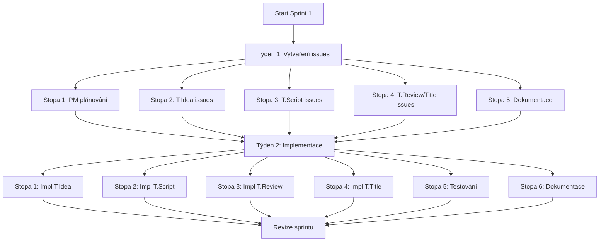

# PARALLEL_RUN_NEXT_FULL - Plán provádění MVP sprintu (Rozšířená verze)

> **⚠️ UPOZORNĚNÍ**: Tento dokument je zastaralý. Pro aktuální specifikaci viz:
> - **PARALLEL_RUN_NEXT_CS.md** - Aktuální streamovaný dokument se všemi 22 issues
> - **PARALLEL_RUN_NEXT.md** - Anglická verze
>
> Tento dokument zůstává pro historické odkazy, ale měl by být aktualizován tak, aby odpovídal aktuálnímu stavu projektu.

**Sprint**: Sprint 1-3 (7-8 týdnů) - Vývoj MVP  
**Datum**: 2025-11-22 (Poznámka o zastaralosti)  
**Aktualizováno**: 2025-11-22  
**Stav**: ZASTARALÉ - Viz PARALLEL_RUN_NEXT_CS.md pro aktuální stav  
**Cíl**: [ZASTARALÉ] Původně: Vybudovat end-to-end workflow MVP

**Aktuální stav projektu**:
- Sprint 1: DOKONČENO ✅ (7/7 issues)
- Sprint 2: DOKONČENO ✅ (6/6 issues)
- Sprint 3: PROBÍHÁ ⚠️ (5/11 issues dokončeno, 6 zbývá)
- Celkem: 16/22 issues dokončeno (73%)

---

## Pro aktuální informace

Viz **PARALLEL_RUN_NEXT_CS.md** pro:
- Aktuální stav všech sprintů
- Zbývající 6 issues (MVP-017 až MVP-022)
- SOLID principy aplikované na issues
- Detailní kritéria přijetí
- Paralelní příležitosti provádění

---

## Přehled MVP sprintu

### Přístup: Vývoj zaměřený na MVP
Následující workflow: **Idea.Create → T.Title.Draft → T.Script.Draft → T.Review.Initial → T.Script.Improvements → T.Title.Improvements → T.Review.Final → T.Publish**

### Cíle Sprintu 1
1. Implementovat základní MVP workflow (8 issues)
2. Vybudovat minimální vlastnosti pro každou fázi
3. Umožnit end-to-end tvorbu obsahu
4. Validovat workflow před přidáním pokročilých vlastností

### Kritéria úspěchu
- ✅ 8 MVP issues definováno (viz MVP_WORKFLOW.md)
- ⏳ Vytváření nápadů funguje
- ⏳ Generování titulků funguje
- ⏳ Generování skriptů funguje
- ⏳ Základní systém revizí funguje
- ⏳ End-to-end tok validován

---

## Strategie provádění MVP

### Filosofie MVP
- **Začít jednoduše**: Vybudovat pouze to, co je potřeba pro funkční produkt
- **Iterovat rychle**: Rychlé cykly build-test-improve
- **Validovat brzy**: Získat zpětnou vazbu před vybudováním pokročilých vlastností
- **Inkrementální hodnota**: Každá fáze přidává konkrétní hodnotu

### Fáze workflow MVP

```
1. Idea.Create          → Základní zachycení nápadu
2. T.Title.Draft        → Generovat varianty titulku
3. T.Script.Draft       → Generovat počáteční skript
4. T.Review.Initial     → Manuální revize a zpětná vazba
5. T.Script.Improvements → Editace na základě zpětné vazby
6. T.Title.Improvements → Aktualizace titulku pokud potřeba
7. T.Review.Final       → Finální brána schválení
8. T.Publish            → Publikovat obsah
```

**Celkem MVP issues**: 8 (vs 120 v plném plánu)  
**Časový horizont**: 4 týdny (vs 7 týdnů pro plný plán)  
**Aktivní workeři**: 3-4 (vs 10-12 pro plný plán)

---

## Sprint 1: Provádění týden po týdnu

---

## Matice alokace workerů - Sprint 1

### Týden 1: Základy a plánování

```
Časový horizont: Den 1-5 (Pondělí-Pátek)
Cíl: Nastavení workerů a vytváření issues
```

#### Paralelní stopa 1: Projektový management a plánování
| Worker | Role | Úkoly | Úsilí | Závislosti |
|--------|------|-------|--------|--------------|
| **Worker01** | PM/Scrum Master | Plánování sprintu, šablony issues, koordinace | 40h | Žádné |

#### Paralelní stopa 2: Rozšíření issues (T.Idea)
| Worker | Role | Úkoly | Úsilí | Závislosti |
|--------|------|-------|--------|--------------|
| **Worker12** | Obsahový specialista | Vytváření issues zaměřených na obsah pro T.Idea | 20h | Žádné |
| **Worker13** | Mistr promptů | Vytváření issues souvisejících s AI/prompty pro T.Idea | 20h | Žádné |
| **Worker08** | AI/ML specialista | Vytváření issues integrace ML pro T.Idea | 15h | Žádné |

#### Paralelní stopa 3: Rozšíření issues (T.Script)
| Worker | Role | Úkoly | Úsilí | Závislosti |
|--------|------|-------|--------|--------------|
| **Worker12** | Obsahový specialista | Vytváření issues generování skriptu | 20h | Žádné |
| **Worker13** | Mistr promptů | Vytváření issues šablon promptů skriptu | 20h | Žádné |
| **Worker02** | Python specialista | Vytváření issues automatizace skriptu | 15h | Žádné |

#### Paralelní stopa 4: Rozšíření issues (T.Review & T.Title)
| Worker | Role | Úkoly | Úsilí | Závislosti |
|--------|------|-------|--------|--------------|
| **Worker10** | Mistr revizí | Vytváření issues workflow revizí | 20h | Žádné |
| **Worker12** | Obsahový specialista | Vytváření issues optimalizace titulků | 15h | Žádné |
| **Worker17** | Analytický specialista | Vytváření issues analytiky/hodnocení | 15h | Žádné |

#### Paralelní stopa 5: Dokumentace a infrastruktura
| Worker | Role | Úkoly | Úsilí | Závislosti |
|--------|------|-------|--------|--------------|
| **Worker15** | Dokumentace | Dokumentace struktury workerů, aktualizace README | 20h | Žádné |
| **Worker06** | Databáze | Plánování databázových schémat pro nové vlastnosti | 10h | Žádné |

**Souhrn týdne 1**:
- 10 workerů aktivních paralelně
- 5 paralelních stop
- 250+ hodin celkové kapacity
- 0 blokujících závislostí

---

### Týden 2: Zahájení implementace

```
Časový horizont: Den 6-10 (Pondělí-Pátek)
Cíl: Zahájení implementace issues s nejvyšší prioritou
```

#### Paralelní stopa 1: Implementace T.Idea
| Worker | Role | Issue | Úsilí | Závislosti | Priorita |
|--------|------|-------|--------|--------------|----------|
| **Worker02** | Python | #T.Idea-001: API rozšíření nápadu | 3d | Žádné | Vysoká |
| **Worker08** | AI/ML | #T.Idea-002: Integrace LLM pro nápady | 3d | Žádné | Vysoká |
| **Worker14** | Platform API | #T.Idea-003: Integrace zdroje YouTube | 2d | Žádné | Střední |

#### Paralelní stopa 2: Implementace T.Script
| Worker | Role | Issue | Úsilí | Závislosti | Priorita |
|--------|------|-------|--------|--------------|----------|
| **Worker02** | Python | #T.Script-001: Jádro generátoru skriptu | 3d | Žádné | Vysoká |
| **Worker13** | Mistr promptů | #T.Script-002: Šablony promptů skriptu | 2d | Žádné | Vysoká |
| **Worker12** | Obsah | #T.Script-003: Kontrola kvality skriptu | 2d | Žádné | Střední |

#### Paralelní stopa 3: Implementace T.Review
| Worker | Role | Issue | Úsilí | Závislosti | Priorita |
|--------|------|-------|--------|--------------|----------|
| **Worker10** | Mistr revizí | #T.Review-001: Engine workflow revizí | 3d | Žádné | Vysoká |
| **Worker12** | Obsah | #T.Review-002: Definice kritérií revize | 2d | Žádné | Střední |

#### Paralelní stopa 4: Implementace T.Title
| Worker | Role | Issue | Úsilí | Závislosti | Priorita |
|--------|------|-------|--------|--------------|----------|
| **Worker12** | Obsah | #T.Title-001: Generátor titulků | 2d | Žádné | Střední |
| **Worker13** | Mistr promptů | #T.Title-002: Prompty optimalizace titulků | 2d | Žádné | Střední |
| **Worker17** | Analytika | #T.Title-003: Systém hodnocení titulků | 3d | Žádné | Nízká |

#### Paralelní stopa 5: Testování a kvalita
| Worker | Role | Issue | Úsilí | Závislosti | Priorita |
|--------|------|-------|--------|--------------|----------|
| **Worker04** | QA/Testování | #Test-001: Testovací framework pro T moduly | 3d | Žádné | Vysoká |
| **Worker10** | Revize | #Test-002: Sada integračních testů | 2d | #Test-001 | Střední |

#### Paralelní stopa 6: Dokumentace
| Worker | Role | Issue | Úsilí | Závislosti | Priorita |
|--------|------|-------|--------|--------------|----------|
| **Worker15** | Dokumentace | #Doc-001: Dokumentace API T modulu | 2d | Implementace zahájena | Střední |

**Souhrn týdne 2**:
- 12 workerů aktivních paralelně
- 6 paralelních stop
- 15+ issues probíhá
- 1 řetěz závislostí (Test-002 závisí na Test-001)

---

## Graf závislostí

### Vizuální reprezentace



### Kritická cesta
1. Worker01: Plánování sprintu (Den 1-2) → **KRITICKÉ**
2. Vytváření issues (Den 1-5) → **KRITICKÉ** pro začátek týdne 2
3. Stopy implementace (Den 6-10) → Paralelní, žádné blokování

**Doba kritické cesty**: 10 dní (celý sprint)
**Faktor paralelizace**: 10-12 workerů aktivních
**Odhadované zrychlení**: 8-10x vs sekvenční provádění

---

## Detaily přiřazení issues

### Formát
Každý příkaz pro workery zahrnuje:
- Označení workera (WorkerXX)
- Referenci issue (#Modul-NNN)
- Kontext provádění (modul/komponenta)
- Závislosti
- Úroveň priority
- Odhadované úsilí

---

## Další sekce

Pro úplné detaily všech příkazů workerů, řešení konfliktů, metrik úspěchu, mitigace rizik, komunikačního plánu a náhledu dalšího sprintu, prosím odkazujte na:

- **[Anglická verze s plnými detaily](./PARALLEL_RUN_NEXT_FULL.md)** - Kompletní plán provádění se všemi příkazy workerů a detailní koordinací

---

## Souhrn metrik úspěchu

### Cíle Sprintu 1

#### Metriky velocity
- **Issues vytvořeno**: Cíl 50+, Minimum 40
- **Issues zahájeno**: Cíl 15+, Minimum 10
- **Issues dokončeno**: Cíl 10+, Minimum 5
- **Aktivní workeři**: Cíl 12, Minimum 8

#### Metriky kvality
- **Kvalita issues**: 100% mají akceptační kritéria
- **SOLID dodržení**: 100% revidováno Worker10
- **Pokrytí testy**: >80% pro dokončený kód
- **Dokumentace**: 100% dokončených vlastností

#### Metriky paralelizace
- **Paralelní stopy**: 5-6 současně
- **Využití workerů**: >80% kapacity
- **Čas blokování**: <15% sprintu
- **Řešení konfliktů**: <24h průměr

---

## Schválení a podpis

### Plánování sprintu
- [x] Worker01: Struktura sprintu definována
- [x] Vytvořena matice paralelizace
- [ ] Týmová revize dokončena
- [ ] Zdroje potvrzeny dostupné
- [ ] Zahájení Sprint 1 schváleno

### Denní monitoring
- [ ] Poznámky z denních standup
- [ ] Sledování blokérů
- [ ] Aktualizace pokroku
- [ ] Rozhodnutí o úpravách

### Dokončení sprintu
- [ ] Všechny výstupy splněny nebo zdokumentovány
- [ ] Revize sprintu dokončena
- [ ] Retrospektiva dokončena
- [ ] Sprint 2 naplánován

---

**Vlastník dokumentu**: Worker01  
**Vytvořeno**: 2025-11-21  
**Naposledy aktualizováno**: 2025-11-21  
**Stav**: Aktivní - Plánování Sprint 1 dokončeno  
**Další aktualizace**: Revize v polovině sprintu (Konec týdne 1)

---

## Souhrn příkazů pro rychlou referenci

### Rychlé příkazy týdne 1
```
Worker01: Plánování sprintu a koordinace (5 dní)
Worker12: T.Idea obsahové issues (4 dny) || T.Script obsahové issues (4 dny) || T.Title issues (3 dny)
Worker13: T.Idea promptové issues (4 dny) || T.Script promptové issues (4 dny)
Worker02: T.Script Python issues (3 dny)
Worker08: T.Idea AI/ML issues (3 dny)
Worker10: T.Review workflow issues (4 dny)
Worker17: T.Title analytické issues (3 dny)
Worker15: Dokumentace (4 dny)
Worker06: Plánování databáze (2 dny)
```

### Rychlé příkazy týdne 2
```
Worker02: #T.Idea-001 (3d) → #T.Script-001 (3d)
Worker08: #T.Idea-002 (3d)
Worker13: #T.Script-002 (2d)
Worker12: #T.Script-003 (2d) → #T.Title-001 (2d)
Worker10: #T.Review-001 (3d)
Worker17: #T.Title-003 (3d)
Worker04: #Test-001 (3d)
Worker15: #Doc-001 (2d, začíná den 8)
```

**Celková paralelní kapacita**: 250+ hodin v týdnu 1, 300+ hodin v týdnu 2  
**Odhadované dokončení**: 40+ issues vytvořeno, 10+ issues implementováno  
**Efektivita paralelizace**: 8-10x vs sekvenční provádění

---

**Poznámka**: Tento dokument je česká referenční verze. Pro plné detaily všech příkazů workerů, komplexní řešení konfliktů, detailní komunikační plán a kompletní specifikace, prosím referujte na [anglickou verzi PARALLEL_RUN_NEXT_FULL.md](./PARALLEL_RUN_NEXT_FULL.md).
