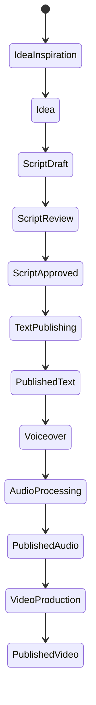

# PrismQ Project - Current State & Opportunities Summary

**Date**: 2025-11-21  
**Version**: 1.0  
**Status**: Initial Assessment

---

## Executive Summary

PrismQ is a comprehensive content production platform that transforms ideas into multi-format content through a sequential enrichment workflow (Text → Audio → Video). The project has a solid foundation with modular architecture but significant opportunities exist for scaling through specialized worker allocation and parallelized execution.

---

## Current State Analysis

### 1. Architecture Overview

#### Module Structure ✅
```
PrismQ/
├── T/          Text Generation Pipeline (Foundation)
│   ├── Idea/           Idea development and inspiration
│   ├── Script/         Script drafting and review
│   ├── Title/          Title optimization
│   ├── Publishing/     Text publishing and SEO
│   └── Review/         Review and editing
├── A/          Audio Generation Pipeline (Second Stage)
│   ├── Voiceover/      Voice recording
│   ├── Narrator/       Narrator selection
│   ├── Normalized/     Audio normalization
│   ├── Enhancement/    Audio enhancement
│   └── Publishing/     Audio publishing
├── V/          Video Generation Pipeline (Final Stage)
│   ├── Scene/          Scene planning
│   ├── Keyframe/       Keyframe generation
│   └── Video/          Video assembly
├── Client/     Web Management Interface
│   ├── Backend/        TaskManager API
│   └── Frontend/       TaskManager UI
└── _meta/      Project-wide metadata and documentation
```

**Strengths**:
- Clear separation of concerns
- Progressive enrichment model (build on previous stage)
- Well-documented workflows (WORKFLOW.md)
- Namespace organization (PrismQ.T, PrismQ.A, PrismQ.V)

**Current Limitations**:
- Limited worker organization at project level
- Issue management distributed across modules
- No central parallelization strategy
- Sprint planning not formalized

---

### 2. Technology Stack

#### Backend
- **Python 3.10+**: Primary language for pipelines
- **FastAPI/Flask**: API development
- **SQLite**: Task queue and data storage
- **pytest**: Testing framework

#### Frontend
- **Vue.js 3**: Web interface
- **TypeScript**: Type-safe frontend code
- **Vite**: Build tooling

#### Infrastructure
- **Git/GitHub**: Version control
- **GitHub Actions**: CI/CD (potential)
- **Docker**: Containerization (potential)

**Strengths**:
- Modern tech stack
- Good test infrastructure
- Modular Python packages

**Opportunities**:
- Standardize CI/CD across modules
- Implement automated testing workflows
- Establish performance benchmarking

---

### 3. Worker Organization

#### Existing Pattern (T/Idea/Inspiration/Source/YouTube)
Found example worker organization with:
- Worker01 (Project Manager)
- Worker02 (Python Specialist)
- Worker03 (Full Stack Developer)
- Worker04 (QA/Testing)
- Worker05 (DevOps)
- Worker06 (Database Specialist)
- Worker10 (Review Specialist)

**Current State**: ⚠️
- Worker pattern exists but limited to one submodule
- No project-wide worker allocation
- No centralized issue management

**New Implementation**: ✅
- Created 20 specialized workers in `_meta/issues/new/`
- Each worker has defined role, skills, and responsibilities
- Ready for project-wide coordination

---

### 4. Issue Management

#### Current Structure
```
_meta/issues/
├── new/        New issues (now with Worker01-20 folders)
├── wip/        Work in progress
├── blocked/    Blocked by dependencies
└── done/       Completed issues
```

**Status**: 
- Basic structure exists
- Worker folders now created
- Ready for issue population

**Needed**:
- Issue templates for each module
- Acceptance criteria standards
- Dependency tracking system
- Sprint planning documents

---

### 5. Content Production Workflow

#### State Machine (from WORKFLOW.md)


**Strengths**:
- Well-defined state transitions
- Clear quality gates
- Progressive enrichment model
- Flexible workflow (can stop at any stage)

**Opportunities**:
- Automate state transitions
- Implement worker-based processing per state
- Add analytics feedback loop
- Create parallelization opportunities within stages

---

## Key Opportunities

### 1. Parallelization Strategy 🚀

**Current**: Sequential processing, single-threaded approach
**Opportunity**: Parallel execution across multiple dimensions

#### Dimensions for Parallelization:

##### A. Content Pipeline Parallelization
- Multiple ideas processed simultaneously
- Different content pieces at different stages
- Independent pipeline instances

##### B. Worker Specialization Parallelization
- Python development (Worker02) runs parallel to Frontend (Worker03)
- Documentation (Worker15) parallel to Implementation
- Testing (Worker04) parallel to next feature development

##### C. Module Parallelization
- T.Idea work parallel to T.Script improvements
- Audio pipeline work parallel to Video pipeline
- Infrastructure improvements parallel to feature development

**Impact**: 5-10x productivity increase through parallelization

---

### 2. Sprint-Based Development 📋

**Opportunity**: Implement formal sprint planning
- 2-week sprints
- Clear sprint goals
- Worker allocation per sprint
- Velocity tracking
- Retrospectives and improvements

**Benefits**:
- Predictable delivery
- Better planning
- Team coordination
- Continuous improvement

---

### 3. Issue Expansion for Key Modules 📝

#### Priority Areas for Issue Creation:

##### High Priority (Immediate)
1. **T.Idea Module**
   - Idea expansion automation
   - Inspiration source integration
   - Idea quality scoring
   - Batch idea processing

2. **T.Script Module**
   - Script generation templates
   - Script review automation
   - Quality checklist implementation
   - Script versioning

3. **T.Review Module**
   - Automated review workflows
   - Feedback template system
   - Review criteria enforcement
   - Multi-stage review process

4. **T.Title Module**
   - Title optimization algorithm
   - SEO title generation
   - A/B testing framework
   - Title quality scoring

##### Medium Priority (Next Sprint)
5. **T.Publishing Module**
   - Multi-platform publishing
   - SEO optimization automation
   - Metadata management
   - Publishing workflow

6. **A.Voiceover Module**
   - Voice selection system
   - TTS integration
   - Quality control
   - Batch processing

7. **Client.TaskManager**
   - Queue optimization
   - Worker coordination
   - Real-time monitoring
   - Performance dashboard

---

### 4. Worker-Based Task Execution 👷

**Opportunity**: Implement worker pattern project-wide

#### Implementation Steps:
1. Define task types for each module
2. Create worker implementations
3. Integrate with SQLite queue
4. Implement LIFO task claiming
5. Add health monitoring
6. Set up metrics collection

**Benefits**:
- Persistent task execution
- State management
- Scalability
- Observability
- Retry logic

---

### 5. Quality & Testing Infrastructure 🧪

**Current**: Module-level testing, inconsistent coverage
**Opportunity**: Establish project-wide quality standards

#### Improvements:
- **Automated Testing**
  - CI/CD integration
  - Pre-commit hooks
  - Coverage requirements (>80%)
  - Performance benchmarks

- **Code Quality**
  - Linting standards
  - SOLID principle enforcement
  - Security scanning
  - Dependency updates

- **Documentation**
  - API documentation automation
  - Architecture diagrams
  - User guides
  - Developer onboarding

---

### 6. AI Integration Enhancement 🤖

**Current**: Limited AI usage
**Opportunity**: Leverage AI across pipeline

#### AI Enhancement Areas:
- **Content Generation**
  - Idea expansion using LLMs
  - Script generation assistance
  - Title optimization
  - SEO metadata generation

- **Quality Assurance**
  - Automated content review
  - Style consistency checking
  - Fact verification
  - Plagiarism detection

- **Optimization**
  - Prompt engineering library
  - Cost-effective AI usage
  - Quality scoring models
  - A/B testing automation

---

### 7. Analytics & Insights 📊

**Current**: Basic metrics, manual tracking
**Opportunity**: Comprehensive analytics platform

#### Analytics Implementation:
- **Performance Metrics**
  - Content performance tracking
  - Engagement analytics
  - SEO rankings
  - Platform-specific metrics

- **Process Metrics**
  - Sprint velocity
  - Issue completion rates
  - Quality metrics
  - Worker productivity

- **Feedback Loop**
  - Analytics → IdeaInspiration
  - Data-driven content decisions
  - Performance optimization
  - Trend identification

---

## Strategic Priorities

### Quarter 1 Focus (Current)

#### 1. Worker Organization (Completed) ✅
- [x] Create 20 specialized worker definitions
- [x] Define roles and responsibilities
- [x] Establish collaboration patterns
- [ ] Assign workers to current issues

#### 2. Issue Expansion (In Progress) 🔄
- [ ] Create issue templates
- [ ] Expand T.Idea issues
- [ ] Expand T.Script issues
- [ ] Expand T.Review issues
- [ ] Expand T.Title issues

#### 3. Parallelization Strategy (Next) 📋
- [ ] Create parallelization matrix
- [ ] Identify parallel execution opportunities
- [ ] Define worker allocation strategy
- [ ] Implement first parallel sprint

---

### Quarter 2 Focus (Planned)

#### 4. Worker Infrastructure
- Implement worker base classes
- Set up task queue system
- Add health monitoring
- Create metrics collection

#### 5. Automation
- Automate state transitions
- Implement CI/CD pipelines
- Set up automated testing
- Deploy monitoring systems

#### 6. AI Integration
- Expand AI content generation
- Implement quality checking
- Create prompt library
- Optimize costs

---

## Resource Allocation Recommendations

### Immediate Needs (Sprint 1-2)

#### High Priority Workers
1. **Worker01** (25% capacity): Sprint planning, issue creation
2. **Worker10** (15% capacity): Review standards, quality gates
3. **Worker02** (20% capacity): Python infrastructure
4. **Worker15** (15% capacity): Documentation updates
5. **Worker12** (15% capacity): Content workflow definition

#### Medium Priority Workers
6. **Worker04** (10% capacity): Test infrastructure
7. **Worker06** (10% capacity): Database optimization
8. **Worker05** (10% capacity): CI/CD setup

---

## Risk Assessment

### High Priority Risks

#### 1. Worker Coordination Overhead
**Risk**: Too many workers without clear coordination
**Mitigation**: 
- Strong Worker01 leadership
- Clear communication channels
- Well-defined interfaces
- Daily standups

#### 2. Issue Quality and Scope
**Risk**: Issues too large or poorly defined
**Mitigation**:
- Issue size limits (1-3 days)
- Acceptance criteria mandatory
- Worker10 review before assignment
- SOLID principle compliance

#### 3. Technical Debt Accumulation
**Risk**: Quick fixes without proper architecture
**Mitigation**:
- Code review mandatory (Worker10)
- SOLID principles enforcement
- Regular refactoring sprints
- Technical debt tracking

---

## Success Metrics

### Project Health Indicators

#### Development Velocity
- **Target**: 10-15 issues per sprint (2 weeks)
- **Measure**: Issue completion rate
- **Goal**: Increasing or stable velocity

#### Quality Metrics
- **Test Coverage**: >80%
- **Code Review**: 100% of PRs
- **SOLID Compliance**: 100%
- **Documentation**: Complete for all public APIs

#### Team Efficiency
- **Parallel Work**: 5+ workers active per sprint
- **Blocked Time**: <15% of sprint
- **Rework Rate**: <10%
- **Sprint Success**: >85% completion rate

---

## Next Actions

### Immediate (This Week)
1. ✅ Create 20 worker definitions
2. ⏳ Create PARALLEL_RUN_NEXT.md
3. ⏳ Expand issues for T.Idea module
4. ⏳ Expand issues for T.Script module
5. ⏳ Create first sprint plan

### Week 2
6. ⏳ Expand issues for T.Review module
7. ⏳ Expand issues for T.Title module
8. ⏳ Assign workers to issues
9. ⏳ Launch first parallel sprint
10. ⏳ Set up sprint tracking

### Week 3-4
11. ⏳ Implement worker infrastructure
12. ⏳ Set up CI/CD pipelines
13. ⏳ Create documentation standards
14. ⏳ First sprint retrospective
15. ⏳ Plan sprint 2

---

## Conclusion

PrismQ has a solid foundation with clear architecture and well-defined workflows. The creation of 20 specialized workers and the upcoming parallelization strategy positions the project for significant productivity gains. Key opportunities lie in:

1. **Parallelization**: 5-10x productivity through parallel execution
2. **Automation**: Reduce manual work through worker-based processing
3. **Quality**: Establish consistent quality standards project-wide
4. **AI Integration**: Leverage AI for content generation and quality
5. **Analytics**: Data-driven decisions and feedback loops

With proper sprint planning, clear issue definitions, and effective worker coordination, PrismQ can scale efficiently while maintaining high quality standards.

---

**Document Owner**: Worker01  
**Contributors**: All Workers  
**Next Review**: End of Sprint 1  
**Status**: Living Document - Updated Regularly
