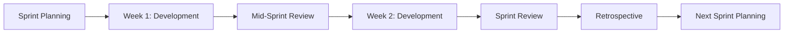

# Worker Organization - 20 Specialized Developers

**Created**: 2025-11-21  
**Status**: Active  
**Purpose**: Centralized worker management for PrismQ project

---

## Overview

This directory contains definitions for 20 specialized workers who collaborate on the PrismQ content production platform. Each worker has specific expertise, responsibilities, and collaboration patterns.

---

## Quick Reference

### Core Leadership
- **[Worker01](Worker01/README.md)** - Scrum Master, Planner & Project Manager
- **[Worker10](Worker10/README.md)** - Review Master & Quality Assurance Lead

### Development Specialists
- **[Worker02](Worker02/README.md)** - Python Specialist
- **[Worker03](Worker03/README.md)** - Full Stack Developer
- **[Worker07](Worker07/README.md)** - JavaScript/TypeScript Expert

### Quality & Operations
- **[Worker04](Worker04/README.md)** - QA & Testing Specialist
- **[Worker05](Worker05/README.md)** - DevOps & Infrastructure
- **[Worker06](Worker06/README.md)** - Database Specialist

### AI & Media
- **[Worker08](Worker08/README.md)** - AI/ML Specialist
- **[Worker09](Worker09/README.md)** - Media Processing Specialist
- **[Worker13](Worker13/README.md)** - Prompt Engineering Master

### Design & Content
- **[Worker11](Worker11/README.md)** - UI/UX Designer & Frontend Specialist
- **[Worker12](Worker12/README.md)** - Content Specialist
- **[Worker15](Worker15/README.md)** - Documentation Specialist

### Integration & Analytics
- **[Worker14](Worker14/README.md)** - Platform Integration Specialist
- **[Worker17](Worker17/README.md)** - Data Analytics Specialist

### Process & Optimization
- **[Worker16](Worker16/README.md)** - Security Specialist
- **[Worker18](Worker18/README.md)** - Workflow & Automation Specialist
- **[Worker19](Worker19/README.md)** - Performance Optimization Specialist
- **[Worker20](Worker20/README.md)** - Research & Innovation Specialist

---

## Worker Roles Matrix

### By Primary Function

| Function | Workers | Count |
|----------|---------|-------|
| **Management & Leadership** | Worker01, Worker10 | 2 |
| **Backend Development** | Worker02, Worker06 | 2 |
| **Frontend Development** | Worker03, Worker07, Worker11 | 3 |
| **Quality & Testing** | Worker04, Worker10, Worker16 | 3 |
| **Operations** | Worker05, Worker18, Worker19 | 3 |
| **AI & Automation** | Worker08, Worker13, Worker20 | 3 |
| **Content & Design** | Worker11, Worker12, Worker15 | 3 |
| **Integration & Analytics** | Worker14, Worker17 | 2 |

---

## Collaboration Patterns

### Hub Workers (Work with Most Others)

#### Worker01 - Project Manager
Coordinates with: **ALL workers**
- Sprint planning and task assignment
- Remove blockers
- Progress tracking

#### Worker10 - Review Master
Reviews work of: **ALL workers**
- Code review
- Quality validation
- Acceptance criteria verification

### Specialist Clusters

#### Development Cluster
- Worker02 (Python) ↔ Worker03 (Full Stack) ↔ Worker07 (JS/TS)
- Collaborate on: API development, frontend-backend integration

#### Quality Cluster
- Worker04 (Testing) ↔ Worker10 (Review) ↔ Worker16 (Security)
- Collaborate on: Quality assurance, security, testing

#### Content Cluster
- Worker12 (Content) ↔ Worker13 (Prompts) ↔ Worker08 (AI/ML)
- Collaborate on: Content generation, AI integration, optimization

#### Infrastructure Cluster
- Worker05 (DevOps) ↔ Worker06 (Database) ↔ Worker18 (Workflow)
- Collaborate on: Infrastructure, deployment, automation

---

## Issue Assignment Guidelines

### Selecting the Right Worker

#### For Python Development
- **Primary**: Worker02 (Python Specialist)
- **Backup**: Worker06 (for database-heavy), Worker18 (for automation)

#### For Frontend Work
- **UI/UX Design**: Worker11
- **JavaScript/TypeScript**: Worker07
- **Full Stack**: Worker03 (backend + frontend)

#### For Content Work
- **Writing**: Worker12 (Content Specialist)
- **AI Content**: Worker08 + Worker13 (AI + Prompts)
- **Documentation**: Worker15

#### For Quality & Review
- **Testing**: Worker04 (QA)
- **Security**: Worker16
- **Code Review**: Worker10 (Review Master)

#### For Infrastructure
- **Deployment**: Worker05 (DevOps)
- **Database**: Worker06
- **Workflow**: Worker18

### Issue Complexity Guide

#### Simple Issues (1 day)
- Assign to specialist worker
- Minimal review needed
- Single file or component changes

#### Medium Issues (2-3 days)
- Assign to specialist worker
- Code review by Worker10
- May involve multiple files
- Testing required

#### Complex Issues (>3 days - AVOID!)
- Should be broken down by Worker01
- Split into multiple issues
- Coordinate between workers
- High risk of scope creep

---

## Communication Channels

### Daily Standups
- **Time**: 9:00 AM daily
- **Format**: Async (issue comments) or sync if needed
- **Required**: All active workers
- **Duration**: 15 minutes max

### Sprint Ceremonies
- **Sprint Planning**: Start of sprint (2 hours)
- **Mid-Sprint Review**: Week 1 end (1 hour)
- **Sprint Review**: Sprint end (2 hours)
- **Retrospective**: After sprint review (1 hour)

### Code Review
- **Process**: Pull request → Worker10 review → Approval
- **SLA**: Within 24-48 hours
- **Required**: All code changes

---

## Sprint Workflow

### Sprint Structure (2 weeks)

### Worker Involvement by Phase

#### Sprint Planning (Worker01 leads)
- All workers: Review assigned issues
- Discuss dependencies and concerns
- Commit to sprint goals

#### Development (All workers)
- Daily standups
- Implement assigned issues
- Code reviews
- Update progress

#### Mid-Sprint Review (Worker01, Worker10)
- Check progress
- Identify blockers
- Adjust if needed

#### Sprint Review (All workers)
- Demo completed work
- Worker10 validates acceptance criteria
- Discuss lessons learned

#### Retrospective (All workers)
- What went well?
- What to improve?
- Action items

---

## Quality Standards

### All Workers Must Follow

#### Code Quality
- SOLID principles compliance
- Unit tests (>80% coverage)
- Code review approval
- No critical security issues

#### Documentation
- README updated
- API documentation
- Code comments where needed
- CHANGELOG updated

#### Process
- Issue acceptance criteria met
- Tests passing
- No breaking changes (or justified)
- Worker10 sign-off

---

## Resource Documents

### Key Documents
1. **[CURRENT_STATE_AND_OPPORTUNITIES.md](../CURRENT_STATE_AND_OPPORTUNITIES.md)** - Project analysis
2. **[PARALLEL_RUN_NEXT.md](../PARALLEL_RUN_NEXT.md)** - Sprint parallelization matrix
3. **[WORKFLOW.md](../WORKFLOW.md)** - Content production workflow
4. **[README.md](../../README.md)** - Project overview

### Worker Resources
- Issue templates: In worker folders
- Code standards: In _meta/docs/
- Architecture docs: In _meta/docs/
- Examples: See T/Idea/Inspiration/Source/YouTube/_meta/issues/new/

---

## Getting Started

### For New Workers

1. **Read Your Worker Profile**
   - Navigate to your Worker folder
   - Read README.md thoroughly
   - Understand your role and responsibilities

2. **Review Project Structure**
   - Explore repository structure
   - Read main README.md
   - Review WORKFLOW.md (in _meta directory)

3. **Check Current Sprint**
   - Read PARALLEL_RUN_NEXT.md
   - See assigned issues
   - Understand dependencies

4. **Set Up Development Environment**
   - Install required tools
   - Clone repository
   - Run tests to verify setup

5. **Attend Sprint Planning**
   - Review assigned issues
   - Ask questions
   - Commit to deliverables

---

## Success Metrics

### Team Level
- **Sprint Velocity**: 10-15 issues per sprint
- **Parallel Efficiency**: 8-10x vs sequential
- **Worker Utilization**: >80% capacity
- **Blocking Time**: <15% of sprint

### Individual Level
- **Issue Completion**: Meet commitments
- **Quality**: Pass code review first try >80%
- **Collaboration**: Help other workers when blocked
- **Communication**: Daily standup participation

---

## Escalation Path

### Blockers
1. **Technical Blocker**: Ask specialist worker for help
2. **Process Blocker**: Escalate to Worker01
3. **Quality Issue**: Escalate to Worker10
4. **Urgent Issue**: Tag Worker01 + Worker10

### Conflicts
1. **Technical Disagreement**: Worker10 makes final call
2. **Resource Conflict**: Worker01 resolves
3. **Priority Conflict**: Worker01 decides
4. **Architecture Decision**: Worker01 + Worker10 together

---

## FAQs

### Q: How do I get assigned an issue?
**A**: Worker01 assigns during sprint planning based on your expertise and capacity.

### Q: What if my issue is blocked?
**A**: Comment on the issue, tag Worker01, who will move it to "blocked" and help resolve.

### Q: Can I work on issues not assigned to me?
**A**: Yes, if you have capacity and coordinate with Worker01 to avoid conflicts.

### Q: What if I finish early?
**A**: Notify Worker01, who will assign additional work or you can help other workers.

### Q: How do I request code review?
**A**: Create PR, tag Worker10, wait for review (SLA: 24-48h).

### Q: What if I disagree with review feedback?
**A**: Discuss with Worker10. If unresolved, Worker01 arbitrates.

---

## Version History

| Version | Date | Changes | Author |
|---------|------|---------|--------|
| 1.0 | 2025-11-21 | Initial worker structure created | Worker01 |

---

**Next Review**: End of Sprint 1  
**Maintained By**: Worker01 (Project Manager)  
**Questions**: Tag @Worker01 in issues or during standup
