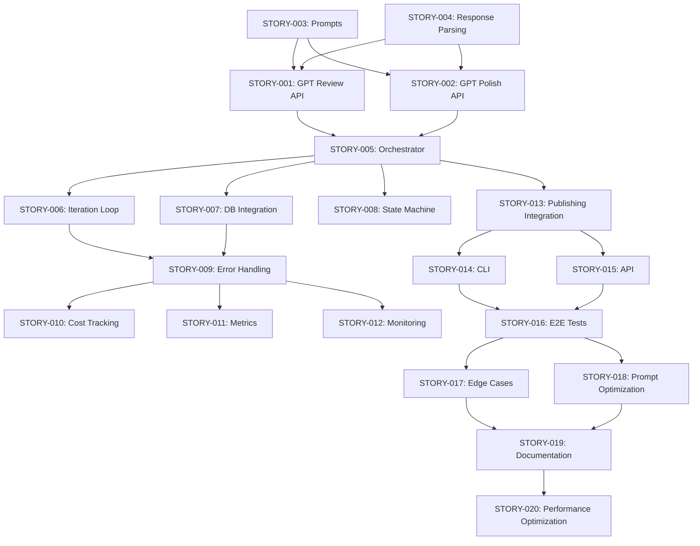

# Story Generation Implementation Plan

**Created**: 2025-11-24  
**Owner**: Worker01 (Project Manager)  
**Status**: Planning Phase  
**Context**: WORKFLOW_DETAILED.md Stages 21-22 (Story.ExpertReview + Story.Polish)

---

## Overview

This document outlines the comprehensive implementation plan for Story Generation workflow stages (21-22) which serve as the final quality gate before publishing. The story generation stages use GPT-based expert review and polish to ensure professional-quality content.

## Workflow Context

### Position in Overall Pipeline

```
Stage 1-20: Text Pipeline (Idea → Title → Script → Local Reviews) ✅ COMPLETE
    ↓
Stage 21: Story.ExpertReview (GPT-based holistic review) ⚠️ IMPLEMENTATION NEEDED
    ↓
    ├─ If PUBLISH → Stage 23: Publishing.Finalization
    │
    └─ If POLISH → Stage 22: Story.Polish (Apply improvements)
                       ↓
                   Return to Stage 21 (Review again)
```

### Current State

**✅ Foundation Complete**:
- Data models and classes implemented (`expert_review.py`, `polish.py`)
- Core review and polish logic exists
- Unit tests present
- Example usage documented

**⚠️ Gaps Identified**:
1. No GPT API integration (currently simulated)
2. No workflow orchestration/runner
3. No database integration for tracking
4. No retry logic and error handling
5. No cost tracking and optimization
6. No quality metrics collection
7. No integration with Publishing stage (Stage 23)
8. No CLI/API endpoints for execution
9. Limited test coverage for edge cases
10. No performance monitoring

---

## Stages Breakdown

### Stage 21: Story.ExpertReview (PrismQ.T.Story.ExpertReview)

**Purpose**: GPT-powered holistic review of title + script + audience context

**Current Implementation**:
- ✅ `expert_review.py`: Data models and simulated review
- ✅ Test coverage for basic scenarios
- ❌ Real GPT API integration missing
- ❌ Workflow orchestration missing

**Key Components**:
1. **ExpertReview Data Model** (✅ Complete)
   - Overall Assessment
   - Story Coherence
   - Audience Fit
   - Professional Quality
   - Platform Optimization
   - Improvement Suggestions
   
2. **StoryExpertReviewer Class** (⚠️ Partial)
   - ✅ Review structure
   - ❌ GPT API integration
   - ❌ Prompt engineering
   - ❌ Response parsing
   - ❌ Error handling

3. **Decision Making** (✅ Complete)
   - Quality threshold evaluation
   - Publish vs. Polish decision
   - Improvement prioritization

### Stage 22: Story.Polish (PrismQ.T.Story.Polish)

**Purpose**: Apply GPT-suggested improvements to title and script

**Current Implementation**:
- ✅ `polish.py`: Data models and simulated polish
- ✅ Change tracking
- ❌ Real GPT API integration missing
- ❌ Workflow orchestration missing

**Key Components**:
1. **StoryPolish Data Model** (✅ Complete)
   - Change log entries
   - Before/after tracking
   - Quality delta estimation
   
2. **StoryPolisher Class** (⚠️ Partial)
   - ✅ Polish structure
   - ❌ GPT API integration
   - ❌ Surgical improvement logic
   - ❌ Preservation of essence

3. **Iteration Loop** (❌ Missing)
   - Polish → Review cycle
   - Max iterations control
   - Convergence detection

---

## Implementation Phases

### Phase 1: GPT Integration (MVP)
**Goal**: Connect real GPT API for review and polish  
**Timeline**: 3-5 days  
**Priority**: Critical

**Issues**:
1. STORY-001: GPT API Integration for ExpertReview
2. STORY-002: GPT API Integration for Polish
3. STORY-003: Prompt Engineering and Templates
4. STORY-004: Response Parsing and Validation

### Phase 2: Workflow Orchestration
**Goal**: Create workflow runner for Stage 21-22 loop  
**Timeline**: 3-4 days  
**Priority**: High

**Issues**:
5. STORY-005: Story Workflow Orchestrator
6. STORY-006: Iteration Loop Management
7. STORY-007: Database Integration for Tracking
8. STORY-008: State Machine Implementation

### Phase 3: Quality & Reliability
**Goal**: Error handling, retry logic, monitoring  
**Timeline**: 2-3 days  
**Priority**: High

**Issues**:
9. STORY-009: Error Handling and Retry Logic
10. STORY-010: Cost Tracking and Optimization
11. STORY-011: Quality Metrics Collection
12. STORY-012: Performance Monitoring

### Phase 4: Integration & Testing
**Goal**: Connect to Publishing stage, E2E testing  
**Timeline**: 2-3 days  
**Priority**: Medium

**Issues**:
13. STORY-013: Publishing Stage Integration
14. STORY-014: CLI Interface for Story Workflow
15. STORY-015: API Endpoints (FastAPI)
16. STORY-016: End-to-End Integration Tests

### Phase 5: Polish & Documentation
**Goal**: Edge cases, optimization, documentation  
**Timeline**: 2 days  
**Priority**: Medium

**Issues**:
17. STORY-017: Edge Case Testing
18. STORY-018: Prompt Optimization
19. STORY-019: Comprehensive Documentation
20. STORY-020: Performance Optimization

---

## Atomic Issue Structure

Each issue will follow this format:

```markdown
# STORY-XXX: [Title]

**Phase**: [1-5]
**Priority**: [Critical/High/Medium/Low]
**Effort**: [X days]
**Dependencies**: [STORY-YYY, ...]
**Assigned**: [Worker##]

## Problem Statement
[What needs to be done]

## Current State
[What exists today]

## Acceptance Criteria
- [ ] Criterion 1
- [ ] Criterion 2
- [ ] Criterion 3

## SOLID Principles Analysis
- **SRP**: [Analysis]
- **OCP**: [Analysis]
- **LSP**: [Analysis]
- **ISP**: [Analysis]
- **DIP**: [Analysis]

## Implementation Details
[Technical approach]

## Testing Strategy
[How to test]

## Definition of Done
- [ ] Code implemented
- [ ] Tests passing (>80% coverage)
- [ ] Documentation updated
- [ ] Code reviewed
- [ ] Integration verified
```

---

## Issue Dependencies



---

## Worker Assignments (Proposed)

### Phase 1: GPT Integration
- **Worker08** (AI/ML Specialist): STORY-001, STORY-002
- **Worker13** (Prompt Master): STORY-003
- **Worker02** (Python Specialist): STORY-004

### Phase 2: Workflow Orchestration
- **Worker02** (Python Specialist): STORY-005, STORY-006
- **Worker06** (Database Specialist): STORY-007
- **Worker02** (Python Specialist): STORY-008

### Phase 3: Quality & Reliability
- **Worker04** (QA/Testing): STORY-009, STORY-017
- **Worker17** (Analytics): STORY-010, STORY-011
- **Worker08** (AI/ML): STORY-012

### Phase 4: Integration & Testing
- **Worker02** (Python Specialist): STORY-013
- **Worker03** (DevOps): STORY-014
- **Worker05** (API Specialist): STORY-015
- **Worker04** (QA/Testing): STORY-016

### Phase 5: Polish & Documentation
- **Worker13** (Prompt Master): STORY-018
- **Worker15** (Documentation): STORY-019
- **Worker02** (Python): STORY-020

---

## Success Criteria

### MVP Success (Phase 1-2)
- [ ] GPT API integration working for review and polish
- [ ] Workflow orchestrator can run Stage 21 → 22 → 21 loop
- [ ] Database tracking implemented
- [ ] Basic error handling in place

### Full Implementation (Phase 1-5)
- [ ] All 20 issues complete
- [ ] >90% test coverage
- [ ] Integration with Publishing stage (Stage 23)
- [ ] CLI and API endpoints functional
- [ ] Documentation complete
- [ ] Cost tracking operational

### Quality Gates
- [ ] No security vulnerabilities
- [ ] All tests passing
- [ ] Code reviewed by Worker10
- [ ] SOLID principles validated
- [ ] Performance benchmarks met

---

## Risk Assessment

### High Risk
1. **GPT API Rate Limits**: May need retry logic and backoff
   - Mitigation: Implement exponential backoff, rate limiting
   
2. **Cost Management**: GPT API calls are expensive
   - Mitigation: Token counting, cost tracking, caching

3. **Prompt Engineering**: Quality depends on prompt quality
   - Mitigation: Extensive testing, A/B testing prompts

### Medium Risk
4. **Iteration Loop Convergence**: May not reach publish threshold
   - Mitigation: Max iteration limits, fallback strategies
   
5. **State Management**: Complex workflow state to track
   - Mitigation: Use state machine pattern, comprehensive logging

### Low Risk
6. **Integration Complexity**: Many moving parts
   - Mitigation: Incremental integration, thorough testing

---

## Timeline Estimate

**Total Duration**: 12-17 days (calendar time)  
**Total Effort**: ~40-50 worker-days

**With Parallelization** (4-5 workers):
- **Week 1**: Phase 1 (GPT Integration)
- **Week 2**: Phase 2 (Orchestration) + Phase 3 (Quality)
- **Week 3**: Phase 4 (Integration) + Phase 5 (Polish)

**Critical Path**: STORY-001 → STORY-005 → STORY-006 → STORY-013 → STORY-016

---

## Next Steps

1. **Worker01**: Create all 20 atomic issues in `_meta/issues/new/Worker01/`
2. **Worker10**: Review plan and issues for SOLID compliance
3. **Worker01**: Apply Worker10's feedback
4. **Worker01**: Move issues to appropriate folders (new/wip/blocked)
5. **Team**: Begin Phase 1 execution

---

## Related Documents

- **[T/WORKFLOW_DETAILED.md](../../T/WORKFLOW_DETAILED.md)** - Complete workflow stages
- **[T/Story/README.md](../../T/Story/README.md)** - Story module overview
- **[T/Story/ExpertReview/README.md](../../T/Story/ExpertReview/README.md)** - ExpertReview docs
- **[T/Story/Polish/README.md](../../T/Story/Polish/README.md)** - Polish docs
- **[_meta/issues/PARALLEL_RUN_NEXT.md](./PARALLEL_RUN_NEXT.md)** - Current sprint plan

---

**Status**: Ready for Worker10 Review  
**Next Action**: Worker10 reviews for SOLID compliance and completeness  
**Updated**: 2025-11-24
